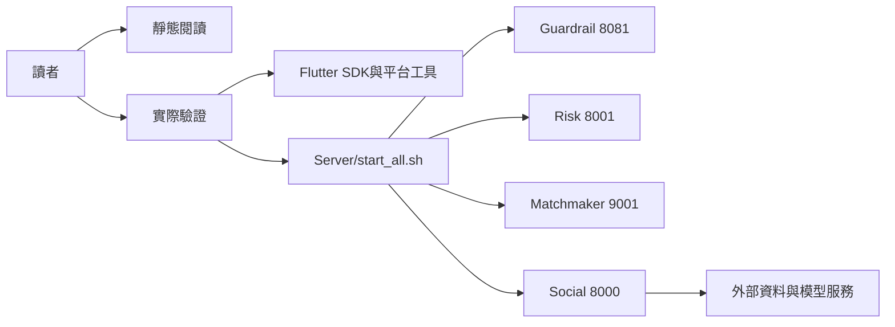

# 00.5 — 開始閱讀與啟動前提

## Relevant Source Files

- `Server/start_all.sh:L187-L245`
- `Server/.github/workflows/tests.yml:L30-L40`
- `DatingApp/pubspec.yaml:L19-L76`
- `DatingApp/lib/main.dart:L46-L67`

## TL;DR

這個系統由 Flutter DatingApp、四個後端執行單位及多個外部資料／模型服務組成。只讀程式碼不需要先啟動全部服務；若要做實際操作驗證，Server 必須透過 `start_all.sh` 啟動，前端則需要 Flutter SDK、相依套件與相應平台工具。最重要的前提是：本機啟動成功不等於外部 Appwrite、MongoDB、Neo4j、模型供應商與 Google Calendar 已可用。

## Overview

閱讀時先把兩個 Git repository 放在同一個工作區，保留各自的 Git 版本。Server 的正式啟動入口是 `Server/start_all.sh`；腳本依序檢查 Guardrail、啟動 Risk、Matchmaker 與 Social，並等待健康檢查。[Server 啟動順序](../../Server/start_all.sh) 中的檔案內容是部署契約的一部分，不應以單獨的 `uvicorn` 指令取代。

DatingApp 是 Flutter 應用程式，SDK 版本約束與 Appwrite、Firebase、HTTP、WebSocket、錄音及語音相關依賴位於 `pubspec.yaml`。程式入口先初始化 Appwrite，再非同步初始化 Firebase，最後把 Session 邊界與 App Voice overlay 放到 `MaterialApp` 之上。[前端入口](../../DatingApp/lib/main.dart) 顯示這個初始化順序。

## Architecture Diagram

## Key Concepts

| Concept | Description | Source |
|---|---|---|
| `start_all.sh` | Server 的完整啟動與健康檢查入口 | `Server/start_all.sh:L187-L245` |
| Flutter bootstrap | Appwrite、Firebase、Session 與全域 overlay 的初始化 | `DatingApp/lib/main.dart:L46-L145` |
| 靜態證據 | 程式碼、設定與測試所支持的描述 | `Server/.github/workflows/tests.yml:L30-L40` |
| 實際驗證 | 以服務、裝置或瀏覽器觀察到的行為；本版尚未全面完成 | `docs/system/16-evidence-and-open-questions.md` |

## How It Works

### 只讀分析

先讀 AGENTS.md、兩個 repository 的版本與工作樹狀態，再由入口檔案向路由、服務、資料存取與外部邊界追蹤。分析排除依賴目錄、建置產物、二進位檔與可能含密鑰的 `.env*` 內容。這個順序讓讀者知道哪些結論來自程式碼，哪些仍需要環境驗證。

### 實際啟動

若要做整合測試，先準備 Python 服務依賴、Pi bridge 的 Node 依賴、Guardrail 所需模型或替代服務，以及外部資料庫與供應商設定。`start_all.sh` 會使用固定的 8081、8001、9001、8000 服務埠並輪詢健康端點；缺任何一個必要服務時，啟動可能在健康檢查階段停止。

### 前端執行

在 `DatingApp/` 取得 Flutter 套件後，依目標平台執行開發或測試。程式會使用正式 API 網域的預設值，也保留 `MATCHMAKER_API_URL` 等編譯時覆寫入口；驗證時必須記錄平台、編譯參數、登入帳號類型與外部服務狀態。

## Component Reference

| Component | Type | Responsibility | Source |
|---|---|---|---|
| `start_services()` | shell function | 依序啟動四個 Server 執行單位 | `Server/start_all.sh:L187-L235` |
| `main()` | Flutter entrypoint | 初始化 SDK 與根 Widget | `DatingApp/lib/main.dart:L46-L67` |
| `tests.yml` | CI workflow | 安裝 Python 依賴、檢查 shell、執行離線測試 | `Server/.github/workflows/tests.yml:L30-L40` |

## Configuration & Environment

| Area | Requirement | Source |
|---|---|---|
| API 網域 | `https://service.misproject.us.ci` | `DatingApp/lib/services/ayue_v3_api_service.dart:L972-L974` |
| Server 埠 | 8000、8001、9001、8081 | `Server/start_all.sh:L188-L245` |
| Flutter SDK | Dart SDK 約束為 `^3.11.3` | `DatingApp/pubspec.yaml:L19-L23` |
| 外部秘密 | 只使用環境設定，不寫入文件 | `Server/social/config.py`、各 `.env.example` |

## Error Handling

健康檢查失敗時，先查看腳本產生的服務 log；不要直接把失敗歸因於 Flutter。API 串流逾時也可能代表後端仍在處理，前端提示會要求重新整理並避免重複送出。[公開串流逾時處理](../../DatingApp/lib/services/ayue_v3_api_service.dart) 是這類情況的範例。

## Gotchas & Conventions

> ⚠️ **Gotcha**：`start_all.sh` 可清理既有固定埠上的程序。執行前應確認那些程序是否屬於本專案，避免在共用環境中誤停服務。

> 📌 **Convention**：測試環境應使用 stub 或 local test database；Server 的測試規則明確禁止自動測試連線或修改正式 MongoDB Atlas／Neo4j。

> ❓ **[NEEDS INVESTIGATION]**：目前沒有在本版執行完整 Server 啟動與 Flutter 實機流程，因此實際環境依賴仍需另行驗證。

## Active Development Areas

從現有檔案與工作區規則可見，Agent runtime、語音互動、配對狀態與摘要／記憶是活躍且跨模組的區域。這些區域應以流程測試和契約測試一起維護，而不是只更新單一說明文字。

## Cross-References

- 整體邊界：[01 — 整體概觀與 C4 架構](01-overview.md)
- 啟動與部署：[14 — 部署、啟動與環境](14-deployment.md)
- 測試限制：[15 — 測試與驗證](15-testing.md)
