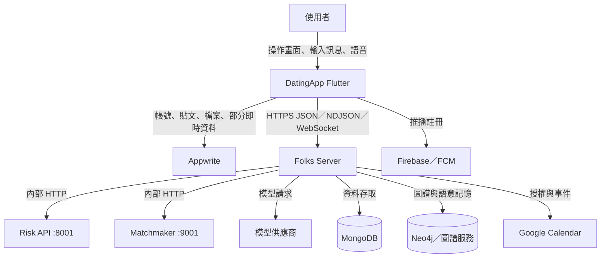
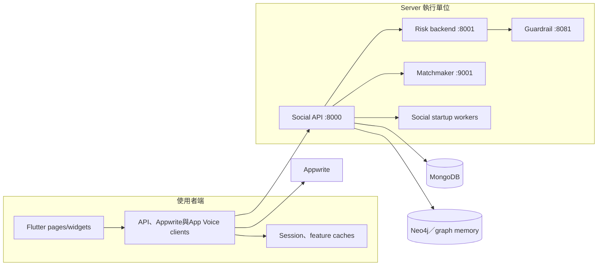
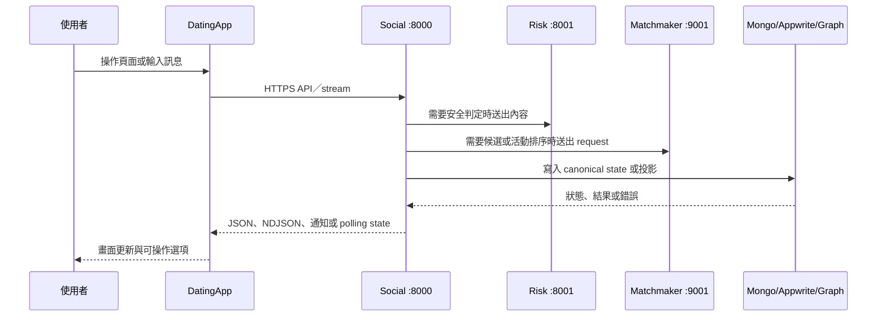

# 01 — 整體概觀與 C4 架構

## Relevant Source Files

- `DatingApp/lib/main.dart:L46-L145`
- `DatingApp/lib/services/appwrite_config.dart:L3-L35`
- `DatingApp/lib/services/ayue_v3_api_service.dart:L953-L1005`
- `Server/start_all.sh:L187-L245`
- `Server/social/main.py:L67-L161`
- `Server/social/database.py:L1-L53`

## TL;DR

Folks Dating System 是一個以 Flutter App 為使用者入口、以 Social API 為主要產品後端、再由 Risk、Matchmaker、Guardrail 與 Agent runtime 支援的混合式系統。它不是單純的「前端呼叫一個後端」：帳號、貼文與檔案有 Appwrite 直連路徑，聊天與 AI 功能則經由固定公開網域進入 Server。最重要的架構事實是：不同資料域有不同 owner，文件不能把所有資料都畫成同一個資料庫。

## Overview

系統邊界以兩個 repository 的現行程式碼為準。DatingApp 負責畫面、導航、Session、快取、API client、即時訊息與語音操作；Server 以 `social/main.py` 建立 FastAPI 應用，掛載聊天、配對、行事曆、Google Calendar、註冊語音、App Voice、關係記憶與摘要路由，並在 startup 設置索引與背景工作。[Social 組裝](../../Server/social/main.py) 是後端容器的主要證據。

在外部邊界上，程式碼直接使用 Appwrite、MongoDB、Neo4j、Firebase／FCM、Google Calendar 與模型供應商。這些依賴是否在正式環境以相同拓撲部署，屬於目前文件的推論或待確認內容；本版只記錄程式碼能證明的連線與資料流。

## Architecture Diagram

### System Context

### Container View

## Key Concepts

| Concept | Description | Source |
|---|---|---|
| Social API | 主要產品 API 與背景工作組裝點 | `Server/social/main.py:L67-L140` |
| 四服務啟動拓撲 | Guardrail、Risk、Matchmaker、Social 的固定埠與順序 | `Server/start_all.sh:L187-L245` |
| 雙資料路徑 | Appwrite 直連與 Server API 並存 | `DatingApp/lib/services/appwrite_config.dart:L3-L35`、`DatingApp/lib/services/ayue_v3_api_service.dart:L953-L1005` |
| 公開網域 | 前端 API client 的正式預設網域 | `DatingApp/lib/services/ayue_v3_api_service.dart:L972-L974` |

## How It Works

使用者操作先進入 Flutter page，再由對應 service 封裝 HTTP、Appwrite 或 WebSocket 呼叫。一般產品資料可能直接進 Appwrite；阿月、配對、風險與行事曆則送往 Social API。Social 依領域轉交內部服務，將結果整理成 JSON、NDJSON stream、通知事件或狀態投影，再由前端更新頁面與快取。

Social 的 startup handler 同時建立多種索引並啟動配對搜尋、記憶 outbox、摘要、事件生命週期、事件配送、概念嵌入與語音任務等 worker。[startup 設定](../../Server/social/main.py) 顯示這個 API process 也承載背景工作，因此「API 是否啟動」與「全部非同步能力是否可用」是兩個不同問題。

## Component Reference

| Component | Type | Responsibility | Source |
|---|---|---|---|
| `MyApp` | Flutter root widget | 建立主題、Session boundary、App Voice overlay 與入口頁 | `DatingApp/lib/main.dart:L70-L145` |
| `AyueV3ApiService` | Dart service | 封裝公開／私人 Agent stream、配對、行事曆等 API | `DatingApp/lib/services/ayue_v3_api_service.dart:L953-L1005` |
| `app` | FastAPI instance | 掛載 Social 路由與 lifecycle hooks | `Server/social/main.py:L67-L140` |
| `start_services()` | shell function | 統一啟動與健康檢查 | `Server/start_all.sh:L187-L235` |

## Data Flow

## Error Handling

外部服務失敗時，各層有不同策略：前端 API client 會把 HTTP、格式與逾時轉成 domain exception；Social 對風險與配對服務通常保留明確錯誤碼；資料庫初始化失敗時，Social 使用 unavailable proxy 讓健康或 demo 狀態反映依賴失敗，而不是默默寫入本機資料庫。[Mongo fallback](../../Server/social/database.py) 是一個重要的 fail-closed 邊界。

## Gotchas & Conventions

> ⚠️ **Gotcha**：C4 的 container 不是 Docker container。這裡的 `Social`、`Risk`、`Matchmaker` 與 `Guardrail` 是可執行的服務邊界；是否由同一台主機或不同主機部署，仍需部署證據。

> 📌 **Convention**：前端使用固定公開網域，Server 內部服務使用 loopback 埠。文件不要把 `127.0.0.1` 內部呼叫直接當成使用者可存取的公開 URL。

> ❓ **[NEEDS INVESTIGATION]**：正式環境的 MongoDB、Neo4j、Guardrail 模型與反向代理拓撲，需要從部署主機或運維設定補查。

## Active Development Areas

跨前後端最活躍的區域是 Agent runtime、配對狀態、風險介入、App Voice action executor，以及記憶／摘要 worker。這些區域有大量測試與相容契約，文件更新時應同步檢查狀態 schema 與錯誤碼。

## Cross-References

- 目錄與邊界：[02 — Repository 與模組導覽](02-repository-structure.md)
- 前端實作：[03 — DatingApp 前端架構](03-datingapp-architecture.md)
- API 契約：[12 — API 與資料契約](12-api-data-contracts.md)
- 啟動拓撲：[14 — 部署、啟動與環境](14-deployment.md)
