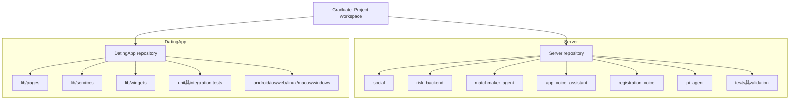
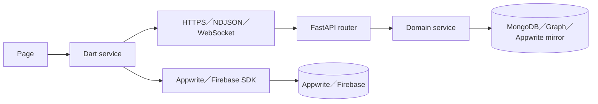

# 02 — Repository 與模組導覽

## Relevant Source Files

- `Server/AGENTS.md`
- `Server/start_all.sh:L187-L245`
- `Server/social/main.py:L1-L161`
- `DatingApp/AGENTS.md`
- `DatingApp/pubspec.yaml:L30-L110`
- `DatingApp/lib/main.dart:L70-L145`

## TL;DR

工作區包含兩個獨立 Git repository：`Server/` 是 Python/FastAPI 後端，`DatingApp/` 是 Flutter/Dart 前端。Server 的主要領域以資料夾與服務埠分開，DatingApp 則以 `lib/pages`、`lib/services`、`lib/widgets` 與 platform folders 組成；閱讀時應先掌握 runtime 邊界，再深入單一功能。目錄名稱只能提供導航，真正的責任要以入口、註冊與呼叫關係確認。

## Overview

Server 的 `social` 是主要產品後端，`risk_backend`、`matchmaker_agent`、`app_voice_assistant`、`registration_voice`、`agent_quota` 與 `pi_agent` 共同構成完整啟動和產品能力。`social/main.py` 匯入 router、資料服務與 worker，顯示它不是薄薄的 API facade，而是多個 domain service 的 composition root。[後端組裝](../../Server/social/main.py:L1-L60)

DatingApp 的 `lib` 是主要產品程式碼。`pages` 對應使用者畫面，`services` 封裝 API、Appwrite、快取、推播、行事曆與語音，`widgets` 封裝共用呈現與互動；原生平台資料夾則由 Flutter 產生或承載平台設定。`pubspec.yaml` 的依賴能確認 Appwrite、Firebase、HTTP、WebSocket、定位、錄音與語音等技術邊界。[前端依賴](../../DatingApp/pubspec.yaml:L30-L76)

## Architecture Diagram

## Key Concepts

| Concept | Description | Source |
|---|---|---|
| Composition root | 建立 FastAPI、掛載 router、註冊 startup／shutdown 的位置 | `Server/social/main.py:L67-L161` |
| Domain service | 由 router 呼叫、擁有狀態或外部整合責任的 Python service | `Server/social/main.py:L8-L60` |
| Page layer | Flutter 畫面與頁面生命週期 | `DatingApp/lib/main.dart:L70-L145` |
| Service layer | Flutter 對 API、Appwrite、快取和外部平台的 adapter | `DatingApp/pubspec.yaml:L30-L66` |
| Platform layer | Flutter 各平台建置與原生整合 | `DatingApp/pubspec.yaml:L97-L110` |

## How It Works

### Server 邊界

Server 的 `social` 直接匯入 router 與 service；`matchmaker_agent` 以 9001 提供配對與事件能力，`risk_backend` 以 8001 提供風險偵測，Guardrail 由啟動腳本以 8081 暴露健康與分類介面。語音能力分成註冊語音和 App Voice，且 Pi bridge 的 Node runtime 位於獨立資料夾。這些是 runtime boundaries，不應在文件中簡化成單一 Python module。

### DatingApp 邊界

`main.dart` 建立 `MaterialApp`、Session boundary 與 App Voice overlay；登入後 `MainPage` 再組裝聊天、配對與設定等主要頁面。頁面不應被視為資料真相：API service、cache repository 與 `AppDataCoordinator` 共同負責讀取、去重與 session epoch 保護。[主頁組裝](../../DatingApp/lib/pages/main_page.dart:L62-L101)、[讀取協調器](../../DatingApp/lib/services/app_data_coordinator.dart:L79-L145)

### 跨 repository 關聯

跨 repository 的最可靠證據是前端 URL／路徑與後端 router prefix 的對應。例如 `AyueV3ApiService` 對 `/api/direct_chat/stream`、`/api/match/request`、`/api/calendar/events` 發送請求，Server 則在相應 router 或 service 處理。GitNexus 可協助找到同一 repository 內的呼叫，但跨語言和跨 repository 仍需對照 URL 與契約。

## Component Reference

| Component | Type | Responsibility | Source |
|---|---|---|---|
| `social/main.py` | FastAPI composition root | 組裝主要 backend | `Server/social/main.py:L67-L140` |
| `start_all.sh` | shell entrypoint | 啟動所有正式 backend | `Server/start_all.sh:L187-L245` |
| `main.dart` | Flutter entrypoint | 組裝 client root | `DatingApp/lib/main.dart:L46-L145` |
| `AppDataCoordinator` | Dart coordinator | 管理 account-scoped warmup、cache 與 updates | `DatingApp/lib/services/app_data_coordinator.dart:L79-L145` |

## Data Flow

## Configuration & Environment

每個 Server 子服務有自己的 requirements 或 `.env.example`；DatingApp 的平台與外部 SDK 設定位於 `pubspec.yaml`、`firebase_options.dart`、`appwrite_config.dart` 以及 platform 資料夾。文件可列出設定名稱與用途，但不應複製 `.env` 值。`Server/AGENTS.md` 也要求把 `start_all.sh` 視為唯一正式入口。

## Error Handling

目錄掃描與自動 AST 分析不一定能覆蓋所有程式碼。Dart 需要額外依靠 GitNexus、`pubspec.yaml` 與原始碼；Server 的大檔案與 cross-language property 可能使圖譜關係被截斷。這些是分析限制，不是應用程式錯誤。

## Gotchas & Conventions

> ⚠️ **Gotcha**：工作區本身不是單一 repository。對 `Server/` 或 `DatingApp/` 的 Git 操作，必須進入各自目錄確認分支與工作樹。

> 📌 **Convention**：重要功能的文件以「畫面、API、服務、資料」排序，不按字母逐檔列出。

> ❓ **[NEEDS INVESTIGATION]**：是否有未納入兩個 repository 的正式 gateway、排程器或管理工具，程式碼本身無法完整回答。

## Active Development Areas

`social/services/ayue_agent`、`social/routers/match.py`、App Voice 相關檔案、DatingApp 的 `ayue_v3_api_service.dart` 與 `app_voice` 服務是跨層高耦合區域；任何契約改動都應同時檢查前端 tests、Server tests 與 runtime architecture 文件。

## Cross-References

- 整體架構：[01 — 整體概觀與 C4 架構](01-overview.md)
- 前端模組：[03 — DatingApp 前端架構](03-datingapp-architecture.md)
- API 邊界：[12 — API 與資料契約](12-api-data-contracts.md)
