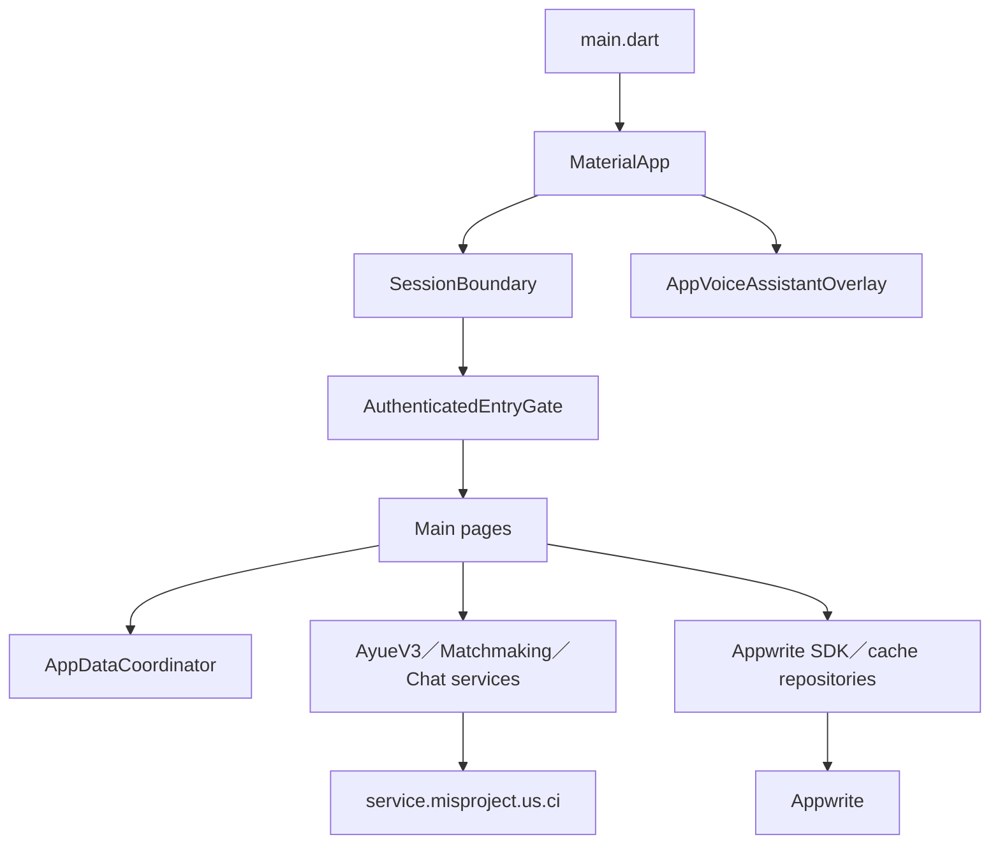
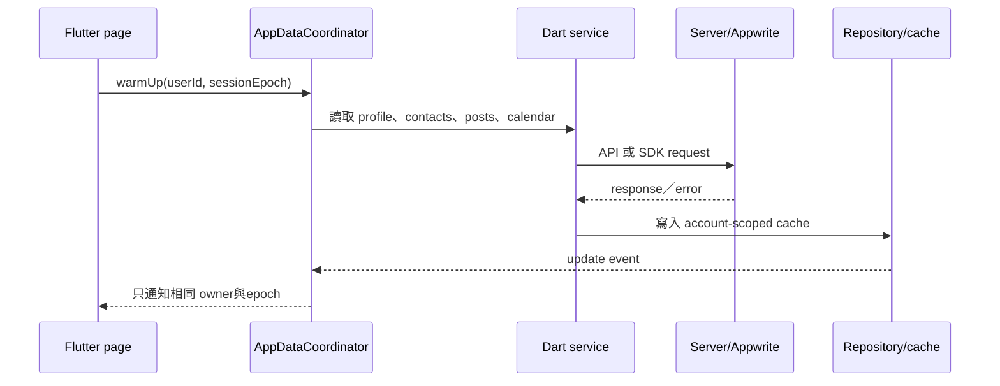

# 03 — DatingApp 前端架構

## Relevant Source Files

- `DatingApp/lib/main.dart:L46-L145`
- `DatingApp/lib/pages/main_page.dart:L62-L101`
- `DatingApp/lib/services/app_session.dart`
- `DatingApp/lib/services/app_data_coordinator.dart:L79-L145`
- `DatingApp/lib/services/ayue_v3_api_service.dart:L953-L1005`
- `DatingApp/lib/services/chat_service.dart:L572-L810`

## TL;DR

DatingApp 是 Flutter 多平台 client，將畫面、session、API adapter、Appwrite SDK、快取、推播與語音互動組合成一個帳號範圍的使用者體驗。`main.dart` 只負責建立根環境；實際功能由 page 呼叫 service，再由 coordinator 與 cache 管理資料生命週期。關鍵原則是頁面呈現的狀態不能取代後端 canonical state，尤其是配對、風險與約會決策。

## Overview

啟動時，App 先初始化 Flutter binding、Appwrite 與 Windows 視窗；Firebase 初始化在非同步區塊中進行，失敗時只停用推播而不阻止 App 啟動。`MaterialApp` 外包 `SessionBoundary` 與 `AppVoiceAssistantOverlay`，表示登入狀態和全域語音功能高於單一 page。[根 Widget](../../DatingApp/lib/main.dart:L46-L145)

登入後的主要頁面由 `MainPage` 組成，包含聊天清單、配對、設定與結果頁。頁面利用 `AppDataCoordinator` 預熱 profile、contacts、posts、calendar 等資料，並以 session epoch 避免舊帳號的非同步結果污染新帳號。[MainPage](../../DatingApp/lib/pages/main_page.dart:L62-L101)、[Coordinator](../../DatingApp/lib/services/app_data_coordinator.dart:L79-L145)

## Architecture Diagram

## Key Concepts

| Concept | Description | Source |
|---|---|---|
| `SessionBoundary` | 讓根畫面隨登入、登出與 session epoch 變化 | `DatingApp/lib/main.dart:L98-L105` |
| `AuthenticatedEntryGate` | 決定顯示登入、註冊或主頁 | `DatingApp/lib/main.dart:L144-L145` |
| `AppDataCoordinator` | 以帳號與 epoch 管理 warmup、cache、更新事件 | `DatingApp/lib/services/app_data_coordinator.dart:L79-L145` |
| `SessionHttpClient` | API client 共用的 session-aware HTTP 層 | `DatingApp/lib/services/ayue_v3_api_service.dart:L959-L970` |
| `RealtimeSubscription` | Appwrite chat collection 的即時訊息通道 | `DatingApp/lib/services/chat_service.dart:L776-L782` |

## How It Works

### 啟動與導航

`main()` 初始化 Appwrite、可用的平台能力與 Firebase，再執行 `runApp`。`MyApp` 將 theme、push navigation key、voice navigation observer、session boundary 與 voice overlay 組合在一起。登入頁完成後，`AuthenticatedEntryGate` 才會把使用者送進 `MainPage`；這使登入檢查集中在根部，而不是每個功能頁各自複製。

### 資料預熱與快取

`AppDataCoordinator` 監聽 profile、contacts、posts、calendar 的更新 stream，將資料變化轉成帶有 `ownerId` 與 `sessionEpoch` 的事件。功能頁仍可注入 fake service 做測試，但 production 呼叫會共用 coordinator 與 repository。這種設計減少重複 request，也能在登出或帳號切換時丟棄過期結果。

### API 與外部 SDK

`AyueV3ApiService`、`MatchmakingApiService`、`ChatService` 和各 repository 分別負責不同契約。前端把 endpoint、timeout、JSON envelope、NDJSON stream 與錯誤碼轉成 Dart model；Appwrite 則透過 `AppwriteConfig.getClient()` 直接處理帳號、文件與檔案。文件後續應以功能流程為中心，避免把多個 client 當成一個模糊的「API service」。

## Component Reference

| Component | Type | Responsibility | Source |
|---|---|---|---|
| `main()` | function | SDK 與根 App 初始化 | `DatingApp/lib/main.dart:L46-L67` |
| `MyApp` | widget | 建立導航、theme、Session 與 Voice overlay | `DatingApp/lib/main.dart:L70-L145` |
| `MainPage` | page | 主頁 tabs 與 warmup 觸發 | `DatingApp/lib/pages/main_page.dart:L62-L101` |
| `AppDataCoordinator` | coordinator | 跨頁資料 warmup、cache 與更新事件 | `DatingApp/lib/services/app_data_coordinator.dart:L79-L145` |
| `AyueV3ApiService` | API adapter | Agent、配對、行事曆及關係 API | `DatingApp/lib/services/ayue_v3_api_service.dart:L953-L1005` |

## Data Flow

## Error Handling

API service 會把非 2xx、NDJSON 格式錯誤與 timeout 轉成可顯示的 exception；頁面再決定顯示錯誤、保留舊資料或要求重新整理。Firebase 初始化失敗是被允許的降級路徑，但 Appwrite session、API domain 與功能資料失敗的處理並不相同，不能用「推播失敗」的寬鬆策略套用到登入或配對。

## Gotchas & Conventions

> ⚠️ **Gotcha**：`AppDataCoordinator` 的事件包含帳號與 session epoch；新增 cache 若沒有同樣的 ownership guard，可能在快速登出／登入後顯示上一個使用者的資料。

> 📌 **Convention**：前端以 status/card API 的結果更新 domain state，不應從 Agent 回覆文字猜測配對或行事曆是否成功。

> ❓ **[NEEDS INVESTIGATION]**：各平台的背景推播、WebSocket 與錄音能力是否完全一致，需要逐平台測試矩陣補充。

## Active Development Areas

App Voice、`AyueV3ApiService` 的 NDJSON parser、chat realtime/polling fallback、session epoch 與新頁面 cache 是目前最需要跨頁回歸測試的區域。

## Cross-References

- 身分與 Session：[04 — 身分驗證與個人資料](04-auth-profile.md)
- Agent API：[05 — 阿月與 Agent](05-ai-agent.md)
- 聊天 client：[07 — 聊天與風險治理](07-chat-risk.md)
- 語音 client：[08 — 語音互動](08-voice.md)
