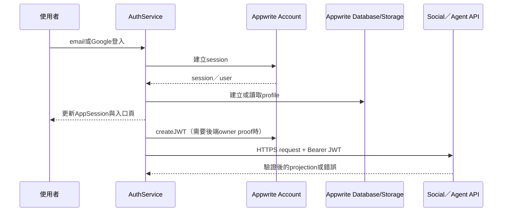
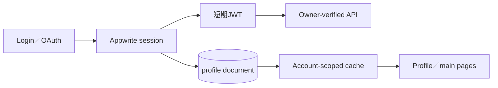

# 04 — 身分驗證與個人資料

## Relevant Source Files

- `DatingApp/lib/services/auth_service.dart:L1-L45`
- `DatingApp/lib/services/auth_service.dart:L90-L145`
- `DatingApp/lib/services/auth_service.dart:L220-L310`
- `DatingApp/lib/services/appwrite_config.dart:L3-L35`
- `DatingApp/lib/services/appwrite_jwt_provider.dart:L1-L80`
- `Server/social/routers/system.py`
- `Server/social/services/appwrite_identity_service.py`

## TL;DR

前端使用 Appwrite Account 處理 email/password 與 Google OAuth，並以 Appwrite Database／Storage 保存或讀取個人資料與檔案；需要後端驗證的 Agent 或外部日曆請求，會在允許的公開 HTTPS 網域上附帶 Appwrite JWT。身分驗證、profile document、Server 端 owner proof 是不同層次，不能把「成功登入」直接等同於「所有後端能力已授權」。

## Overview

`AuthService` 建立 Appwrite client、Account、Databases 與 Storage。email login 呼叫 `createEmailPasswordSession`，register 呼叫 `Account.create`，Google login 走 OAuth2 session；成功後更新 `AppSession` 的明確登出狀態。[AuthService](../../DatingApp/lib/services/auth_service.dart:L1-L145)

帳號建立後，服務會透過 profile collection 建立或更新使用者資料；檔案則使用 Appwrite Storage。`AppwriteConfig` 集中放置 endpoint、database／collection／bucket 的識別名稱，並提供 client 建構函式。[Appwrite 設定](../../DatingApp/lib/services/appwrite_config.dart:L3-L35) 這些識別值可作為架構證據，但文件不公開任何私密憑證。

Agent API 的 JWT 由 `AppwriteJwtProvider` 取得，`AyueV3ApiService` 只在 HTTPS、正式網域、線上 session 且 user id 相符時附加 Authorization header。無法取得 JWT 時，既有聊天仍可能可用，但外部 Calendar owner proof 會被保留或拒絕。[JWT 附加條件](../../DatingApp/lib/services/ayue_v3_api_service.dart:L976-L1000)

## Architecture Diagram

## Key Concepts

| Concept | Description | Source |
|---|---|---|
| Appwrite Account | 帳號、session、OAuth 的身分來源 | `DatingApp/lib/services/auth_service.dart:L19-L34` |
| Profile document | 登入帳號外的產品個人資料 | `DatingApp/lib/services/auth_service.dart:L220-L310` |
| Owner proof | 後端確認請求者確實擁有 user id 的 JWT 證據 | `DatingApp/lib/services/ayue_v3_api_service.dart:L976-L1000` |
| Explicit sign-out | 由 AppSession 保存的登出意圖，避免單純 getCurrentUser 猜測狀態 | `DatingApp/lib/services/auth_service.dart:L100-L109` |
| Account-scoped cache | 與 owner 與 session epoch 綁定的前端快取 | `DatingApp/lib/services/app_data_coordinator.dart:L79-L145` |

## How It Works

### 登入與註冊

email login 與 register 使用 Appwrite SDK；Google OAuth 的 callback 在 Web 會使用目前 URL。登入成功後 `AppSession` 解除 `explicitlySignedOut`，根層的 authenticated gate 重新決定顯示內容。錯誤會由 AuthService 往上拋，頁面負責呈現訊息與保留輸入。

### Profile 與媒體

profile collection 與檔案 bucket 不是同一個資料面。建立個人資料時，AuthService 使用 database document；頭像或其他媒體則透過 Storage 上傳並保存 file id。貼文另有自己的 collection與bucket，詳見 [11 — 社群、貼文與媒體](11-social-media.md)。

### 後端身份邊界

一般 API request 可能只帶 user id，Agent、外部 Calendar 與語音 session 則要求更強的 owner proof 或 session ticket。前端會限制 JWT 只送往固定 HTTPS host，後端再依 route 的驗證 helper 或服務檢查 owner／consent。文件不能推論所有 `/api/*` 端點都採用同一種驗證強度。

## Component Reference

| Component | Type | Responsibility | Source |
|---|---|---|---|
| `AuthService` | Dart service | Appwrite auth、profile與storage facade | `DatingApp/lib/services/auth_service.dart:L19-L34` |
| `AppwriteConfig` | Dart config | SDK endpoint、project與資源識別 | `DatingApp/lib/services/appwrite_config.dart:L3-L35` |
| `AppwriteJwtProvider` | Dart provider | 取得登入者 JWT | `DatingApp/lib/services/appwrite_jwt_provider.dart:L1-L80` |
| `AppSession` | Dart state | 保存登入者、epoch與登出意圖 | `DatingApp/lib/services/app_session.dart` |
| `appwrite_identity_service` | Python service | Server 端 Appwrite identity／owner 輔助 | `Server/social/services/appwrite_identity_service.py` |

## Data Flow

## Error Handling

常見失敗包括帳號憑證錯誤、OAuth callback 失敗、profile document 不存在、JWT 取得逾時與 owner mismatch。前端需把這些分成可重試、需重新登入、需完成 profile 與權限不足，而不是全部顯示成「網路錯誤」。後端若不能證明 owner，應維持 fail closed，避免用 user id 字串作為唯一信任來源。

## Gotchas & Conventions

> ⚠️ **Gotcha**：`AppwriteConfig` 中的 public project／bucket identifiers 不是 secret；真正的 secret 仍應由環境設定管理，不能把 `.env` 內容貼入文件。

> 📌 **Convention**：session epoch 是 cache 正確性的必要條件。所有延遲 callback 都要檢查目前 owner 與 epoch。

> ❓ **[NEEDS INVESTIGATION]**：正式 Appwrite collection attributes、permissions 與 Server identity middleware 尚未以線上 schema 逐項核對。

## Active Development Areas

App Voice session、Agent JWT owner proof、profile completion gate、push subscription 與 account-scoped cache 是目前最需要一起維護的身份相關區域。

## Cross-References

- 前端生命週期：[03 — DatingApp 前端架構](03-datingapp-architecture.md)
- Agent 授權：[05 — 阿月與 Agent](05-ai-agent.md)
- API 錯誤與驗證：[12 — API 與資料契約](12-api-data-contracts.md)
