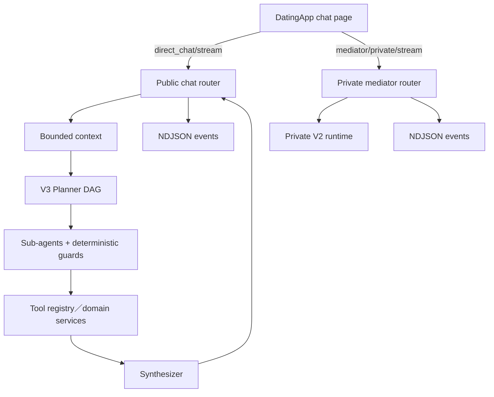
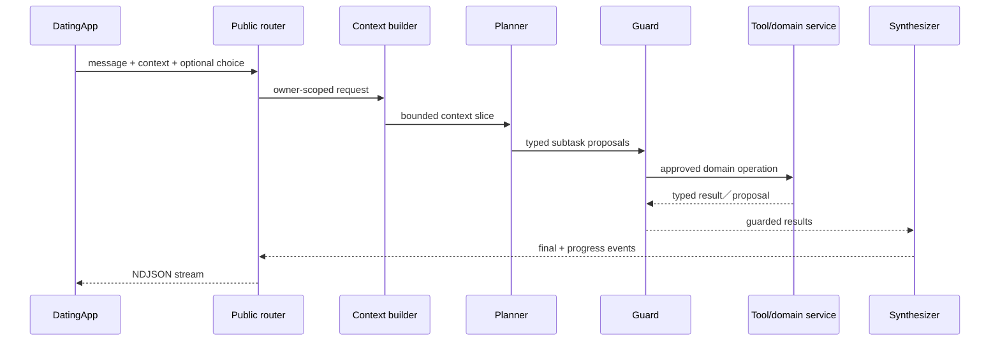

# 05 — 阿月與 Agent

## Relevant Source Files

- `Server/social/routers/public_chat.py:L250-L355`
- `Server/social/services/ayue_agent/public_runtime.py:L1-L23`
- `Server/social/services/ayue_agent/v3/scheduler.py`
- `Server/social/services/ayue_agent/tool_registry.py`
- `Server/social/routers/private_mediator.py:L1-L240`
- `DatingApp/lib/services/ayue_v3_api_service.dart:L1261-L1385`
- `DatingApp/lib/pages/match_chat_page.dart:L593-L721`

## TL;DR

阿月分成公開 runtime 與私人媒婆 runtime：公開對話走 Public V3 的 scheduler／sub-agent 架構，私人悄悄話則由獨立 Private V2 runtime 負責。DatingApp 以 NDJSON stream 傳送使用者訊息與互動選項，Server 將 context、planner、tool guard、domain service 與 synthesizer 組合成回覆。公開與私人 runtime 不應混成一條 fallback 路徑，這是目前架構的核心邊界。

## Overview

公開聊天 router 只負責 HTTP facade、訊息保存前置條件、風險邊界與 stream response 的組裝；實際的 Public Agent runner 位於 `services/ayue_agent`。工作區規則明確指定 Public V3 的唯一 orchestrator 是 `v3/scheduler.py`，流程為 Context → Planner(DAG) → Sub-agents(Guard+Tool) → Synthesizer → Final。這份架構規則應優先於檔名中看起來像舊版本的相容 contract。

私人媒婆頁面則呼叫 `/api/mediator/private/stream`，後端由 `private_mediator.py` 轉交獨立 private runtime。兩者可共用 domain service，但 context、privacy namespace、tool policy 與 trace 不可互相滲透。[前端雙 stream](../../DatingApp/lib/services/ayue_v3_api_service.dart:L1261-L1385)

## Architecture Diagram

## Key Concepts

| Concept | Description | Source |
|---|---|---|
| Public V3 | 公開阿月唯一現役的 DAG orchestrator | `Server/social/services/ayue_agent/v3/scheduler.py`、`Server/docs/AGENTS.md` |
| Private V2 | 與 Public 隔離的私人媒婆 runtime | `Server/social/routers/private_mediator.py:L1-L240` |
| Stream event | 前端逐段接收的 NDJSON typed event | `DatingApp/lib/services/ayue_v3_api_service.dart:L1309-L1340` |
| Tool Registry | 工具能力、schema、風險與 confirmation 的唯一入口 | `Server/social/services/ayue_agent/tool_registry.py` |
| Proposal／completed result | Sub-agent 輸出的兩種 typed 結果形狀 | `Server/docs/AGENTS.md` |

## How It Works

### 公開訊息

`AyueV3ApiService.streamPublicMessage` 將 user、message、mentioned ids、choice、focused match revision 與 device location 組成 request，並只在正式 HTTPS host 和有效 session 條件下附加 JWT。Server 收到後，公開 router 會處理 owner、room、訊息保存與 stream envelope，再呼叫 Public runtime。

Public V3 先建立 bounded context，再由 Planner 產生靜態 DAG。各 sub-agent 只能提出符合 schema 的 tool proposal，Guard 驗證權限、evidence、confirmation、revision、idempotency 與 budget；需要副作用的 domain action 不由模型直接執行。最後由 synthesizer 組合結果和使用者可見文字，並以 progress、choice、confirmation 或 final event 回傳。

### 私人訊息

私人頁面送 `other_id` 與訊息到另一條 endpoint。Private runtime 可以處理雙方關係語境，但不應讀取對方未同意分享的私人 Agent 內容。前端用同一個 NDJSON decoder，但這不代表兩個 runtime 共用相同的 domain policy。

### 前端串流

公開 stream 具有約 30 秒建立 timeout、整體約 150 秒 deadline 與 NDJSON parser；私人 stream 具有自己的 request／chunk timeout。逾時時前端會取消 iterator，並提示後端可能仍在處理，避免使用者重複送出同一個副作用請求。[公開 timeout](../../DatingApp/lib/services/ayue_v3_api_service.dart:L1297-L1340)

## Component Reference

| Component | Type | Responsibility | Source |
|---|---|---|---|
| `public_chat` | FastAPI router | 公開聊天 HTTP facade與stream | `Server/social/routers/public_chat.py:L250-L355` |
| `public_runtime` | runtime facade | 將公開 turn 交給 Public V3 | `Server/social/services/ayue_agent/public_runtime.py:L7-L12` |
| `scheduler.py` | orchestrator | V3 DAG、budget、guard與結果彙整 | `Server/social/services/ayue_agent/v3/scheduler.py` |
| `tool_registry.py` | registry | typed tool spec與執行權限 | `Server/social/services/ayue_agent/tool_registry.py` |
| `private_mediator` | FastAPI router | 私人媒婆 stream facade | `Server/social/routers/private_mediator.py:L1-L240` |
| `AyueV3ApiService` | Dart adapter | 公開／私人 stream client | `DatingApp/lib/services/ayue_v3_api_service.dart:L1261-L1385` |

## Data Flow

## Error Handling

模型逾時、低信心、schema 不合法、tool 失敗或 confirmation 缺失時，應停止未確認的副作用並回傳 bounded error／clarification。Public V3 失敗不得在 request-level 自動切回另一個舊 public runtime；Private V2 的失敗也不能被當成 Public fallback。前端若看到 incomplete stream，應保留可追查的錯誤碼而不是把部分文字當成成功結果。

## Gotchas & Conventions

> ⚠️ **Gotcha**：檔名中出現 `v1`、`v2` 的 typed payload 不一定代表 runtime 版本；以 `Server/docs/AGENTS.md` 的現行 runtime ownership 為準。

> 📌 **Convention**：模型只做語意判斷，程式做身份、狀態、權限、revision、idempotency 與安全決策。

> ❓ **[NEEDS INVESTIGATION]**：各模型 provider 的正式 fallback、配額與 live voice 可用性需要以部署設定及健康檢查補證。

## Active Development Areas

Public V3 scheduler、tool registry、typed context slice、stream event compatibility、App Voice action routing 與 Private V2 privacy boundary 是最敏感的維護區域。

## Cross-References

- 前端 stream：[03 — DatingApp 前端架構](03-datingapp-architecture.md)
- 語音 Agent：[08 — 語音互動](08-voice.md)
- 記憶 context：[09 — 記憶、摘要與圖譜](09-memory-graph.md)
- API 契約：[12 — API 與資料契約](12-api-data-contracts.md)
