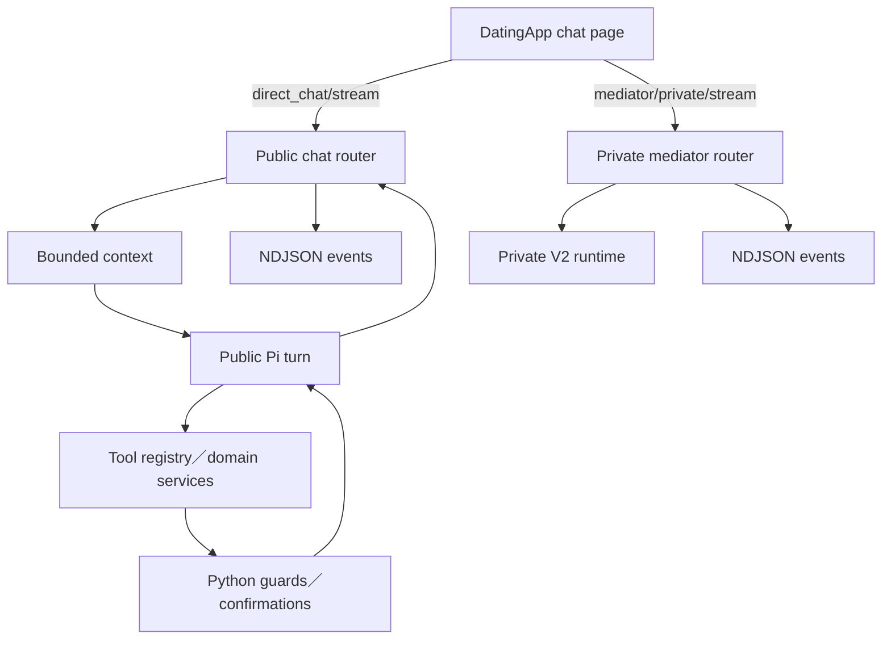
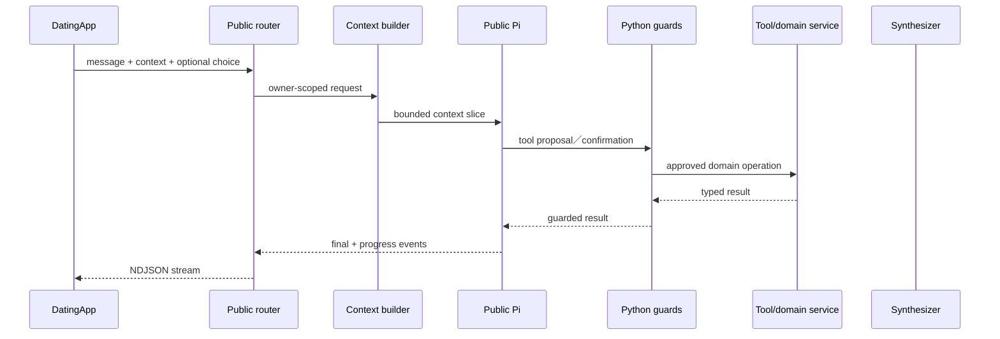

# 05 — 阿月與 Agent

## Relevant Source Files

- `Server/social/routers/public_chat.py:L250-L355`
- `Server/social/services/ayue_agent/public_runtime.py:L1-L23`
- `Server/social/services/ayue_agent/pi/public_turn.py`
- `Server/social/services/ayue_agent/pi/runtime.py:L1-L80`
- `Server/social/services/ayue_agent/tool_registry.py`
- `Server/social/routers/private_mediator.py:L1-L240`
- `DatingApp/lib/services/ayue_v3_api_service.dart:L1261-L1385`
- `DatingApp/lib/pages/match_chat_page.dart:L593-L721`

## TL;DR

阿月分成公開 runtime 與私人媒婆 runtime。工作區規則把公開架構命名為 Public V3，但目前 checkout 中可直接追到的公開入口是 `public_runtime → pi.public_turn → pi/runtime`；私人悄悄話則由獨立 Private Pi／Private V2 runtime 負責。DatingApp 以 NDJSON stream 傳送使用者訊息與互動選項，公開與私人 runtime 不應混成一條 fallback 路徑。

## Overview

公開聊天 router 只負責 HTTP facade、訊息保存前置條件、風險邊界與 stream response 的組裝；實際 checkout 會由 `public_runtime.py` 轉交 `pi/public_turn.py` 與 `pi/runtime.py`。`pi/runtime.py` 的模組說明是 Pi 負責 intent／tool iteration，而 Python 負責 credentials、bounded context、guards、confirmations 與 writes。`Server/docs/AGENTS.md` 仍描述 Public V3 Scheduler／Planner／Sub-agents／Synthesizer；目前沒有在 checkout 找到該 `v3/scheduler.py`，因此兩者的版本對應必須標成待確認。

私人媒婆頁面則呼叫 `/api/mediator/private/stream`，後端由 `private_mediator.py` 轉交獨立 private runtime。兩者可共用 domain service，但 context、privacy namespace、tool policy 與 trace 不可互相滲透。[前端雙 stream](../../DatingApp/lib/services/ayue_v3_api_service.dart:L1261-L1385)

## Architecture Diagram

## Key Concepts

| Concept | Description | Source |
|---|---|---|
| Public runtime naming | 工作區規則稱 Public V3；目前 source path 可直接追到 Public Pi runtime | `Server/docs/AGENTS.md`、`Server/social/services/ayue_agent/public_runtime.py:L7-L12` |
| Private V2 | 與 Public 隔離的私人媒婆 runtime | `Server/social/routers/private_mediator.py:L1-L240` |
| Stream event | 前端逐段接收的 NDJSON typed event | `DatingApp/lib/services/ayue_v3_api_service.dart:L1309-L1340` |
| Tool Registry | 工具能力、schema、風險與 confirmation 的唯一入口 | `Server/social/services/ayue_agent/tool_registry.py` |
| Proposal／completed result | Sub-agent 輸出的兩種 typed 結果形狀 | `Server/docs/AGENTS.md` |

## How It Works

### 公開訊息

`AyueV3ApiService.streamPublicMessage` 將 user、message、mentioned ids、choice、focused match revision 與 device location 組成 request，並只在正式 HTTPS host 和有效 session 條件下附加 JWT。Server 收到後，公開 router 會處理 owner、room、訊息保存與 stream envelope，再呼叫 Public runtime。

目前 source path 顯示 Public Pi 由 `public_turn` 建立 public turn，再以 registry tool schemas 與 `PiToolRuntime` 執行工具迭代；Python 邊界負責 bounded context、guard、confirmation、revision、idempotency 與 writes。工作區規則所描述的 Planner／DAG／Synthesizer 可能是設計契約、未合併分支或尚未更新的 implementation；文件不能把它直接寫成已在此 revision 執行的程式碼。

### 私人訊息

私人頁面送 `other_id` 與訊息到另一條 endpoint。Private runtime 可以處理雙方關係語境，但不應讀取對方未同意分享的私人 Agent 內容。前端用同一個 NDJSON decoder，但這不代表兩個 runtime 共用相同的 domain policy。

### 前端串流

公開 stream 具有約 30 秒建立 timeout、整體約 150 秒 deadline 與 NDJSON parser；私人 stream 具有自己的 request／chunk timeout。逾時時前端會取消 iterator，並提示後端可能仍在處理，避免使用者重複送出同一個副作用請求。[公開 timeout](../../DatingApp/lib/services/ayue_v3_api_service.dart:L1297-L1340)

## Component Reference

| Component | Type | Responsibility | Source |
|---|---|---|---|
| `public_chat` | FastAPI router | 公開聊天 HTTP facade與stream | `Server/social/routers/public_chat.py:L250-L355` |
| `public_runtime` | runtime facade | 將公開 turn 交給 Public V3 | `Server/social/services/ayue_agent/public_runtime.py:L7-L12` |
| `public_turn.py`／`pi/runtime.py` | runtime | 公開回合、provider、tool iteration與safe stream boundary | `Server/social/services/ayue_agent/pi/public_turn.py`、`Server/social/services/ayue_agent/pi/runtime.py:L1-L80` |
| `tool_registry.py` | registry | typed tool spec與執行權限 | `Server/social/services/ayue_agent/tool_registry.py` |
| `private_mediator` | FastAPI router | 私人媒婆 stream facade | `Server/social/routers/private_mediator.py:L1-L240` |
| `AyueV3ApiService` | Dart adapter | 公開／私人 stream client | `DatingApp/lib/services/ayue_v3_api_service.dart:L1261-L1385` |

## Data Flow

## Error Handling

模型逾時、低信心、schema 不合法、tool 失敗或 confirmation 缺失時，應停止未確認的副作用並回傳 bounded error／clarification。無論目前 runtime 最終命名是 Public V3 或 Public Pi，公開回合都不應在 request-level 自動切回另一個 public runtime；Private V2 的失敗也不能被當成 Public fallback。前端若看到 incomplete stream，應保留可追查的錯誤碼而不是把部分文字當成成功結果。

## Gotchas & Conventions

> ⚠️ **Gotcha**：檔名中出現 `v1`、`v2` 的 typed payload 不一定代表 runtime 版本；以 `Server/docs/AGENTS.md` 的現行 runtime ownership 為準。

> 📌 **Convention**：模型只做語意判斷，程式做身份、狀態、權限、revision、idempotency 與安全決策。

> ❓ **[NEEDS INVESTIGATION]**：各模型 provider 的正式 fallback、配額與 live voice 可用性需要以部署設定及健康檢查補證。

## Active Development Areas

Public runtime 命名／實作對齊、Pi tool registry、typed context slice、stream event compatibility、App Voice action routing 與 Private V2 privacy boundary 是最敏感的維護區域。

## Cross-References

- 公開阿月詳細流程：[05.1 — 公開阿月](05.1-public-ayue.md)
- 私人媒人詳細流程：[05.2 — 阿月悄悄話](05.2-private-ayue.md)
- Pi Agent 執行核心：[05.3 — Pi Agent 架構](05.3-pi-agent-architecture.md)
- 前端 stream：[03 — DatingApp 前端架構](03-datingapp-architecture.md)
- 語音 Agent：[08 — 語音互動](08-voice.md)
- 記憶 context：[09 — 記憶、摘要與圖譜](09-memory-graph.md)
- API 契約：[12 — API 與資料契約](12-api-data-contracts.md)
