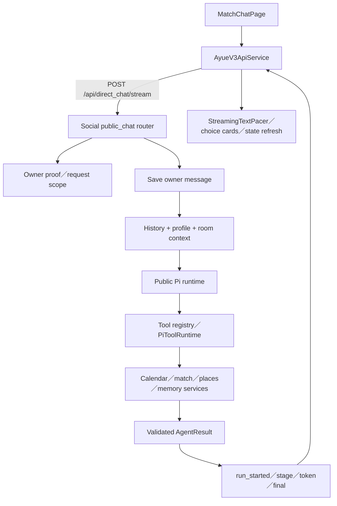
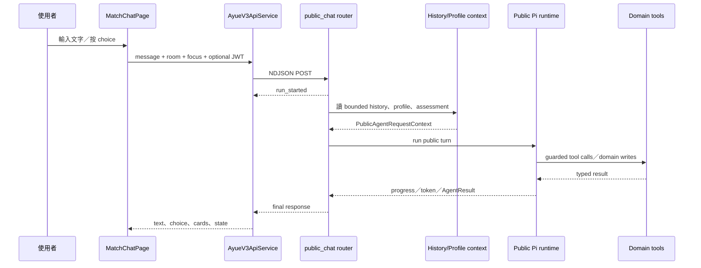

# 05.1 — 公開阿月：主聊天室與 Agent 回合

## Relevant Source Files

- `DatingApp/lib/pages/match_chat_page.dart:L126-L270`
- `DatingApp/lib/pages/match_chat_page.dart:L1298-L1435`
- `DatingApp/lib/services/ayue_v3_api_service.dart:L1261-L1341`
- `Server/social/routers/public_chat.py:L266-L355`
- `Server/social/routers/public_chat.py:L605-L715`
- `Server/social/services/ayue_agent/public_runtime.py:L1-L23`
- `Server/social/services/ayue_agent/pi/public_turn.py`
- `Server/social/services/ayue_agent/pi/runtime.py:L1-L80`
- `Server/social/services/ayue_agent/pi/registry.py`
- `Server/tests/contracts/test_public_ayue_stream_contract.py:L22-L90`

## TL;DR

公開阿月是 DatingApp 的主要 AI 聊天入口，提供一般問答、個人化建議、配對查詢、活動／地點探索、行事曆與互動選項。前端以 `/api/direct_chat/stream` 傳送訊息，Social 先保存 owner message、組合 bounded context，再交給公開 Pi runtime，最後以 NDJSON events 回到聊天室。這個功能的安全重點是：模型只能透過已註冊工具提出能力需求，狀態寫入與確認由 Python domain service 掌握；目前 repository instruction 對 Public V3 的描述，與 checkout 中實際存在的 Pi public runtime 命名仍有待核對。

## Overview

`MatchChatPage` 同時承擔公開阿月聊天室、語音上下文、配對卡片與多房間 AI room。頁面註冊 `AppVoiceSessionRoomScope`，把最後 20 則可見訊息、地點 cards、目前 room title 與可用 action 編成 voice context；可用 action 包含 `match.query`、`match.ayue_query`、`ayue.public_query` 與 `personality.explore`。[頁面 scope](../../DatingApp/lib/pages/match_chat_page.dart:L196-L255)

使用者送出文字時，`AyueV3ApiService.streamPublicMessage` 將 user id、message、mentions、choice、focused match revision、room id 與 device location 組成 request。前端只對正式 HTTPS origin 附加 JWT，接著讀取 NDJSON stream；建立連線約 30 秒、整體回合約 150 秒，超時會取消 iterator 並提示使用者避免重送。[公開串流 client](../../DatingApp/lib/services/ayue_v3_api_service.dart:L1261-L1341)

Server 端的 `direct_chat_stream` 先建立 event queue，再判斷是否為 `ai_assistant`。公開阿月請求需要通過 `authenticated_owner_matches` 的 owner proof（若請求使用需要身份的能力），並可透過 `X-Ayue-Stream-Tokens: v1` opt-in token events。worker 執行公開回合、發送安全化 progress／token／final event；即使 client disconnect，回合內的 background tasks 仍會在 worker 中收尾。[stream router](../../Server/social/routers/public_chat.py:L605-L715)

## Architecture Diagram

## Key Concepts

| Concept | Description | Source |
|---|---|---|
| Public room | `ai_assistant` 或 named AI room；由前端 `aiRoomId` 區分 | `DatingApp/lib/pages/match_chat_page.dart:L176-L186` |
| Public request context | 回合使用的 owner、room、message、history、profile、mentions 與 focus state | `Server/social/routers/public_chat.py:L266-L316` |
| Owner message path | owner message 在 Agent turn 前保存並帶入 `message_id` | `Server/social/routers/public_chat.py:L266-L330` |
| Public stream event | `run_started`、progress、token、final、error 的 NDJSON envelope | `Server/social/routers/public_chat.py:L631-L715` |
| Token opt-in | 前端只有帶 `X-Ayue-Stream-Tokens: v1` 才接收 token events | `Server/social/routers/public_chat.py:L622-L648` |
| Tool registry | Agent 可使用的能力與 schema 集合 | `Server/social/services/ayue_agent/pi/registry.py` |
| AgentResult | 回覆、cards、sources、choices、calendar state與memory metadata 的結果物件 | `Server/social/services/ayue_agent/contracts.py` |

## How It Works

### 1. 頁面建立回合

頁面啟動時會初始化目前使用者、載入 room history、profile／context、notification preference 與 match status。多房間模式會把 `aiRoomId` 放入 request；若指定 room 找不到，頁面可以清除該 room cache，再依 `requireExactRoom` 決定顯示錯誤或回到預設聊天室。這避免語音專用 room 失效時偷偷把訊息送到另一個 room。[room 初始化](../../DatingApp/lib/pages/match_chat_page.dart:L368-L440)

### 2. Owner message 與 context

Server 的 `_complete_public_turn` 從 Mongo 取最近 32 則訊息，標記 history 是否被截斷，讀取 profile 並更新 owner memory profile，再依 assessment session、room、mentions、focused match 與 device location 建立 `PublicAgentRequestContext`。Agent 得到的是 bounded history，不是整個資料庫或未過濾的 graph document。[context 組裝](../../Server/social/routers/public_chat.py:L266-L316)

### 3. Pi runtime 與工具

目前 checkout 的實際 public runtime 由 `public_runtime.py` 轉到 `pi.public_turn.run_pi_public_turn`，再使用 `pi/runtime.py` 的 Pi process、provider、tool schemas 與 `PiToolRuntime`。`pi/runtime.py` 的模組註解明確表示 Pi 負責 intent／tool iteration，而 Python 負責 model credentials、bounded context、guards、confirmations 與 writes。[Pi runtime](../../Server/social/services/ayue_agent/pi/runtime.py:L1-L29)

工作區 `Server/docs/AGENTS.md` 將現行架構命名為 Public V3，並要求 Scheduler／Planner／Sub-agents／Synthesizer 的 owner 規則；但目前檔案樹未找到 `services/ayue_agent/v3/scheduler.py`，而公開入口仍指向 Pi runtime。這是文件與 implementation 的重要差異，不能在正式交付前假設兩者完全相同。[NEEDS INVESTIGATION]：需由維護者確認 checkout 是否漏掉分支、生成碼或新 runtime 的搬遷。

### 4. 回覆與前端呈現

AgentResult 回到 `_complete_public_turn` 後，Server 會限制 reply 數量、sources、place cards、presentation blocks，寫入 assistant message metadata，再輸出 public response。stream router 只公開通過 `_sanitize_public_stream_event` 的欄位；前端 `StreamingTextPacer` 將 token 轉成平滑文字，final response 再更新 sources、choice、calendar state 與 proposal cards。[前端回合處理](../../DatingApp/lib/pages/match_chat_page.dart:L1298-L1435)

### 5. 互動選項與副作用

阿月不應用自然語言猜測使用者是否確認。當回覆帶有 choice prompt，頁面會把 choice 註冊成可見控制；語音或使用者按鈕送 `choice_id`、`choice_action` 回到同一個 room。行事曆 confirmation 成功的判定還會檢查 `calendarStateChanged`，只有真的改變 canonical state 才回報成功。[語音 action 對公開阿月的橋接](../../DatingApp/lib/pages/match_chat_page.dart:L484-L600)

## Component Reference

| Component | Type | Responsibility | Source |
|---|---|---|---|
| `MatchChatPage` | Flutter page | 顯示公開阿月、room、stream、cards與voice scope | `DatingApp/lib/pages/match_chat_page.dart:L126-L270` |
| `streamPublicMessage` | Dart stream client | 建立公開 request、讀取 NDJSON與處理 timeout | `DatingApp/lib/services/ayue_v3_api_service.dart:L1261-L1341` |
| `direct_chat_stream` | FastAPI route | queue、owner proof、worker與stream envelope | `Server/social/routers/public_chat.py:L605-L715` |
| `_complete_public_turn` | Python orchestration facade | bounded history、profile、context、AgentResult與message projection | `Server/social/routers/public_chat.py:L266-L355` |
| `run_public_agent_turn` | runtime facade | 將 public turn 交給 public runtime | `Server/social/services/ayue_agent/public_runtime.py:L7-L12` |
| `PiToolRuntime` | tool executor | 以 registry contract 執行受控能力 | `Server/social/services/ayue_agent/pi/tool_runtime.py` |

## Data Flow

## Configuration & Environment

重要設定包括 `MATCHMAKER_API_URL`（client base URL override）、`X-Ayue-Stream-Tokens` protocol、Agent provider credentials、Pi bridge path、model timeout、agent quota、CORS origin、Appwrite identity 與 Mongo connection。文件只列設定名稱；值必須留在 runtime environment。

## Error Handling

公開回合可能在 owner proof、room lookup、provider、tool schema、tool execution、stream transport 或 final validation 失敗。Server 會用 error event 和固定 retry reply 結束，前端會保留「後端可能仍在處理」的提示，避免重複副作用。若工具已寫入 canonical state 但 final response 遺失，下一步應讀 status/state API，不要重送同一個 choice。

## Gotchas & Conventions

> ⚠️ **Gotcha**：`direct_chat/stream` 對 `ai_assistant` 與一般 contact 的行為不同；非 public contact 仍維持 direct JSON final event，不能把所有 stream 都當作 Public Agent。

> 📌 **Convention**：owner message、Agent reply、progress event、choice card 與 debug trace 的保存用途不同；progress 不可當作聊天訊息或 domain state。

> ❓ **[NEEDS INVESTIGATION]**：Public V3 instruction 與目前 Pi public implementation 的版本對應、正式 tool registry 來源與 production rollback 邊界需由維護者確認。

## Active Development Areas

Public stream contract、Pi tool runtime、focused match context、named AI rooms、choice confirmation、calendar writes、proactive messages 與 public／private runtime separation 是公開阿月目前最需要持續維護的區域。

## Cross-References

- Agent 共通原則：[05 — 阿月與 Agent](05-ai-agent.md)
- 悄悄話：[05.2 — 阿月悄悄話](05.2-private-ayue.md)
- 配對阿月：[06.1 — 配對阿月](06.1-matchmaking-ayue.md)
- 語音控制：[08.1 — 語音阿月](08.1-voice-ayue.md)
- API 契約：[12 — API 與資料契約](12-api-data-contracts.md)
