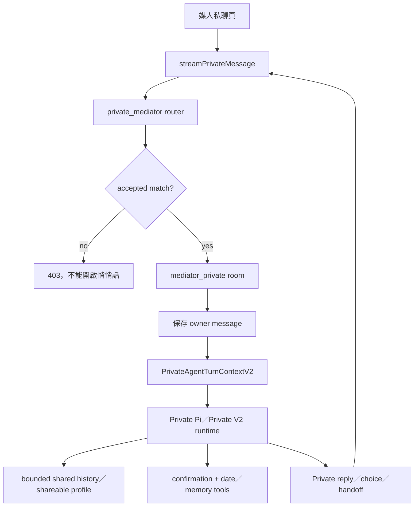
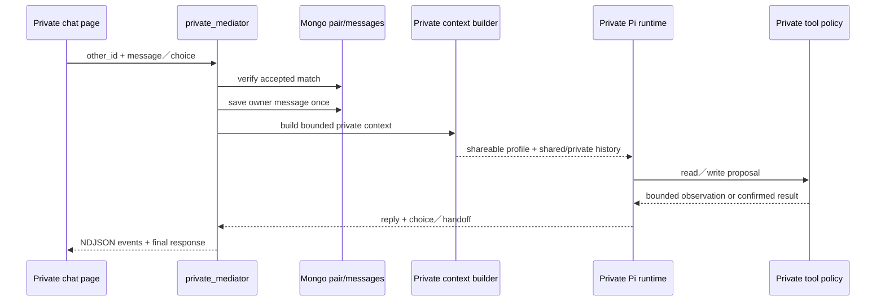

# 05.2 — 阿月悄悄話：Private Mediator

## Relevant Source Files

- `DatingApp/lib/pages/mediator_private_chat_page.dart:L120-L190`
- `DatingApp/lib/pages/mediator_private_chat_page.dart:L593-L780`
- `DatingApp/lib/services/ayue_v3_api_service.dart:L1343-L1385`
- `Server/social/routers/private_mediator.py:L1-L120`
- `Server/social/routers/private_mediator.py:L162-L248`
- `Server/social/routers/private_mediator.py:L252-L399`
- `Server/social/services/ayue_agent/private_v2.py:L91-L170`
- `Server/social/services/ayue_agent/private_v2.py:L270-L530`
- `Server/social/services/ayue_agent/private_pi/runtime.py:L132-L260`
- `Server/social/tests/test_chat_router_characterization.py:L190-L240`

## TL;DR

阿月悄悄話是使用者與媒人 Agent 的私密工作區，只能在雙方已接受配對後開啟。它與公開阿月使用不同 room、context、tool registry、history 與 privacy boundary；前端呼叫 `/api/mediator/private/stream`，Server 保存 owner message 後交給 Private Pi runtime，最後回傳 NDJSON progress／token／final。私聊可以提供關係建議、約會協調與有限的可分享資訊，但不能讀取對方未同意的私人記憶。

## Overview

後端 private router 在檔案開頭就明確區分 Private Pi runtime，並把 `run_private_agent_turn_v2` 保留為相容 symbol，但 production turn 實際指向 `run_private_pi_turn`。GET history、JSON POST 和 NDJSON stream 都先呼叫 `find_accepted_match`，沒有 accepted match 時回 403。[Private router](../../Server/social/routers/private_mediator.py:L1-L60)

私聊 room 由 `generate_mediator_private_room_id(user_id, other_id)` 產生，與 public room、一般 pair room 分離。GET history 會清理舊的 private probe state、清除 unread count，並帶回 pending feedback、date coordination 與 post-date feedback 等只屬於這個對象的 projection。[私聊 history](../../Server/social/routers/private_mediator.py:L48-L130)

這裡有一個必須明確記錄的現況差異：`Server/AYUE_V3_ARCHITECTURE.md` 仍寫「Private Ayue 維持 `private_v2.py`，不改成 Pi」，但目前 checkout 的 `private_mediator.py` 直接 import `private_pi.runtime.run_private_pi_turn`，並以 `run_private_agent_turn_v2 = run_private_pi_turn` 保留相容名稱；Private Pi 的測試也檢查 `agent_mode == "pi"`。因此本篇以目前 source path 觀察到的執行行為描述，並將架構文件更新責任列為待處理事項。[NEEDS INVESTIGATION]

## Architecture Diagram

## Key Concepts

| Concept | Description | Source |
|---|---|---|
| Accepted match gate | 只有已接受配對才允許私聊 | `Server/social/routers/private_mediator.py:L48-L56` |
| Private room | 以雙方 user id 產生的 mediator-private room | `Server/social/routers/private_mediator.py:L58-L69` |
| `PrivateAgentTurnContextV2` | owner、對方可分享資料、shared/private history、pair revision與calendar authorization | `Server/social/services/ayue_agent/private_v2.py:L91-L108` |
| Shareable projection | 可提供給觀看者的對方資訊，與對方私人 memory 分離 | `Server/social/services/ayue_agent/private_v2.py:L154-L170` |
| Choice confirmation | 約會、回饋或 memory action 的明確確認 | `Server/social/services/ayue_agent/private_v2.py:L413-L470` |
| Handoff | 將需要公開阿月處理的問題以 prefill action 轉回 public room | `Server/social/routers/private_mediator.py:L204-L226` |

## How It Works

### 1. 進入悄悄話

前端載入 `otherId` 對應的 private history；Server 驗證 accepted match，若 room 尚無訊息，建立 private welcome message。它也會清理 legacy private probe state、重設 unread count，只回傳與這段關係相關的 pending state。[GET history](../../Server/social/routers/private_mediator.py:L48-L130)

### 2. 保存 owner message

JSON POST 和 stream POST 都在非 choice turn 先保存 owner message，取得 `source_message_id` 後才執行 Agent。這個 id 會傳入 private runtime，讓後續 profile／relationship memory candidate 能指出來源；choice action 則可以跳過新增 owner message，避免把「確認」重複存成一般聊天內容。[Private JSON path](../../Server/social/routers/private_mediator.py:L252-L299)、[stream worker](../../Server/social/routers/private_mediator.py:L300-L376)

### 3. 組合 private context

`PrivateAgentTurnContextV2` 同時保存 viewer profile、對方可分享 profile、對方 advisory、shared history、private history、shared facts、pair revision、relationship semantic context、owner memories 及 external calendar authorization。`_bounded_history` 限制筆數與字元 budget，將 sender 映射成「本人／對方／阿月」，避免把 raw collection 直接交給 provider。[bounded context](../../Server/social/services/ayue_agent/private_v2.py:L91-L151)

### 4. Private runtime 與 tool policy

Private V2 先處理 explicit confirm／cancel，讀取工具只回傳 availability、shared history 或 bounded relationship context；寫入工具（例如約會協調、memory candidate）需要 confirmation，並由既有 date／memory service 執行。Private Pi runtime 會安全化 reply、移除內部資料、處理 active choices、追蹤 run id 與 failure code。[private runtime boundary](../../Server/social/services/ayue_agent/private_pi/runtime.py:L132-L260)

### 5. 回覆、choice 與 handoff

`save_private_mediator_reply` 會將有 actions 的回覆標成 `mediator_card`，把 choice prompt、handoff 與 relationship memory entry 放入 metadata。若 Private Agent 判斷問題應交給公開阿月，會建立 `navigate_public_prefill` action，讓前端明確顯示「回阿月主聊天室」，不會在背景自動切換資料域。[reply projection](../../Server/social/routers/private_mediator.py:L134-L159)、[handoff](../../Server/social/routers/private_mediator.py:L204-L248)

### 6. 前端串流

前端 private stream 使用相同的 NDJSON decoder，但 endpoint、timeout 與 UI room 不同。Server 只允許 `run_started`、stage、tool_started、tool_finished、token 等安全 event，最後才送 final response；private stream 不應把 raw provider trace 或對方私人資料傳給 client。[private stream contract](../../Server/social/routers/private_mediator.py:L320-L399)

## Component Reference

| Component | Type | Responsibility | Source |
|---|---|---|---|
| `MediatorPrivateChatPage` | Flutter page | 私人 mediator room、choices與stream presentation | `DatingApp/lib/pages/mediator_private_chat_page.dart:L120-L190` |
| `streamPrivateMessage` | Dart stream client | private endpoint、NDJSON parser與timeout | `DatingApp/lib/services/ayue_v3_api_service.dart:L1343-L1385` |
| `mediator_private_chat_stream` | FastAPI route | accepted match gate、owner save、private worker與event filter | `Server/social/routers/private_mediator.py:L300-L399` |
| `build_private_turn_context_v2` | context builder | bounded history、shareable projection與pair state | `Server/social/services/ayue_agent/private_v2.py:L154-L220` |
| `run_private_pi_turn` | Private runtime | tool loop、safe reply、confirmation與memory candidate | `Server/social/services/ayue_agent/private_pi/runtime.py:L323-L520` |

## Data Flow

## Error Handling

未接受配對、source message missing、provider timeout、provider unavailable、context failure、choice expired、calendar authorization missing 與 memory write denied 都應有不同處理。Private runtime 對 provider timeout 可以使用固定 timeout reply，但 context failure 不應誤顯示成「模型只是慢」；這也是現有 private runtime tests 特別驗證的差異。[NEEDS INVESTIGATION]：正式 provider error code 與 live private fallback copy 仍需執行 environment smoke 才能確認。

## Gotchas & Conventions

> ⚠️ **Gotcha**：私聊和公開阿月都叫「阿月」，但 room id、context、tool policy、history與資料權限完全不同。

> 📌 **Convention**：`other_id` 只能在 accepted match 範圍內使用；不能用 client 傳入的 user id 取代 match／owner 驗證。

> ❓ **[NEEDS INVESTIGATION]**：shareable profile、relationship memory projection 與正式 production privacy policy 尚未以真實資料 schema 逐項驗證。

## Active Development Areas

Private V2 Pi runtime、date coordination、choice confirmation、relationship memory entry、public handoff、private stream delivery 與 privacy tests 是悄悄話的核心活動區域。

## Cross-References

- 公開阿月：[05.1 — 公開阿月](05.1-public-ayue.md)
- 配對狀態：[06.1 — 配對阿月](06.1-matchmaking-ayue.md)
- 記憶邊界：[09 — 記憶、摘要與圖譜](09-memory-graph.md)
- 語音控制：[08.1 — 語音阿月](08.1-voice-ayue.md)
