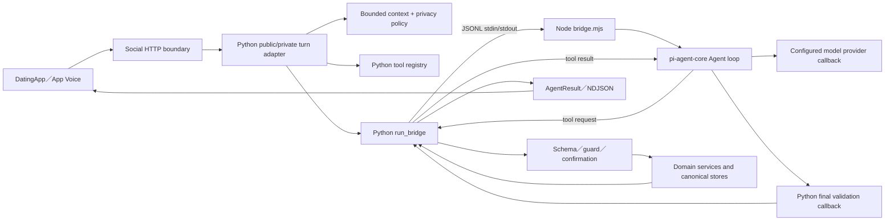
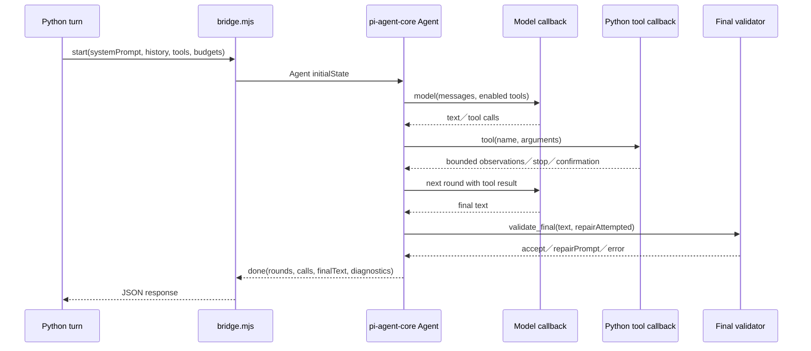

# 05.3 — Pi Agent 架構：Python、Node Bridge 與工具回合

## Relevant Source Files

- `Server/AYUE_V3_ARCHITECTURE.md:L1-L25`
- `Server/social/services/ayue_agent/public_runtime.py:L1-L23`
- `Server/social/services/ayue_agent/pi/public_turn.py:L451-L535`
- `Server/social/services/ayue_agent/pi/runtime.py:L220-L270`
- `Server/pi_agent/bridge.mjs:L1-L25`
- `Server/pi_agent/bridge.mjs:L55-L118`
- `Server/pi_agent/bridge.mjs:L119-L225`
- `Server/social/services/ayue_agent/pi/registry.py:L1-L100`
- `Server/social/services/ayue_agent/pi/tool_runtime.py:L1-L250`
- `Server/social/services/ayue_agent/private_pi/bridge_client.py:L1-L180`
- `Server/social/services/ayue_agent/private_pi/runtime.py:L336-L410`

## TL;DR

Pi Agent 是目前公開阿月的實際推理 runtime：Python 負責身份、context、工具 schema、權限、confirmation、domain write、budget 與 final validation；Node `bridge.mjs` 啟動 `@earendil-works/pi-agent-core`，負責模型回合、tool-call loop、context trimming、repair 與等待 idle。兩邊透過受限 JSON Lines stdin/stdout 溝通，模型永遠不能直接碰資料庫或 secret。Private Pi 使用另一個 Python context／policy／tool callback，但共用相同 bridge protocol；因此「Public Pi」與「Private Pi」是兩套 policy/runtime adapter，不是兩個完全獨立的 Node 引擎。

## Overview

目前公開 HTTP 入口是 `public_chat.py → run_public_agent_turn() → public_runtime.py → pi.public_turn.run_pi_public_turn()`。`run_pi_public_turn()` 建立 public turn、載入 pending operation batch、驗證 mentions、處理 choice／assessment，再呼叫 Pi runtime；回傳 `AgentResult`，由 router 保存回覆和產生 NDJSON。[Public turn entry](../../Server/social/services/ayue_agent/pi/public_turn.py:L451-L510)

`pi/runtime.py` 的 `run_bridge()` 不是模型 provider 本身，而是 Python sidecar controller。它啟動 Node child process，送出 `start`，等待 Node 發出的 `model`、`tool`、`validate_final` request，再把 Python callback 結果以相同 request id 回送。這個設計把「模型回合控制」與「資料／權限所有權」分開。[Python bridge controller](../../Server/social/services/ayue_agent/pi/runtime.py:L220-L270)

Node bridge 的第一行註解直接定義責任：Pi 擁有 agent loop，Python 擁有 model credentials、context 與所有 tools。它用 `Agent` 建立 sequential tool loop，將 provider result 轉成 text／toolCall，並在每回合檢查 allowed tools、budget、final validation、repair 與 tool failure。[Node bridge](../../Server/pi_agent/bridge.mjs:L1-L5)

## Architecture Diagram

## Key Concepts

| Concept | Description | Source |
|---|---|---|
| Python owner | credentials、context、guards、confirmation與writes的權威層 | `Server/pi_agent/bridge.mjs:L1-L5` |
| Node loop | Pi Agent 的 sequential model/tool loop | `Server/pi_agent/bridge.mjs:L153-L225` |
| JSONL protocol | `start`、`model`、`tool`、`validate_final`、`response`、`done` messages | `Server/pi_agent/bridge.mjs:L273-L311`、`Server/social/services/ayue_agent/pi/runtime.py:L258-L270` |
| Public registry | Public Pi 可見的 domain tools與schema | `Server/social/services/ayue_agent/pi/registry.py:L22-L100` |
| `PiToolRuntime` | 讀取 budget、duplicate guard、executor authority與confirmation | `Server/social/services/ayue_agent/pi/tool_runtime.py:L45-L250` |
| Final validation | 驗證回覆是否可公開，必要時只允許無工具 prose repair | `Server/pi_agent/bridge.mjs:L196-L224`、`Server/social/services/ayue_agent/pi/runtime.py:L575-L604` |
| Private adapter | Private context／policy／tool callback，使用相同 bridge pipe | `Server/social/services/ayue_agent/private_pi/bridge_client.py:L1-L5` |

## How It Works

### 1. Python 建立初始 payload

Public turn 先建立 `PublicAgentTurnContext`，並把 bounded history、system prompt、tool schemas、initial tool names、model／tool budget、hard deadline 與 `validateFinal` callback 傳給 `run_bridge`。Private turn 則建立 `PrivatePiTurnContext`，使用自己的 private tool registry、privacy projection、relationship scope 與 failure policy。

### 2. Python 啟動 Node bridge

`run_bridge()` 檢查 `pi_available()`、Node binary 與 Pi package，使用 `subprocess.Popen` 啟動 `pi_agent/bridge.mjs`，將 stdin／stdout 設為 text JSONL pipe。reader thread 將每一行放入 bounded queue；主迴圈用 deadline 等待 response，超時、process exit、invalid JSON 或未知 message type 都轉成 Pi failure code。[Bridge lifecycle](../../Server/social/services/ayue_agent/pi/runtime.py:L220-L270)

### 3. Node 建立 Agent loop

Node bridge 將 initial tools 轉為 `Agent` tools，限制 `maxRounds` 在 1～10、`maxToolCalls` 在 1～16。provider callback 不保存 API credentials，而是把 `messages` 與 enabled tool names 送回 Python `model` request；Python 呼叫實際 provider，再回傳 content、tool calls、token usage 或 provider error。[model callback](../../Server/pi_agent/bridge.mjs:L55-L118)

### 4. Tool-call round

模型提出 tool call 時，Node 的 `beforeToolCall` 先檢查 prose repair mode、tool 是否 enabled、是否已 stop、是否超過 tool budget。通過後 `execute()` 將 tool name 與 arguments 回送 Python。Python `PiToolRuntime` 再做 schema validation、domain read budget、duplicate key、server-owned argument injection、URL／place safety、guard proposal 與 domain executor。[Node gate](../../Server/pi_agent/bridge.mjs:L119-L181)、[Python tool runtime](../../Server/social/services/ayue_agent/pi/tool_runtime.py:L186-L250)

Public registry 目前將 system、calendar、relationship、profile、assessment、places、web、match、product、workflow 分成 domain handlers；工具必須出現在 `PI_TOOL_NAMES`，而部分高風險操作明確排除，避免「列在共用 registry」就自動暴露給 Pi。[Public registry](../../Server/social/services/ayue_agent/pi/registry.py:L22-L50)

### 5. Observation 回到模型

Python 不會把 raw Mongo、Neo4j 或外部 provider response 原封不動交回 Node。`PiToolRuntime` 將結果壓成 task id、tool、status、result、error code 的 observation，並記錄 progress、guard result、duplicate、讀取次數與 tool result。Node 將 observation 轉為 tool result message，讓下一個 model round 決定是否繼續、換工具或完成自然語言回覆。

Public read 有 per-domain 與 total budget；同一組 normalized tool arguments 不能在同一 run 重複執行。寫入工具則設定 `write_prepared`，建立帶 `source_engine=pi`、tool protocol version、preview、opaque choice、TTL、CAS 與 idempotency 的 confirmation，並停止再發生第二筆未確認 write。[Confirmation creation](../../Server/social/services/ayue_agent/pi/tool_runtime.py:L150-L181)

### 6. Context trimming與工具更新

Node `transformContext` 在 messages 超過 40 則時保留前 8 與後 32；工具執行結果可以要求 upgrade budget、enable tools、stop 或進入 prose repair mode。`prepareNextTurnWithContext` 將新的 tool set 或 recovery prompt 放入下一回合，避免把整份 raw context 不受控地重送。[Context transform](../../Server/pi_agent/bridge.mjs:L119-L195)

### 7. Final validation與repair

當模型停止且沒有 tool call，Node 將 candidate text 送回 Python `validate_final`。若通過，Python 回傳 final text；若可修復且尚未 repair，Node 只允許一次 follow-up。若 validator 要求 `disableTools`，Node 清空 enabled tools，repair 回合只能使用既有 observation 重寫文字，不可再做工具或宣稱未完成的 write。這是「模型說得漂亮」與「系統允許發布」之間的最後邊界。[Final validation](../../Server/pi_agent/bridge.mjs:L196-L224)

### 8. Stream與結果組裝

Python 收到 bridge result 後，public runtime 會將 validated token、presentation blocks、choice／confirmation、sources、calendar／match state changed 與 metrics 組成 `AgentResult`。Router 再把它轉成 NDJSON `run_started`、`tool_started`、`tool_finished`、`token`、`final`、`error`。Private runtime 走自己的 result model，但 bridge client 使用相同 JSONL request／response protocol。[Public result path](../../Server/social/services/ayue_agent/pi/public_turn.py:L626-L735)

## Component Reference

| Component | Type | Responsibility | Source |
|---|---|---|---|
| `run_pi_public_turn` | Python public runtime | 建立 public turn、處理 choice／batch並呼叫 bridge | `Server/social/services/ayue_agent/pi/public_turn.py:L451-L535` |
| `run_bridge` | Python bridge controller | 啟動 Node、傳送 JSONL、管理 deadline與model/tool budget | `Server/social/services/ayue_agent/pi/runtime.py:L220-L270` |
| `runExperiment` | Node Agent loop | 建立 `pi-agent-core` Agent、provider、tool execution、repair與done result | `Server/pi_agent/bridge.mjs:L55-L311` |
| `PI_TOOL_NAMES` | Public registry | 決定 Pi 可見的工具集合與 domain handler | `Server/social/services/ayue_agent/pi/registry.py:L22-L100` |
| `PiToolRuntime` | Python executor | schema、guard、duplicate、read budget、server authority與confirmation | `Server/social/services/ayue_agent/pi/tool_runtime.py:L45-L250` |
| `run_private_pi_turn` | Private runtime | private context、policy、tool loop與private result | `Server/social/services/ayue_agent/private_pi/runtime.py:L336-L410` |
| `provider_messages` | Private bridge adapter | 將 Pi Agent messages轉成 provider chat shape | `Server/social/services/ayue_agent/private_pi/bridge_client.py:L22-L72` |

## Public 與 Private 的差異

| 層級 | Public Pi | Private Pi |
|---|---|---|
| HTTP owner | `/api/direct_chat`、`/api/direct_chat/stream` | `/api/mediator/private`、`/api/mediator/private/stream` |
| Context | PublicAgentRequestContext、公開 room、mentions、match focus | PrivatePiTurnContext、accepted pair、shareable profile、private history |
| Registry | `pi/registry.py` 的 public domains | `private_pi/registry.py` 的 private tools |
| Python client | `pi/runtime.py` | `private_pi/bridge_client.py` |
| Store policy | Public confirmation、contact selection、operation batch | Private confirmation、relationship memory、date coordination |
| 回覆標示 | `agent_mode=pi`、`agent_version=pi_public.v1` | `agent_mode=pi`、`agent_version=pi_private.v1` |

兩者共用 generic `pi_agent/bridge.mjs` protocol，但不共用 context、tool allowlist、privacy policy 或 domain authority。[Private bridge client](../../Server/social/services/ayue_agent/private_pi/bridge_client.py:L1-L180)

## Data Flow

## Configuration & Environment

Pi 執行需要 Node 22.19+、`Server/pi_agent/package.json` 鎖定 dependencies、bridge self-check、model provider 設定、Pi timeout、model／tool budgets、agent quota 與 provider callback。Public 與 Private 的 Python code 都不應把 API key 交給 Node；Node 只收到 bounded messages、tool schemas 與 request/response callbacks。

## Error Handling

Pi 失敗可分成 `pi_runtime_unavailable`、`pi_node_unavailable`、`pi_deadline_exceeded`、`pi_process_exited`、`pi_protocol_invalid`、`pi_model_budget_exhausted`、`pi_tool_budget_exhausted`、`pi_tool_schema_invalid`、`pi_provider_error`、`pi_provider_timeout`、`pi_reply_invalid` 與 `pi_write_budget_exhausted`。Public router 將它們轉成 bounded error event；Private runtime 使用 private failure copy；兩者都不能 fallback 到已退役的 Public V3 DAG。

## Gotchas & Conventions

> ⚠️ **Gotcha**：Pi Agent 不是直接連資料庫的 autonomous process。Node 的 tool call 必須回 Python，真正的權限、owner、revision、confirmation 與 write 都在 Python/domain service。

> 📌 **Convention**：`source_engine=pi`、`agent_mode=pi` 與 `agent_version=pi_public.v1`／`pi_private.v1` 是 runtime provenance；`AyueV3ApiService` 仍是 API client 名稱，不代表 V3 DAG 正在執行。

> ❓ **[NEEDS INVESTIGATION]**：正式 model provider 的實際 endpoint、quota、response latency 與 Node package 版本 parity 仍需部署環境驗證。

## Active Development Areas

Python／Node bridge protocol、Pi budget、tool schema recovery、final reply validation、confirmation CAS、public／private registry separation、provider callback與runtime diagnostics是 Pi Agent 最需要持續維護的區域。

## Cross-References

- 公開功能：[05.1 — 公開阿月](05.1-public-ayue.md)
- 私人功能：[05.2 — 阿月悄悄話](05.2-private-ayue.md)
- 語音 delegation：[08.1 — 語音阿月](08.1-voice-ayue.md)
- 部署依賴：[14 — 部署、啟動與環境](14-deployment.md)
