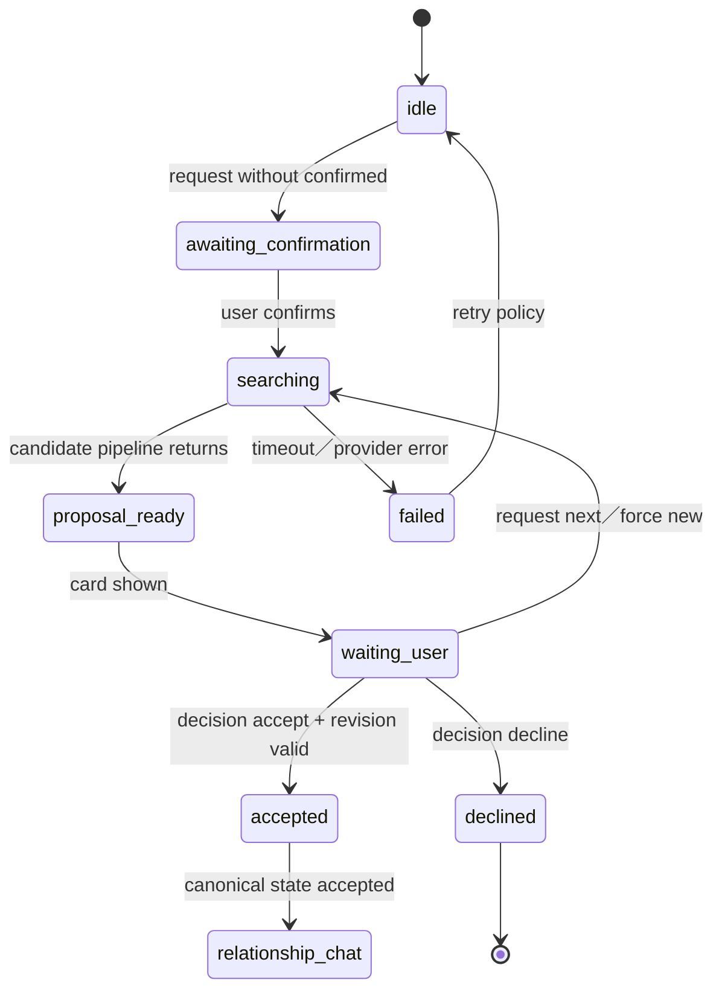
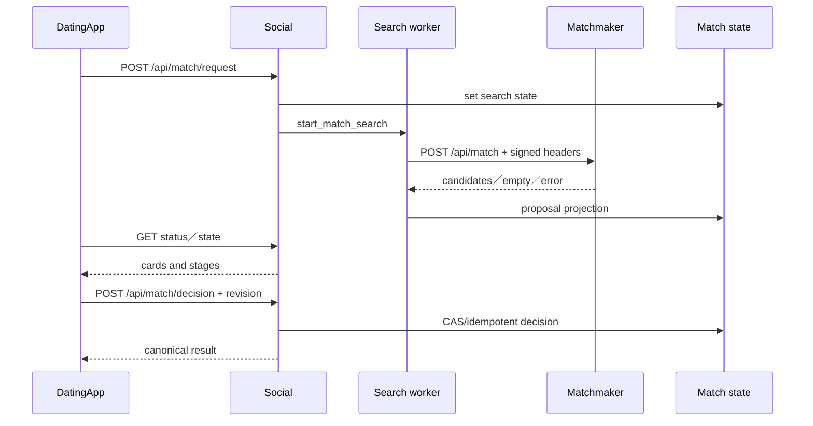

# 06 — 配對與關係建立

## Relevant Source Files

- `DatingApp/lib/services/ayue_v3_api_service.dart:L1388-L1475`
- `DatingApp/lib/services/matchmaking_api_service.dart:L1000-L1055`
- `DatingApp/lib/pages/match_hub_page.dart:L500-L560`
- `Server/social/routers/match.py:L1958-L2048`
- `Server/social/routers/match.py:L1405-L1435`
- `Server/social/services/match_action_service.py`
- `Server/matchmaker_agent/agent_api.py:L286-L397`

## TL;DR

配對是由 Social 維護狀態、由 Matchmaker 產生候選／活動訊號的兩層流程。DatingApp 先請求配對搜尋，再輪詢或取得狀態卡片，最後用帶有 expected status、revision、namespace 與 explicit reasons 的 decision request 接受或拒絕。這個設計把「找到候選」與「使用者做決策」分開，並用 idempotency／revision 防止重複或過期操作。

## Overview

前端 `AyueV3ApiService` 提供 `requestMatchSearch`、`cancelMatchSearch`、`getMatchState` 與 `decideMatch`；較舊或其他頁面也可透過 `MatchmakingApiService` 使用對應 endpoint。Match Hub 顯示 server-owned card，使用者決定後才呼叫 decision API。[前端配對 API](../../DatingApp/lib/services/ayue_v3_api_service.dart:L1388-L1475)

Social 的 `/api/match/request` 先檢查既有 active proposal、source、confirmation、origin room 與 search context，再交給 `start_match_search`。產生候選時，Social 透過內部 HTTP 呼叫 `http://127.0.0.1:9001/api/match`，並以 signed headers 傳遞受控 payload；timeout 或 Graph unavailable 會轉成明確的 pipeline error。[配對 router](../../Server/social/routers/match.py:L1958-L1995)、[Matchmaker 呼叫](../../Server/social/routers/match.py:L1405-L1435)

## Architecture Diagram

## Key Concepts

| Concept | Description | Source |
|---|---|---|
| Match search | 由 Social 建立並追蹤的候選搜尋狀態 | `Server/social/routers/match.py:L1960-L1995` |
| Proposal | 經過候選排序後展示給使用者的配對卡片 | `Server/social/routers/match.py:L2030-L2048` |
| Decision | 使用者對 proposal 的接受／拒絕操作 | `DatingApp/lib/services/ayue_v3_api_service.dart:L1437-L1456` |
| Revision | 防止過期卡片覆寫新狀態的版本欄位 | `DatingApp/lib/services/ayue_v3_api_service.dart:L1440-L1454` |
| Matchmaker | 候選、活動與圖譜訊號的內部服務 | `Server/matchmaker_agent/agent_api.py:L286-L397` |

## How It Works

### 請求與確認

使用者從 Matching 或 Match Hub 發起下一位配對；若 request 未帶 `confirmed`，Server 只回傳等待確認狀態，不會立即啟動搜尋。確認後，Social 綁定 source、force_new、idempotency key 與 optional search context，並把狀態寫入使用者的 match search projection。

### 候選產生

`generate_matches_for_user` 會依目前 scope 準備 payload，再呼叫 9001 的 Matchmaker。Matchmaker 可能使用圖譜記憶、候選資料、活動資料與模型 provider 進行排序；Social 只接受符合 response contract 的候選，並將它們投影到 Match Hub 可顯示的 card。

### 決策與聊天入口

使用者按接受或拒絕時，前端送出 match id、action、expected status、expected revision、proposal namespace 與理由。若接受成功但導覽讀取失敗，client 會從 canonical state 再讀一次，而不重送 decision request。這個「寫入成功、讀取失敗」分支是重要的可靠性設計。[recover accepted target](../../DatingApp/lib/services/ayue_v3_api_service.dart:L1459-L1475)

## Component Reference

| Component | Type | Responsibility | Source |
|---|---|---|---|
| `requestMatchSearch` | Dart API method | 建立或確認配對搜尋 | `DatingApp/lib/services/ayue_v3_api_service.dart:L1395-L1415` |
| `decideMatch` | Dart API method | 提交接受／拒絕及 revision | `DatingApp/lib/services/ayue_v3_api_service.dart:L1437-L1456` |
| `request_next_match` | FastAPI route | 驗證 request、建立 search state | `Server/social/routers/match.py:L1960-L1995` |
| `_request_matchmaker_selection` | Python adapter | 呼叫 9001 並分類錯誤 | `Server/social/routers/match.py:L1405-L1435` |
| `MatchmakerAgent` | FastAPI／domain service | 候選與活動評估 | `Server/matchmaker_agent/matchmaker.py:L89-L201` |

## Data Flow

## Error Handling

Matchmaker timeout、Graph timeout、provider error、invalid response 與 empty response 都有不同錯誤碼；前端可決定顯示 retry、空名單或需要使用者重新確認。過期 revision 不應被當成網路錯誤，應要求重新載入 canonical state。當 source room 不屬於使用者時，Social 會拒絕請求。

## Gotchas & Conventions

> ⚠️ **Gotcha**：搜尋 request 和 decision write 是兩個不同 lifecycle；不要把收到候選卡片當成已建立關係。

> 📌 **Convention**：所有副作用決策都帶 expected status／revision 或 idempotency key，client 的 retry 不應重複建立決策。

> ❓ **[NEEDS INVESTIGATION]**：正式候選排序使用哪些 Neo4j、模型與活動資料，在目前程式碼可見部分之外仍需以完整環境設定補查。

## Active Development Areas

Match search context、event discovery、proposal namespace、decision recovery、timeout restoration 與 Match Hub voice action 是配對區域的高變動面。

## Cross-References

- Agent 互動：[05 — 阿月與 Agent](05-ai-agent.md)
- 聊天入口：[07 — 聊天與風險治理](07-chat-risk.md)
- 活動與約會：[10 — 活動、約會與行事曆](10-calendar-events.md)
- API schema：[12 — API 與資料契約](12-api-data-contracts.md)
