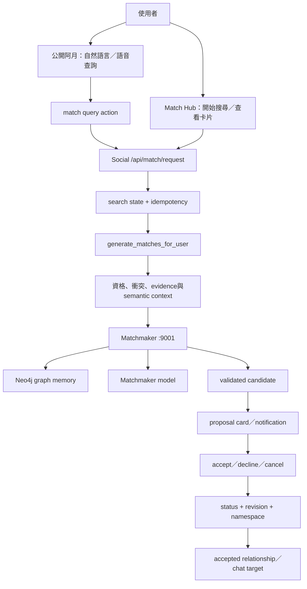
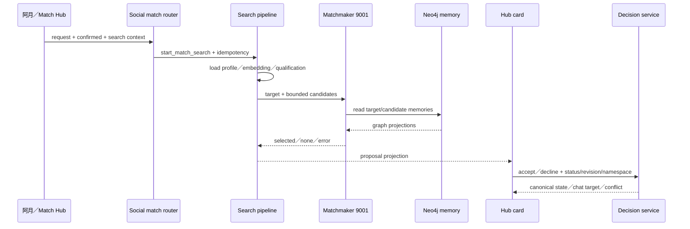

# 06.1 — 配對阿月：從聊天提問到牽線決策

## Relevant Source Files

- `DatingApp/lib/pages/match_chat_page.dart:L237-L255`
- `DatingApp/lib/pages/match_chat_page.dart:L484-L600`
- `DatingApp/lib/pages/match_hub_page.dart:L498-L560`
- `DatingApp/lib/services/ayue_v3_api_service.dart:L1388-L1475`
- `DatingApp/lib/services/matchmaking_api_service.dart:L1012-L1048`
- `Server/social/routers/match.py:L598-L719`
- `Server/social/routers/match.py:L1405-L1435`
- `Server/social/routers/match.py:L1452-L1540`
- `Server/social/routers/match.py:L1960-L2055`
- `Server/social/services/match_action_service.py:L1-L170`
- `Server/social/services/match_decision_service.py:L165-L278`
- `Server/matchmaker_agent/agent_api.py:L286-L391`

## TL;DR

「配對阿月」不是單一 API，而是由公開阿月的自然語言入口、Social 配對狀態、Matchmaker 候選評估、Match Hub 卡片與 accepted relationship state 組成的完整功能。使用者可以在阿月聊天室問「幫我找人」，也可以在 Match Hub 明確開始搜尋；阿月負責理解與呈現，Social 負責狀態和權限，9001 Matchmaker 負責候選排序，最後一定要由使用者接受或婉拒。相似度本身不能直接創造牽線邀請，候選必須有 owner-grounded evidence 與 reciprocal safety。

## Overview

前端 `MatchChatPage` 的 voice context 宣告 `match.query`、`match.ayue_query`、`ayue.public_query` 等 action；語音或文字可先在 public Ayue room 中查詢。當回覆包含 hub-only invitation card，頁面會開啟 `MatchHubPage`，讓使用者在獨立清單中查看 proposal、確認、婉拒或撤回，而不是在聊天 bubble 中直接完成關係決策。[公開阿月 action](../../DatingApp/lib/pages/match_chat_page.dart:L237-L255)、[hub handoff](../../DatingApp/lib/pages/match_chat_page.dart:L509-L535)

Match Hub 的 `_decide` 會帶 user id、match id、action、expected status、expected revision、proposal namespace 與 explicit reasons 呼叫 `decideMatch`。Server 成功後，前端把 card 更新為 pending／declined／completed，再重新整理 canonical state；若 response 顯示 chat reused，代表已存在可使用的 accepted chat，而不是另外建立一個新關係。[Match Hub decision](../../DatingApp/lib/pages/match_hub_page.dart:L498-L560)

## Architecture Diagram

## Key Concepts

| Concept | Description | Source |
|---|---|---|
| Match query | 阿月或 Match Hub 提出的搜尋意圖與 context | `DatingApp/lib/pages/match_chat_page.dart:L484-L535` |
| Search state | Social 保存的 loading、waiting、proposal、failure等狀態 | `Server/social/routers/match.py:L177-L205` |
| Candidate qualification | reciprocal safety、direct evidence、requested topic與semantic similarity檢查 | `Server/social/routers/match.py:L598-L719` |
| Matchmaker | 讀取 graph memory、global rules、候選資料並產出最多一個 validated match | `Server/matchmaker_agent/agent_api.py:L286-L391` |
| Proposal namespace | 區分不同來源／版本的 proposal，避免重複關係 anchor | `Server/social/services/match_decision_service.py:L165-L278` |
| Expected revision | 防止過期 card 覆寫最新 decision | `DatingApp/lib/services/ayue_v3_api_service.dart:L1437-L1456` |

## How It Works

### 1. 阿月理解「我想認識誰」

公開阿月收到 `match.ayue_query` 或自然語言問題時，先由 Agent 解析成受控的 match query。模型不能提供 user id、match id 或 revision；runtime 只把 user-owned context、目前 Match Hub projection 與可見 choices 放入 action。若阿月只得到模糊意圖，應回到 clarification，而不是直接啟動搜尋。

### 2. Social 建立搜尋狀態

`/api/match/request` 會檢查既有 active proposal、`confirmed`、source、origin room、force_new、idempotency key 與 search context。未確認時只回 `awaiting_confirmation`；確認後才呼叫 `start_match_search`。這讓「問阿月」與「真的開始找人」保持兩段式邊界。[request route](../../Server/social/routers/match.py:L1960-L1995)

### 3. 候選資格先於模型排序

Social 會先讀 profile、current context、embedding與候選來源，再執行 `candidate_qualification`。它檢查雙向 hard conflict、shared persistent preferences、shared values、shared activity、requested topic 與 semantic context similarity；只有有 concrete reason code 且沒有 hard conflict 才能進入 Matchmaker。embedding 只能幫助 recall，不能單獨產生 proposal。[qualification](../../Server/social/routers/match.py:L598-L719)

### 4. Matchmaker 使用圖譜與模型

9001 的 `/api/match` 將 target、candidate list、deep profile 與 bounded search context 轉成 `MatchRequest`。它平行讀取 target graph memory、global rules 與候選 memory，再呼叫 `agent.match_async`。回應必須是 JSON，且 `matches` 最多保留一個；`no_suitable_candidate`、timeout、provider error、invalid response 都必須保留差異，不能把 provider failure 假裝成沒有適合的人。[Matchmaker endpoint](../../Server/matchmaker_agent/agent_api.py:L137-L148)、[評估流程](../../Server/matchmaker_agent/agent_api.py:L286-L391)

### 5. 形成 proposal card

Social 以 owner-bound evidence 建立 proposal reason、directional explanation、distinctive tags 與 candidate projection。可顯示的內容來自 profile、context signals、shared values 與 graph evidence；不會從相似度推論對方行程、位置、聯絡方式或已同意認識你。[validated explanation](../../Server/social/routers/match.py:L741-L780)

### 6. 使用者做最後決策

Match Hub 的 accept／decline 操作必須帶 expected status、revision 與 namespace。`match_decision_service.apply_match_decision` 會在 compare-and-set 邊界內處理 accepted、declined、pending、cooldown、chat reuse 與 side effects。過期 decision 會回最新 terminal state，前端重新整理，不重送原始 action。[decision service](../../Server/social/services/match_decision_service.py:L165-L278)

## Component Reference

| Component | Type | Responsibility | Source |
|---|---|---|---|
| `MatchChatPage` | Flutter page | 解析阿月的 match query、choice與hub handoff | `DatingApp/lib/pages/match_chat_page.dart:L484-L535` |
| `MatchHubPage._decide` | Flutter method | 顯示 reason dialog、提交 decision與更新 card | `DatingApp/lib/pages/match_hub_page.dart:L498-L560` |
| `request_next_match` | FastAPI route | confirmation、search state與request context | `Server/social/routers/match.py:L1960-L1995` |
| `candidate_qualification` | Python policy | reciprocal safety與owner evidence gate | `Server/social/routers/match.py:L598-L719` |
| `generate_matches_for_user` | Python pipeline | embedding、candidate batches與Matchmaker call | `Server/social/routers/match.py:L1452-L1540` |
| `match_endpoint` | Matchmaker route | graph memory、model call、JSON validation | `Server/matchmaker_agent/agent_api.py:L286-L391` |
| `apply_match_decision` | domain service | revision、namespace、status與side effects | `Server/social/services/match_decision_service.py:L165-L278` |

## Data Flow

## Error Handling

重要錯誤包括 `awaiting_confirmation`、`already_active`、`matchmaker_timeout`、`matchmaker_graph_timeout`、`matchmaker_provider_error`、`matchmaker_invalid_response`、`vector_search_unavailable`、stale revision 與 source room forbidden。每個錯誤對使用者的建議不同：確認、稍後重試、重新整理、修改搜尋條件或查看最新邀請，不能全都顯示成「找不到配對」。

## Gotchas & Conventions

> ⚠️ **Gotcha**：Matchmaker 回傳 candidate 不等於使用者已接受；只有 decision service 完成 accepted state，才可建立 accepted chat target。

> 📌 **Convention**：所有 user-visible match reason 必須能追溯到 owner-bound evidence；vector score 不能單獨成為說服使用者的理由。

> ❓ **[NEEDS INVESTIGATION]**：production 使用的 graph schema、candidate pool、embedding provider、模型版本與 event discovery 對配對排序的實際權重仍需部署資料補證。

## Active Development Areas

Match query clarification、Match Hub proposal cards、candidate qualification、graph memory、event opportunities、decision namespace、timeout restoration與 voice actions 是配對阿月的主要活動區域。

## Cross-References

- 公開阿月：[05.1 — 公開阿月](05.1-public-ayue.md)
- 配對總覽：[06 — 配對與關係建立](06-matchmaking.md)
- 悄悄話：[05.2 — 阿月悄悄話](05.2-private-ayue.md)
- 語音操作：[08.1 — 語音阿月](08.1-voice-ayue.md)
