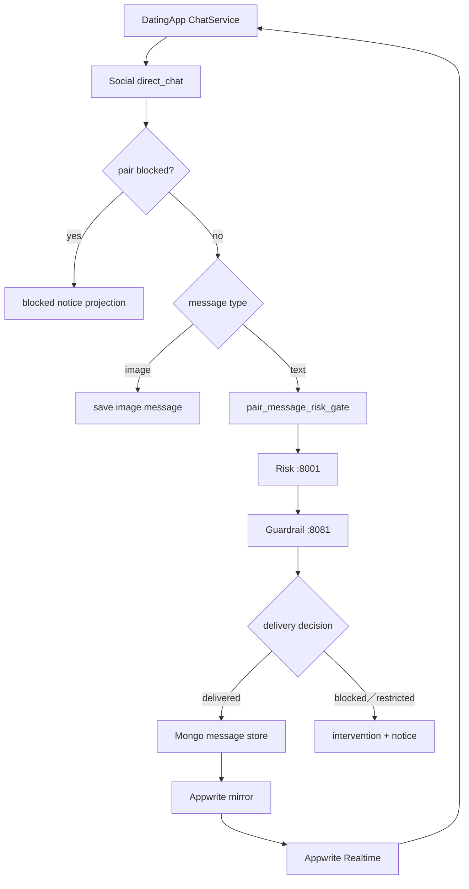
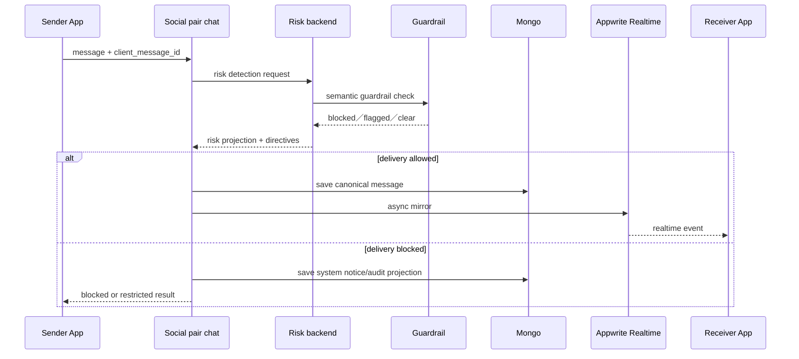

# 07 — 聊天與風險治理

## Relevant Source Files

- `DatingApp/lib/services/chat_service.dart:L682-L810`
- `DatingApp/lib/services/chat_service.dart:L776-L782`
- `Server/social/routers/public_chat.py:L780-L875`
- `Server/social/services/chat_service.py:L62-L75`
- `Server/social/services/appwrite_mirror.py:L1-L137`
- `Server/social/services/risk_policy_service.py:L120-L270`
- `Server/risk_backend/app/api/risk_detection.py:L85-L160`
- `Server/risk_backend/app/main.py:L21-L56`

## TL;DR

雙人聊天的文字訊息必須先經過風險政策，再決定是否可以保存與讓接收者看見；圖片訊息因沒有可分析文字，會走不同的投影分支。Social 以 MongoDB 作為聊天資料主要寫入路徑，並非同步鏡像部分訊息到 Appwrite Realtime；DatingApp 同時支援 polling 與 Realtime，因此前端不能只依賴單一即時通道。風險結果包含 delivery、level、介入指令與回饋資料，不能只用一個 boolean 表示。

## Overview

前端 `ChatService.sendMessage` 將 sender、receiver、content、client message id 與 optional file id 送到 `/api/direct_chat`，解析 `risk_assessment`、blocked 狀態與 message envelope。[前端送訊息](../../DatingApp/lib/services/chat_service.dart:L682-L730) Server 的 public chat／pair chat 邏輯會檢查 pair block，再對文字執行 `pair_message_risk_gate.evaluate`；若不可 delivery，會保存系統通知或風險投影，而不是把原文當成一般訊息送出。[後端風險閘門](../../Server/social/routers/public_chat.py:L780-L875)

Risk backend 的 `/api/v1/risk/detect` 先跑 Guardrail，再視結果建立 risk state、intervention command、message log、risk history 與 intervention log。Social 的 risk policy service 以內部 HTTP 呼叫該 endpoint，並將 `RISK_SERVICE_URL` 與 timeout 受控在後端設定中。[Risk endpoint](../../Server/risk_backend/app/api/risk_detection.py:L85-L160)、[Social client](../../Server/social/services/risk_policy_service.py:L120-L270)

## Architecture Diagram

## Key Concepts

| Concept | Description | Source |
|---|---|---|
| `client_message_id` | 前端提供的去重識別，避免 retry 重複寫入 | `DatingApp/lib/services/chat_service.dart:L682-L703` |
| Risk projection | 給前端的 level、delivery、priority、directive | `Server/social/services/risk_policy_service.py:L93-L110` |
| Guardrail | 在完整風險融合前做語意安全攔截 | `Server/risk_backend/app/api/risk_detection.py:L99-L120` |
| Intervention | 風險狀態、雙方指令與 audit log | `Server/risk_backend/app/api/risk_detection.py:L118-L148` |
| Appwrite mirror | 非同步將 Mongo message 投影給 Realtime | `Server/social/services/appwrite_mirror.py:L1-L137` |

## How It Works

### 文字訊息

Social 先確認 pair 是否被封鎖，再把文字傳給 risk gate。Risk client 對 8001 的 `/api/v1/risk/detect` 發送 bounded request；Risk backend 的 Guardrail 如果直接封鎖，會產生 blocked risk state 與介入指令，並寫入完整 audit 記錄。若未直接封鎖，後續規則、NLP、歷史狀態與 intervention engine 再決定 delivery。

只有 `may_persist` 為 true 的 decision 才能讓文字進入 receiver-visible message flow。前端收到 `risk_assessment` 後建立 sender receipt；若被封鎖，則顯示與風險等級和指令相符的 UI，而不是假裝訊息已送達。

### 圖片與即時同步

圖片沒有可供文字 risk gate 分析的 content，因此後端會保存 image message 並帶有受控的空風險投影；這個分支必須與文字差異保持一致。Mongo 寫入成功後，`chat_service.py` 呼叫 `mirror_message_to_appwrite_async` 和 push notification。Appwrite mirror 失敗不應回滾 Mongo 的 canonical message，前端仍可透過 polling fallback 取得訊息。

### 接收者的安全操作

Risk projection 可能帶 `receiver_directive`、action options、cooldown 與 report／block 選項。前端使用者按下選項後，應呼叫明確的 risk action API；推播或通知只提供 allowlisted navigation data，不可自行切換房間或執行決策。[通知資料限制](../../Server/social/services/notification_service.py:L119-L140)

## Component Reference

| Component | Type | Responsibility | Source |
|---|---|---|---|
| `ChatService.sendMessage` | Dart method | 發送訊息、解析風險與 envelope | `DatingApp/lib/services/chat_service.dart:L682-L730` |
| `subscribeToMessages` | Dart method | 訂閱 Appwrite chat collection Realtime | `DatingApp/lib/services/chat_service.dart:L776-L782` |
| `pair_message_risk_gate` | Python service | 決定文字是否可 delivery | `Server/social/routers/public_chat.py:L830-L875` |
| `detect_risk` | FastAPI endpoint | Guardrail、risk state、intervention與 audit | `Server/risk_backend/app/api/risk_detection.py:L85-L160` |
| `save_message` | Python persistence | Mongo 寫入、mirror 與 push | `Server/social/services/chat_service.py:L62-L75` |

## Data Flow

## Error Handling

Risk service timeout、invalid response、Guardrail degraded、Appwrite mirror failure 與 Mongo failure 要分開記錄。Risk 不能因外部模型暫時不可用而默默放行未知內容；Social 也不能因 mirror 失敗就讓 client 重送而造成重複訊息。前端 timeout 文字會提示後端可能仍在處理，並要求先查看結果。

## Gotchas & Conventions

> ⚠️ **Gotcha**：`delivery == delivered` 與 HTTP 2xx 不完全等價；回覆內的 risk projection 才能告訴前端訊息是否真的可見。

> 📌 **Convention**：`client_message_id`、message id 與 risk triggered message id 都是可追查性與去重的一部分。

> ❓ **[NEEDS INVESTIGATION]**：正式 Mongo collection index、Appwrite mirror schema、Guardrail provider 的降級門檻尚未在 live environment 逐一驗證。

## Active Development Areas

Pair message risk gate、介入 cooldown、sender appeal、receiver feedback、Appwrite mirror、Realtime/polling 去重與圖片訊息分支是目前聊天安全區域的主要變動面。

## Cross-References

- 聊天風險詳細流程：[07.1 — 聊天風險](07.1-chat-risk.md)
- Agent 對話：[05 — 阿月與 Agent](05-ai-agent.md)
- 身分與 owner：[04 — 身分驗證與個人資料](04-auth-profile.md)
- API 錯誤碼：[12 — API 與資料契約](12-api-data-contracts.md)
- 測試策略：[15 — 測試與驗證](15-testing.md)
