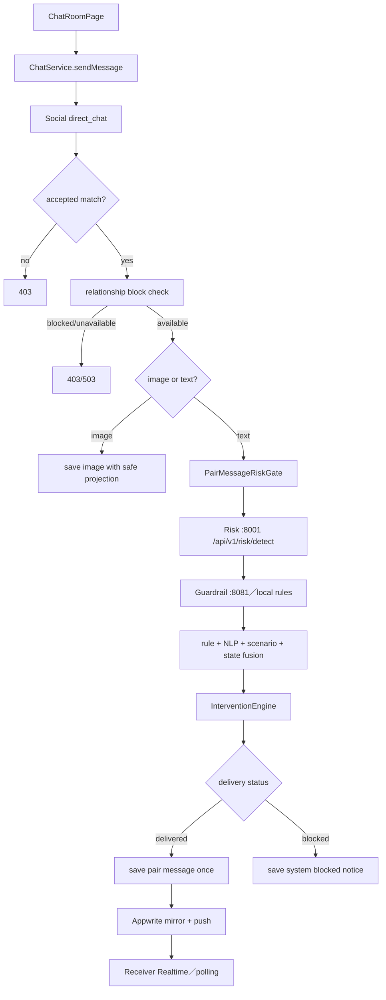
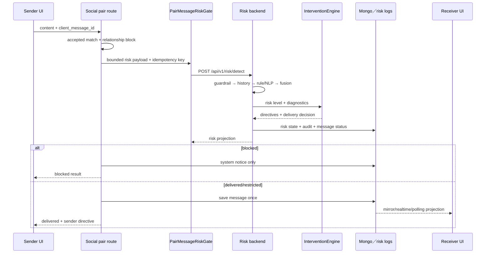

# 07.1 — 聊天風險：從送出訊息到安全介入

## Relevant Source Files

- `DatingApp/lib/pages/chat_room_page.dart:L940-L1037`
- `DatingApp/lib/services/chat_service.dart:L682-L810`
- `Server/social/routers/public_chat.py:L774-L875`
- `Server/social/services/risk_policy_service.py:L119-L254`
- `Server/risk_backend/app/api/risk_detection.py:L85-L160`
- `Server/risk_backend/app/api/risk_detection.py:L165-L351`
- `Server/risk_backend/app/core/guardrail_engine.py:L1-L160`
- `Server/risk_backend/app/models/schemas.py:L91-L121`
- `Server/tests/contracts/test_pair_chat_risk_wiring.py:L44-L155`
- `Server/social/services/appwrite_mirror.py:L62-L137`

## TL;DR

聊天風險功能不是在 UI 上加一個「安全提示」，而是一條先判斷關係封鎖、再判斷訊息內容、最後決定 delivery 與介入 side effect 的管線。文字訊息會進入 Social `PairMessageRiskGate`，再呼叫 Risk backend 的 Guardrail、規則、NLP、scenario、state machine 與 intervention engine；只有明確 `blocked` 才阻止 canonical pair message，其他風險等級仍可帶著 restricted／warning projection 投遞。圖片訊息沒有可分析文字，使用不同的安全投影分支。

## Overview

前端 `ChatRoomPage._sendMessage` 先在畫面插入 pending local message，再呼叫 `ChatService.sendMessage`。成功後更新 risk level／delivery；失敗時若是 blocked 會移除 local message 並重新讀歷史，若是其他錯誤則保留 failed bubble，並根據 sender directive 顯示 reflection banner、modal warning、cooldown 或 block action。[聊天 UI](../../DatingApp/lib/pages/chat_room_page.dart:L940-L1037)

Server public chat 的 pair branch 先驗證 accepted match，再查 relationship block。Risk block service 不可用時回 503，pair blocked 時回 403；這是「不能傳訊息」的 availability gate，與之後的內容風險判定不同。[pair gate](../../Server/social/routers/public_chat.py:L774-L792)

## Architecture Diagram

## Key Concepts

| Concept | Description | Source |
|---|---|---|
| Relationship gate | accepted match與block state的可用性檢查 | `Server/social/routers/public_chat.py:L774-L792` |
| PairMessageRiskGate | Social 對 Risk service 的 bounded、cached、idempotent adapter | `Server/social/services/risk_policy_service.py:L119-L200` |
| Guardrail | 風險管線的第一道語意／禁詞檢查 | `Server/risk_backend/app/core/guardrail_engine.py:L1-L160` |
| Risk state | 規則、NLP、情境與歷史累積出的 state | `Server/risk_backend/app/api/risk_detection.py:L171-L263` |
| Intervention command | sender／receiver directive、cooldown、feedback與triggered message | `Server/risk_backend/app/models/schemas.py:L91-L121` |
| Delivery status | pending、delivered、blocked 等 canonical message status | `Server/risk_backend/app/api/risk_detection.py:L280-L301` |
| Deterministic insert once | 用 message id／client id 保證訊息 retry 不重複 | `Server/tests/contracts/test_pair_chat_risk_wiring.py:L120-L155` |

## How It Works

### 1. 前端建立 pending message

`ChatRoomPage` 產生 local message、設成 pending，立即更新畫面，讓使用者看到送出中的狀態。它將 local id 當作 `clientMessageId` 傳給 `ChatService`；這個 id 不只是 UI key，也是 server `idempotency_key` 的一部分。[送出流程](../../DatingApp/lib/pages/chat_room_page.dart:L940-L971)

### 2. 關係可用性先於內容安全

Social 先確認 accepted match，接著查 pair block。relationship block 表示這個雙人通道本身不可用；risk gate 則是訊息內容的安全治理。這兩個 gate 必須保持順序，contract test 直接讀 router 文字確認 block gate 與 message persistence 的先後。[wiring test](../../Server/tests/contracts/test_pair_chat_risk_wiring.py:L103-L118)

### 3. 圖片分支

圖片訊息沒有 `content` 文字，Social 不把空字串送到 Risk／LLM，而是建立 `safe`、`delivered` 的訊息投影並以 `message_type=image` 保存。這不表示圖片內容在所有層都經過視覺安全模型；它只表示目前這條文字 risk gate 不分析圖片。[圖片分支](../../Server/social/routers/public_chat.py:L796-L828) [NEEDS INVESTIGATION]：是否存在獨立的圖片 moderation pipeline，需要檢查外部 deployment 或未納入這條 route 的服務。

### 4. PairMessageRiskGate

文字以 conversation id、sender、receiver、current message、optional message timestamp 與 idempotency key 呼叫 Risk backend。Gate 對相同 key 做 cache；`blocked` 且沒有 sanction exemption 才回 `delivery=blocked`，`safe`、`observation`、`warning`、`restricted` 與 unavailable 都回 delivered，但會帶對應 level、ui priority、triggered message id 與 directives。[Risk adapter](../../Server/social/services/risk_policy_service.py:L141-L200)

這是一個有意義的 fail-open 邊界：Risk service timeout 或 invalid response 不應把整個聊天服務變成不可用；但 response 的 `unavailable` 與 `guardrail_degraded` 必須讓 UI／observability 知道判斷不完整。這和 Guardrail 硬封鎖的 `blocked` 不同，不能統稱為 safe。

### 5. Risk backend 的完整管線

`detect_risk` 先建立 real message id，再執行 Guardrail。若 Guardrail 直接 blocked，會立刻建立 fake high-risk state、intervention command、message log、risk history、intervention log 與 blocked response。[hard block path](../../Server/risk_backend/app/api/risk_detection.py:L85-L157)

未直接 blocked 時，Risk backend 先寫入 pending message，再讀 delivered history、behavior history、relationship metrics、summary 與 prior state；接著依序跑 temporal features、rule engine、NLP engine、fusion、scenario layer、state machine 與 intervention engine。最後持久化 message status、intervention、analysis detail、background judge review 與 relationship update。[full pipeline](../../Server/risk_backend/app/api/risk_detection.py:L165-L351)

### 6. UI 介入與接收者行為

sender directive 可能顯示 reflection banner、modal warning、cooldown 或 block message；receiver directive 則以 system notice、action options、feedback／report／block 等安全選項投影。訊息若 blocked，不以 receiver-visible original content 保存，而是存一則 system notice，讓接收者知道系統攔截過一則可能造成不適的訊息。[blocked notice](../../Server/social/routers/public_chat.py:L838-L857)

### 7. Canonical message、mirror 與 realtime

delivery 允許後，Social 用 deterministic insert once 保存 message；成功後非同步 mirror 到 Appwrite Realtime 並排入 push。mirror failure 不應讓 client 以為 message 未寫入而無限 retry；前端可透過 polling 或 history refresh 恢復。[訊息 persistence](../../Server/social/services/chat_service.py:L62-L75)

## Component Reference

| Component | Type | Responsibility | Source |
|---|---|---|---|
| `_sendMessage` | Flutter method | pending UI、risk result、directive與failure呈現 | `DatingApp/lib/pages/chat_room_page.dart:L940-L1037` |
| `ChatService.sendMessage` | Dart adapter | direct_chat request、risk receipt與duplicate response | `DatingApp/lib/services/chat_service.dart:L682-L730` |
| `PairMessageRiskGate.evaluate` | Python policy | risk HTTP、cache、idempotency與delivery projection | `Server/social/services/risk_policy_service.py:L141-L200` |
| `detect_risk` | FastAPI endpoint | guardrail、history、fusion、state、intervention與audit | `Server/risk_backend/app/api/risk_detection.py:L85-L351` |
| `InterventionEngine.execute` | domain engine | sender／receiver directives與sanction logic | `Server/risk_backend/app/core/intervention_engine.py:L40-L125` |
| `save_pair_owner_message_once` | persistence helper | deterministic insert once與message metadata | `Server/social/services/chat_service.py` |

## Data Flow

## Error Handling

要區分 accepted match missing、pair blocked、risk service unavailable、Guardrail degraded、NLP degraded、invalid risk response、explicit blocked、sanction exemption、duplicate message、Appwrite mirror failure與push failure。contract tests 已明確驗證 unavailable與invalid response仍會 delivered，只有 explicit blocked 會阻止 persistence。[risk policy tests](../../Server/tests/contracts/test_pair_chat_risk_wiring.py:L57-L101)

## Gotchas & Conventions

> ⚠️ **Gotcha**：`risk_level=restricted` 不代表訊息被攔截；目前 policy 讓它 delivered，但 UI priority 是 risk。

> 📌 **Convention**：Risk 判斷與訊息寫入使用同一個 idempotency key，duplicate retry 不可再次呼叫風險服務或產生第二則 message。

> ❓ **[NEEDS INVESTIGATION]**：圖片／附件是否有獨立 moderation、正式 risk provider 的 degraded policy、Appwrite mirror 的 delivery guarantee 與資料保留時間仍需 live environment 補證。

## Active Development Areas

PairMessageRiskGate、Guardrail provider、intervention cooldown、sender appeal、receiver feedback、sanction exemption、message history filters、Realtime mirror與跨平台 risk UI 是聊天風險的主要活動區域。

## Cross-References

- 聊天總覽：[07 — 聊天與風險治理](07-chat-risk.md)
- 身份與關係：[04 — 身分驗證與個人資料](04-auth-profile.md)
- API 錯誤：[12 — API 與資料契約](12-api-data-contracts.md)
- 測試：[15 — 測試與驗證](15-testing.md)
