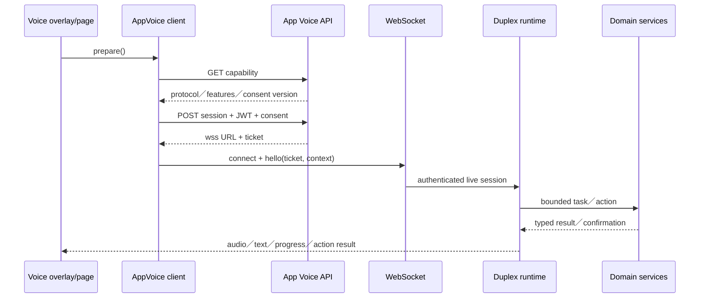
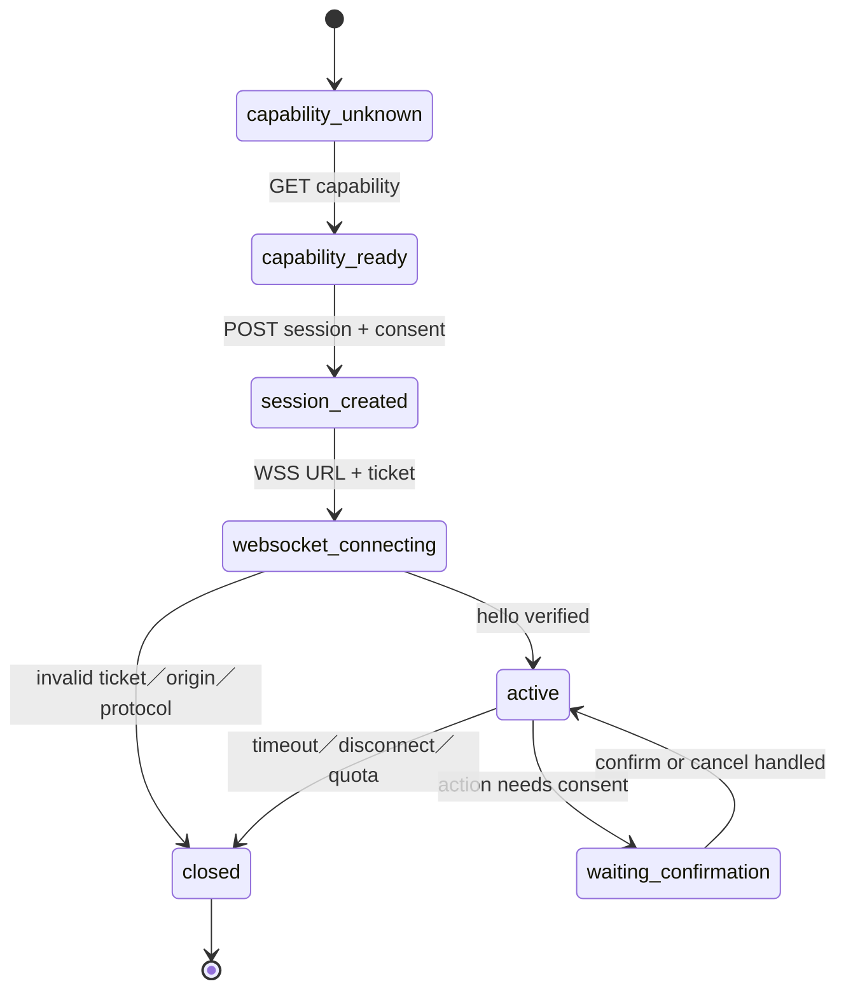

# 08 — 語音互動

## Relevant Source Files

- `DatingApp/lib/services/app_voice/app_voice_client.dart:L55-L148`
- `DatingApp/lib/services/app_voice/app_voice_client.dart:L163-L230`
- `DatingApp/lib/services/app_voice/app_voice_action_executor.dart:L61-L123`
- `DatingApp/lib/pages/match_chat_page.dart:L464-L588`
- `Server/app_voice_assistant/router.py:L317-L430`
- `Server/app_voice_assistant/router.py:L637-L790`
- `Server/registration_voice/router.py:L1-L180`

## TL;DR

系統有兩種語音能力：註冊語音與 App 內語音。App Voice 先取得 capability，再建立帶 consent、installation id、user id 與 client protocol version 的 session，最後以 WSS ticket 連線；Server 會驗證 origin、ticket、client binding、quota 與 authenticated session。語音 action executor 只協調既有 Auth、Chat、Matchmaking、Calendar 與 Agent service，不直接成為另一套 domain state owner。

## Overview

前端 `AppVoiceSocketClient` 把固定公開網域、capability flags、consent version、protocol version 與 session ticket 封裝在一個 client 中。`prepare()` 先呼叫 `/api/app-voice/capability`，再依回覆決定 live audio、full duplex、structured confirmation 與 task service 是否可用；`connect()` 取得 JWT（若要求）、建立 session，驗證回傳的 WSS host 後才建立 WebSocket。[前端能力與 session](../../DatingApp/lib/services/app_voice/app_voice_client.dart:L115-L221)

Server 的 `create_router` 將 App Voice 掛在 `/api/app-voice`，提供 capability、session、REST task 與 WebSocket endpoint。WebSocket handshake 會檢查 origin、hello protocol、ticket client fingerprint、concurrency limit 與 quota，再進入 duplex runtime。[後端 route](../../Server/app_voice_assistant/router.py:L317-L430)、[WebSocket](../../Server/app_voice_assistant/router.py:L637-L790)

註冊語音是另一個 route／provider，用於註冊流程中的語音輸入與 session；它不能被文件誤寫成 App Voice 的同一條 live session。

## Architecture Diagram

## Key Concepts

| Concept | Description | Source |
|---|---|---|
| Capability negotiation | Server 宣告 protocol 與可用功能 | `DatingApp/lib/services/app_voice/app_voice_client.dart:L115-L148` |
| Consent version | 語音 session 使用者同意的版本識別 | `DatingApp/lib/services/app_voice/app_voice_client.dart:L55-L59` |
| Session ticket | 建立 WSS 後驗證 user／installation／client binding 的短期票據 | `Server/app_voice_assistant/router.py:L418-L498` |
| Page context | 目前頁面、可見 target 與 scope 的 bounded context | `DatingApp/lib/pages/match_chat_page.dart:L464-L588` |
| Action executor | 將語音意圖轉交既有 domain API 與 UI action | `DatingApp/lib/services/app_voice/app_voice_action_executor.dart:L61-L123` |

## How It Works

### Capability 與 session

前端不預設所有語音能力都存在，而是依 capability response 設定 flags。session request 會帶 installation id、user id、consent accepted timestamp、input／output mode 與 client protocol version。Server 回傳的 websocket URL 必須是 `wss` 且 host 符合正式網域；否則 client 會拒絕連線。

### WebSocket handshake

Server 接受 socket 後等待 hello，驗證 protocol version、ticket、installation／IP fingerprint、session scope 與 concurrent session limit。通過後才進入 duplex runtime；若 ticket 過期、origin 不允許、quota 用完或 protocol 不符，Server 會用明確 close code／error event 結束，避免進入未授權的語音 loop。

### Action execution

`AppVoiceActionExecutor` 持有 Auth、Matchmaking、Chat、Ayue V3 與 interaction controller。它可執行開頁、選擇 visible choice、取得配對狀態或呼叫既有 API；真正的 domain state 仍由後端 endpoint 擁有。需要確認的動作會保留 pending choice／revision，直到使用者明確確認或取消。

## Component Reference

| Component | Type | Responsibility | Source |
|---|---|---|---|
| `AppVoiceSocketClient` | Dart client | capability、session、WSS 與 event parsing | `DatingApp/lib/services/app_voice/app_voice_client.dart:L55-L230` |
| `AppVoiceActionExecutor` | Dart coordinator | 將語音 action 轉成 UI/API 操作 | `DatingApp/lib/services/app_voice/app_voice_action_executor.dart:L61-L123` |
| `create_router` | Python factory | 建立 App Voice capability、session、task與WS routes | `Server/app_voice_assistant/router.py:L317-L430` |
| `app_voice` | WebSocket handler | 驗證 hello、ticket、quota並進入 runtime | `Server/app_voice_assistant/router.py:L637-L790` |
| `registration_voice` | Python router | 註冊階段語音 session | `Server/registration_voice/router.py:L1-L180` |

## Data Flow

## Error Handling

前端區分 capability unavailable、authenticated session required、quota exhausted、invalid websocket URL、websocket error 與 task failure。Server 需在 handshake 前後都 fail closed；語音模型 provider 的降級只可影響回覆能力，不可繞過 owner proof、confirmation 或 task state。

## Gotchas & Conventions

> ⚠️ **Gotcha**：Capability protocol version 和模型是否可用是兩件事；前端必須依 flags 隱藏不支援的 UI。

> 📌 **Convention**：語音只觸發既有 typed API 或可見 UI target，不直接寫 Mongo、Appwrite 或配對狀態。

> ❓ **[NEEDS INVESTIGATION]**：不同平台的 microphone、live audio、background lifecycle 與 WebSocket reconnect 行為仍需實機矩陣驗證。

## Active Development Areas

App Voice protocol、structured confirmation、task service、voice-to-match／calendar action、quota 與 page context registry 是語音功能的主要活動區域。

## Cross-References

- 語音阿月詳細流程：[08.1 — 語音阿月](08.1-voice-ayue.md)
- Agent runtime：[05 — 阿月與 Agent](05-ai-agent.md)
- 配對 action：[06 — 配對與關係建立](06-matchmaking.md)
- API 與權限：[12 — API 與資料契約](12-api-data-contracts.md)
