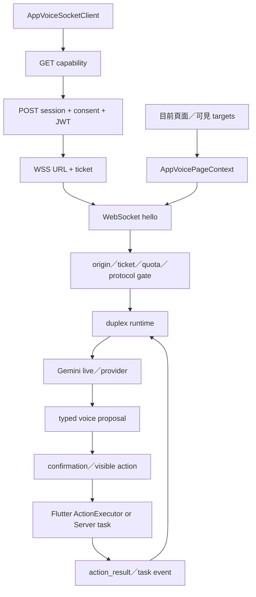
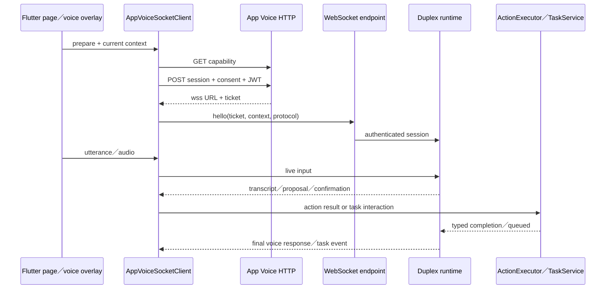

# 08.1 — 語音阿月：能力協商、即時 session 與任務操作

## Relevant Source Files

- `DatingApp/lib/services/app_voice/app_voice_client.dart:L55-L148`
- `DatingApp/lib/services/app_voice/app_voice_client.dart:L163-L262`
- `DatingApp/lib/services/app_voice/app_voice_client.dart:L273-L430`
- `DatingApp/lib/services/app_voice/app_voice_action_executor.dart:L61-L123`
- `DatingApp/lib/pages/match_chat_page.dart:L196-L255`
- `DatingApp/lib/pages/match_chat_page.dart:L484-L600`
- `DatingApp/lib/pages/match_hub_page.dart:L799-L825`
- `Server/app_voice_assistant/router.py:L80-L180`
- `Server/app_voice_assistant/router.py:L317-L430`
- `Server/app_voice_assistant/router.py:L519-L636`
- `Server/app_voice_assistant/router.py:L637-L790`
- `Server/app_voice_assistant/duplex_runtime.py:L60-L230`
- `Server/app_voice_assistant/task_service.py:L150-L250`
- `Server/app_voice_assistant/task_service.py:L780-L940`
- `Server/app_voice_assistant/tests/test_api.py:L94-L135`

## TL;DR

語音阿月不是把文字聊天換成麥克風，而是一個有 capability negotiation、consent、Appwrite owner proof、installation binding、WSS ticket、page context、structured confirmation 與 task lifecycle 的即時系統。前端先查詢 server capabilities，再建立 session 和 WebSocket；語音模型提出的 action 需要回到 Flutter 的 visible target 或既有 API 執行，後端 durable task 則使用 task ref、revision、retry、dismiss、undo 與 input 操作管理。

## Overview

`AppVoiceSocketClient` 的 `prepare()` 先呼叫 `/api/app-voice/capability`，依 protocol version 判斷 live audio、full duplex、structured confirmation 與 task service 是否可用。若 server 要求 authenticated session，`connect()` 必須先取得 JWT，並在 session request 中送 installation id、user id、consent version、consent accepted timestamp、input／output mode 與 client protocol version。[capability negotiation](../../DatingApp/lib/services/app_voice/app_voice_client.dart:L115-L148)、[session request](../../DatingApp/lib/services/app_voice/app_voice_client.dart:L163-L205)

Server 回傳 WSS URL 和 ticket 後，client 會驗證 scheme 與 host、建立 channel、送 hello（ticket、protocol、input/output mode、page context），等待 `ready` 和 optional `duplex_ready` event。Server 端則在 handshake 前後檢查 origin、ticket、installation／IP binding、concurrency、quota、protocol 與 consent。[Server session／router](../../Server/app_voice_assistant/router.py:L317-L430)、[WebSocket handshake](../../Server/app_voice_assistant/router.py:L637-L790)

## Architecture Diagram

## Key Concepts

| Concept | Description | Source |
|---|---|---|
| Capability | Server 宣告 protocol、consent、audio、confirmation與task能力 | `DatingApp/lib/services/app_voice/app_voice_client.dart:L115-L148` |
| AppVoicePageContext | 當前頁面、scope、screen content與可見 action | `DatingApp/lib/pages/match_chat_page.dart:L196-L255` |
| Installation binding | 以本機 installation id 綁定 session，降低 ticket 被轉用 | `DatingApp/lib/services/app_voice/app_voice_client.dart:L150-L160` |
| Structured confirmation | 對 calendar、match、post等副作用由使用者明確確認 | `Server/app_voice_assistant/router.py:L256-L315` |
| Voice proposal | 模型提出的 typed action，不是已完成的 domain write | `Server/app_voice_assistant/duplex_runtime.py:L114-L230` |
| Task ref／revision | 後端 durable voice work 的可追蹤狀態與 optimistic concurrency | `Server/app_voice_assistant/task_service.py:L150-L250` |

## How It Works

### 1. 能力協商與 consent

前端不預設 live audio 或 task service 存在。Capability response 會提供 protocol version、`gemini_live_audio`、`full_duplex_live`、`structured_confirmation`、`task_service`、task protocol version、session memory 與 authenticated session requirement。若 capability disabled，UI 應停用對應功能；若 quota exhausted，前端顯示 quota notice，不進行不完整 session。

### 2. Session 與 WebSocket

`connect()` 在需要身份時取得 JWT，送 session request 後驗證 server 回傳的 WSS host。hello 封包包含 `context`，使後端知道目前是公開阿月 room、Match Hub、Calendar 或其他 scope。連線 ready 後，client 可送 utterance、interrupt、audio、confirmation response、action result、task cancel 和 task interaction。[client event methods](../../DatingApp/lib/services/app_voice/app_voice_client.dart:L273-L374)

### 3. Context 不是 raw page dump

`MatchChatPage` 只提供最近 20 則可見訊息、place recommendations、room title、scope 與 allowlisted actions；`MatchHubPage` 提供 card 的 match id、namespace、revision、status、target kind 與 allowed actions。[Match Hub voice surface](../../DatingApp/lib/pages/match_hub_page.dart:L799-L825) 這讓語音模型可以說「接受這一則」而不是自行猜測 database id 或從整個聊天室尋找任意對象。

### 4. Proposal、confirmation 與 action result

duplex runtime 把模型 function call 轉成 `VoiceProposal`，再檢查 action schema、scope、revision、confirmation requirement 和 visible target。需要 UI 操作的 action 由 Flutter `AppVoiceActionExecutor` 執行；需要 durable write 的操作由 server task／domain service 執行。執行結果再以 `action_result` 回送，模型不能把 proposal 當成已成功。[Flutter executor](../../DatingApp/lib/services/app_voice/app_voice_action_executor.dart:L61-L123)

### 5. Durable task lifecycle

Task service 支援 list、cancel、retry、input、dismiss、undo。每個 task 帶 task ref、revision、expiry、retryable、editable fields、interaction state 與 result；client 送 task interaction 時只允許固定 action set（retry、input、dismiss、undo），並帶 expected revision。confirmed durable write 可以先回 queued，再由 worker 完成，這是非同步成功而非同步失敗的差異。[task service](../../Server/app_voice_assistant/task_service.py:L780-L940)

## Component Reference

| Component | Type | Responsibility | Source |
|---|---|---|---|
| `AppVoiceSocketClient` | Dart client | capability、session、WebSocket與event方法 | `DatingApp/lib/services/app_voice/app_voice_client.dart:L55-L430` |
| `AppVoiceActionExecutor` | Dart coordinator | visible target、頁面、配對、聊天、行事曆 action | `DatingApp/lib/services/app_voice/app_voice_action_executor.dart:L61-L123` |
| `AppVoiceRuntime` | Python runtime holder | provider、memory、limiter、origin與session state | `Server/app_voice_assistant/router.py:L128-L253` |
| `create_router` | FastAPI route factory | capability、session、task routes | `Server/app_voice_assistant/router.py:L317-L636` |
| `app_voice` | WebSocket endpoint | hello validation、quota、context與duplex loop | `Server/app_voice_assistant/router.py:L637-L790` |
| `VoiceTaskService` | Python task domain | durable task CRUD、retry、input、undo | `Server/app_voice_assistant/task_service.py:L150-L250` |

## Data Flow

## Error Handling

錯誤應區分 capability unavailable、authenticated session required、invalid ticket、origin not allowed、protocol mismatch、client mismatch、quota exhausted、voice task expired、revision conflict、provider timeout、WebSocket closed 與 action failed。`sendTaskInteraction` 對未知 action 直接拒絕送出；`sendConfirmationResponse` 也只回傳 typed confirmation，而不是把自然語言直接交給任意 domain service。

## Gotchas & Conventions

> ⚠️ **Gotcha**：語音模型說「完成了」不等於 action 已完成；只有 action result 或 task canonical state 能證明成功。

> 📌 **Convention**：頁面 context 只提供 bounded projection；語音功能不可讀 raw Mongo、完整 chat history 或其他使用者私人記憶。

> ❓ **[NEEDS INVESTIGATION]**：不同平台 microphone、live audio、background lifecycle、reconnect與正式 quota policy 尚未用實機和 production configuration 驗證。

## Active Development Areas

App Voice protocol version、structured confirmation、task queue、undo、page context registry、Match Hub voice target、Calendar voice action與 provider fallback是語音阿月的主要活動區域。

## Cross-References

- 語音總覽：[08 — 語音互動](08-voice.md)
- 公開阿月：[05.1 — 公開阿月](05.1-public-ayue.md)
- 配對阿月：[06.1 — 配對阿月](06.1-matchmaking-ayue.md)
- 部署與 quota：[14 — 部署、啟動與環境](14-deployment.md)
