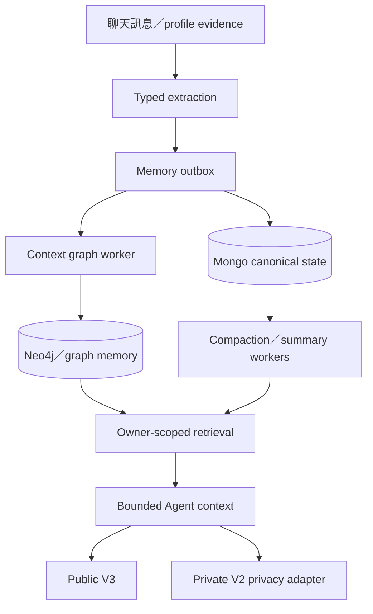
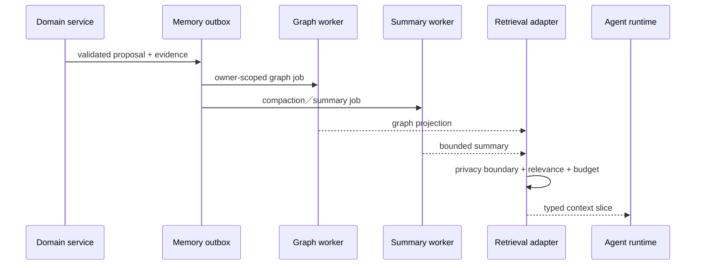

# 09 — 記憶、摘要與圖譜

## Relevant Source Files

- `Server/social/services/memory_service.py`
- `Server/social/services/context_graph_service.py:L1-L180`
- `Server/social/services/semantic_plan_service.py:L240-L280`
- `Server/social/services/conversation_compaction_service.py`
- `Server/social/services/conversation_summary_operations.py`
- `Server/social/services/memory_outbox_service.py`
- `Server/docs/MEMORY_CONTEXT_ENGINE_GUIDE.md`
- `DatingApp/lib/services/ayue_v3_api_service.dart:L1140-L1235`

## TL;DR

系統把短期對話、profile memory、relationship context、摘要與圖譜投影分成不同資料域，並透過 bounded context API 供 Agent 使用。Mongo 的 preview、Neo4j／graph memory 與 Appwrite 的資料投影不能互相取代；每個 memory write 都需要 owner、evidence、confidence、source 與 idempotency。文件目前能確認程式邊界，但正式 graph schema、索引與已存在資料量仍需部署環境補查。

## Overview

Social 的 memory service 與 context graph service 負責把訊息、profile extraction、關係資料和摘要整理成 Agent 可用的 projection。`semantic_plan_service.py` 可建立 Neo4j driver，表示圖譜與語意計畫是明確的外部邊界；`context_graph_service.py` 則在 Social startup 中啟動 worker，將更新從 request path 分離。[Graph 設定](../../Server/social/services/semantic_plan_service.py:L240-L280)、[Social startup worker](../../Server/social/main.py:L120-L139)

工作區文件把 Public V3 context 定義成 bounded、versioned typed bundle，且要求先做 owner／room／accepted-relation 的硬隔離，再做相關度與 budget 排序。這些規則比「把整段聊天塞進 prompt」更接近現行設計；任何新功能都應先確認 domain owner 與 privacy adapter。

## Architecture Diagram

## Key Concepts

| Concept | Description | Source |
|---|---|---|
| Durable memory | 通過 evidence、owner、confidence與source驗證的長期資料 | `Server/docs/MEMORY_CONTEXT_ENGINE_GUIDE.md` |
| Relationship context | 雙人關係或共同聊天室範圍的 context，不等同個人偏好 | `Server/social/services/semantic_plan_service.py` |
| Memory outbox | 將 request path 與 graph／memory side effect 解耦的 queue | `Server/social/services/memory_outbox_service.py` |
| Context projection | 給 Agent 的 bounded、privacy-safe typed bundle | `Server/social/services/context_graph_service.py` |
| Summary worker | 將長對話壓縮成可檢索摘要 | `Server/social/services/conversation_summary_operations.py` |

## How It Works

訊息或 profile change 先由 domain service 建立可驗證的 proposal，再交給 memory facade 或 outbox。outbox worker 可重試、去重並將資料投影到 Mongo、圖譜或摘要流程；這樣 request 不會直接阻塞在每一個外部寫入上。

讀取時，context builder 依 owner、room、accepted relationship 等 hard boundary 篩選候選，再做 query、relevance、dedup 與 token／字元 budget。Public V3 與 Private V2 會套用不同 privacy adapter，避免公開阿月讀到私人 mediator context。前端可透過 `/api/profile/memories`、relationship memory endpoints 或狀態 API 顯示必要 projection，但不應取得 raw graph document。

摘要與 compaction 是另一條背景流程：它處理長對話的壓縮、review、retry 與 failure state；摘要成功不代表原始訊息被刪除，也不代表摘要可直接當作永久偏好。

## Component Reference

| Component | Type | Responsibility | Source |
|---|---|---|---|
| `memory_service` | domain service | memory proposal validation與寫入 facade | `Server/social/services/memory_service.py` |
| `context_graph_service` | worker/service | graph projection與context retrieval | `Server/social/services/context_graph_service.py:L1-L180` |
| `semantic_plan_service` | graph adapter | Neo4j driver與semantic plan操作 | `Server/social/services/semantic_plan_service.py:L240-L280` |
| `memory_outbox_service` | outbox worker | 非同步 memory side effect | `Server/social/services/memory_outbox_service.py` |
| `conversation_summary_operations` | summary worker | 摘要 batch、review與failure recovery | `Server/social/services/conversation_summary_operations.py` |

## Data Flow

## Error Handling

外部 graph unavailable、outbox retry、summary batch failure、低 confidence 或缺 evidence 時，系統應回傳 bounded empty／error code 或保留 pending state，不能退回 raw document。任何跨 owner／room 的 retrieval 應被拒絕或消毒；「查不到」不能藉由放寬 privacy filter 來修復。

## Gotchas & Conventions

> ⚠️ **Gotcha**：Mongo `profile_memory_preview`、relationship projection 與 Neo4j node 不是三份可自由修改的真相；文件要標示 source of truth 與 projection。

> 📌 **Convention**：所有 durable memory 都必須可追溯到 evidence、message id 或明確來源，並具備 idempotency。

> ❓ **[NEEDS INVESTIGATION]**：目前尚未取得正式 Neo4j schema、圖譜資料治理與摘要 rollout 設定，因此不能在此宣稱完整資料模型。

## Active Development Areas

Context slice、privacy adapter、memory outbox、summary DAG、profile extraction 與 semantic plan projection 是高風險活動區域；新增欄位時要同步更新 Agent contract、privacy tests 與前端 projection。

## Cross-References

- Agent 使用方式：[05 — 阿月與 Agent](05-ai-agent.md)
- 聊天來源：[07 — 聊天與風險治理](07-chat-risk.md)
- API projection：[12 — API 與資料契約](12-api-data-contracts.md)
- 背景工作：[13 — 背景工作與可靠性](13-background-reliability.md)
