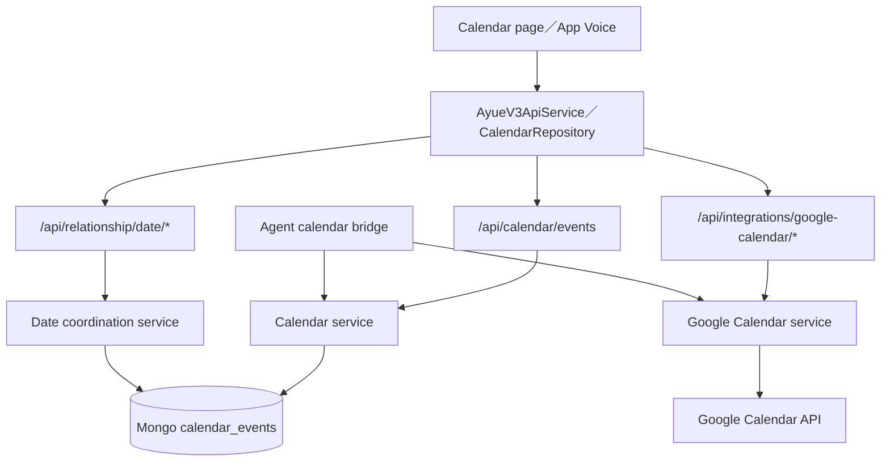
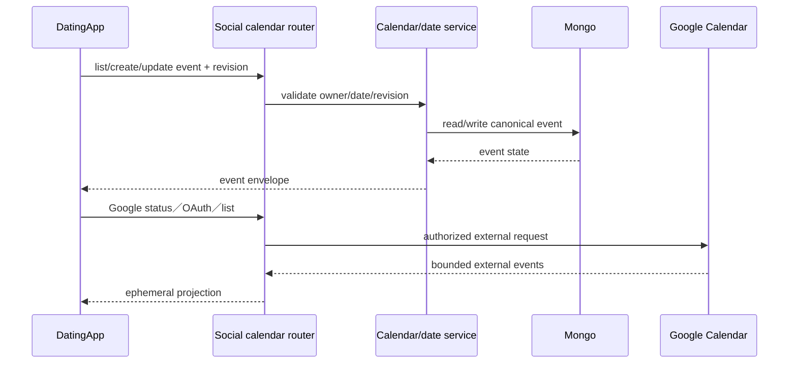

# 10 — 活動、約會與行事曆

## Relevant Source Files

- `DatingApp/lib/services/ayue_v3_api_service.dart:L1480-L1685`
- `DatingApp/lib/services/calendar_repository.dart`
- `DatingApp/lib/services/google_calendar_api_service.dart:L100-L220`
- `Server/social/routers/calendar.py:L16-L85`
- `Server/social/routers/google_calendar.py:L13-L143`
- `Server/social/services/calendar_service.py`
- `Server/social/services/date_coordination_service.py`
- `Server/social/services/agent_calendar_bridge.py:L80-L115`
- `Server/social/services/event_discovery_service.py:L1-L130`

## TL;DR

系統把個人行事曆、雙人約會協調、Google Calendar 整合與活動探索分成不同流程。前端使用 expected revision 更新或取消事件；Server 由 calendar／relationship date services 擁有狀態；Google Calendar 則有獨立授權、查詢區間與 account status。阿月可以讀取受限的 calendar projection，但不應將外部事件或未授權資料直接寫成使用者的永久偏好。

## Overview

前端 `AyueV3ApiService` 封裝 `/api/calendar/events` 的 list、create、patch、cancel、reschedule、settings 與 relationship date endpoints，並把 revision 回傳給下一次寫入。`CalendarRepository` 再把 API model 與 page cache 組合，讓 Calendar page 和 App Voice 使用同一份狀態。[前端 calendar API](../../DatingApp/lib/services/ayue_v3_api_service.dart:L1480-L1685)

後端 `calendar.py` 負責個人事件與共同約會事件的 HTTP adapter；若事件來源是 date，取消或改期會轉交 `date_coordination_service`，維持雙方 revision 與狀態一致。Google Calendar 在另一組 router 中處理 OAuth callback、status、list 與 disconnect；其查詢範圍也有日期上限。[Calendar router](../../Server/social/routers/calendar.py:L16-L85)、[Google Calendar router](../../Server/social/routers/google_calendar.py:L13-L143)

## Architecture Diagram

## Key Concepts

| Concept | Description | Source |
|---|---|---|
| Calendar event | 個人或雙人事件的 canonical record | `Server/social/routers/calendar.py:L33-L62` |
| Revision | 防止舊畫面覆寫新事件狀態 | `DatingApp/lib/services/ayue_v3_api_service.dart:L1529-L1579` |
| Date coordination | 雙方邀請、確認、改期與取消的狀態 | `DatingApp/lib/services/ayue_v3_api_service.dart:L1601-L1685` |
| External calendar | 受 OAuth、owner 與日期範圍限制的 Google projection | `Server/social/routers/google_calendar.py:L45-L143` |
| Agent calendar bridge | Agent 可用的 bounded calendar read／write adapter | `Server/social/services/agent_calendar_bridge.py:L80-L115` |

## How It Works

個人事件流程由前端送 user id、日期、時區與內容到 `/api/calendar/events`；Server 解析日期範圍、呼叫 calendar service、寫入 calendar collection，再回傳 event envelope。更新、取消與改期都帶 expected revision，Server 會拒絕過期 revision，避免兩台裝置互相覆寫。

雙人約會流程先建立 coordination，再由另一方 respond、update 或 confirm。共同事件取消與改期會查出 participants，交由 date coordination service 進行雙方狀態轉移，而非直接把資料庫 status 改掉。

Google Calendar 是獨立 provider。Server 先取得 connection status 或開始 OAuth，callback 完成後才可 list events；查詢區間在 router 內限制為最多約 92 天。Agent 讀取外部事件時，`agent_calendar_bridge` 會要求 owner proof 與 calendar consent，並回傳 ephemeral projection，不應把原始 Google event 整包放進 prompt。

活動探索則由 Matchmaker／Social event discovery worker ingest、reconcile、relevance project 與 lifecycle cleanup，最後產生可供配對或 proactive flow 使用的 bounded opportunity。

## Component Reference

| Component | Type | Responsibility | Source |
|---|---|---|---|
| `CalendarRepository` | Dart repository | 本地 cache 與 calendar API 的橋接 | `DatingApp/lib/services/calendar_repository.dart` |
| `calendar.py` | FastAPI router | 個人事件、約會事件與 revision adapter | `Server/social/routers/calendar.py:L16-L85` |
| `google_calendar.py` | FastAPI router | OAuth、status、list與disconnect | `Server/social/routers/google_calendar.py:L13-L143` |
| `date_coordination_service` | domain service | 雙方約會 state machine | `Server/social/services/date_coordination_service.py` |
| `event_discovery_service` | worker/service | 活動來源 ingest、reconcile與cache | `Server/social/services/event_discovery_service.py:L1-L130` |

## Data Flow

## Error Handling

日期格式錯誤、查詢超過範圍、Google 未連線、重新授權、account 不允許、過期 revision 與雙方協調狀態不符，都應保持可區分的 error code。前端可以重新整理或要求使用者確認，但不能在 revision conflict 時自動重送同一個寫入。

## Gotchas & Conventions

> ⚠️ **Gotcha**：Google Calendar event 是外部 projection，不是 Social 的 Mongo canonical event；兩者的 id、權限與生命週期不同。

> 📌 **Convention**：所有可變更事件都帶 revision；Agent 的 Calendar write 必須經過 confirmation 與 owner proof。

> ❓ **[NEEDS INVESTIGATION]**：正式 Google OAuth client、redirect domain、scope 與 production calendar account allowlist 尚未從部署設定核對。

## Active Development Areas

date coordination、calendar revision／CAS、App Voice calendar action、Google Calendar owner consent、event discovery 與 proactive opportunity 是目前行事曆相關的主要活動區域。

## Cross-References

- Agent 工具：[05 — 阿月與 Agent](05-ai-agent.md)
- 配對活動：[06 — 配對與關係建立](06-matchmaking.md)
- API 契約：[12 — API 與資料契約](12-api-data-contracts.md)
