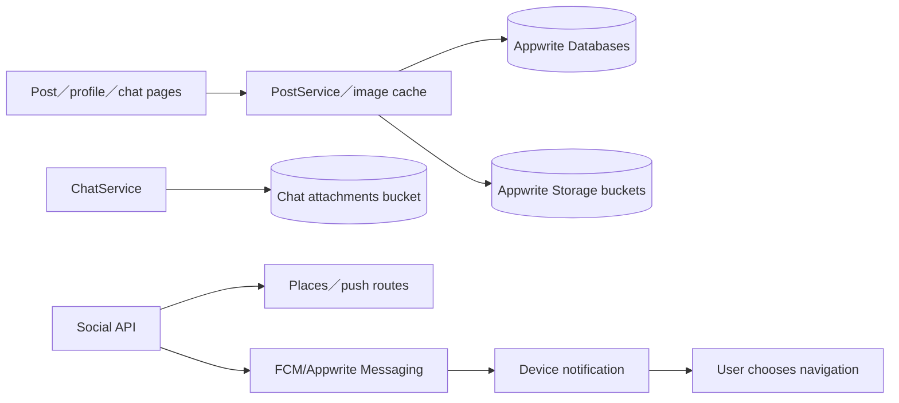
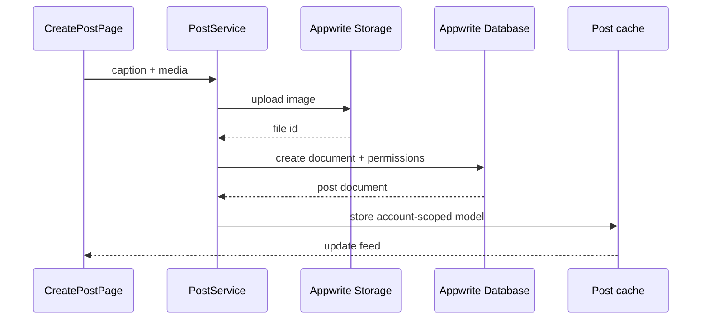

# 11 — 社群、貼文與媒體

## Relevant Source Files

- `DatingApp/lib/services/post_service.dart:L1-L90`
- `DatingApp/lib/services/post_service.dart:L360-L450`
- `DatingApp/lib/services/image_cache_repository.dart:L1-L80`
- `DatingApp/lib/services/chat_image_cache.dart:L50-L180`
- `DatingApp/lib/pages/create_post_page.dart`
- `Server/social/routers/places.py`
- `Server/social/routers/push.py`
- `DatingApp/lib/services/push_notification_service.dart:L270-L430`

## TL;DR

社群功能由 DatingApp 直接使用 Appwrite Database 與 Storage 保存貼文、圖片和媒體 metadata；Social 仍提供地點、通知、推播與部分 profile／relationship API。貼文與聊天圖片使用不同 collection／bucket，前端再以 cache、prefetch 與 image optimization 降低畫面等待。文件應把「內容 owner」「檔案 owner」「通知導航資料」分開說明。

## Overview

`PostService` 把 live storage adapter 與 test double 隔離。建立貼文時先上傳圖片（若有），再以 Appwrite Databases 建立 document，並設定 read、update、delete permissions；更新、刪除與列表讀取走同一個 repository facade。[貼文 storage](../../DatingApp/lib/services/post_service.dart:L360-L450)

聊天 attachments 使用 `chatAttachmentsBucketId`，profile image 使用另一個 bucket，貼文又有自己的 `postsBucketId`。這種分桶可降低權限與 cache 混淆，但也意味著每個 page／service 不能只傳一個通用 file id。

Push notification 會在登入帳號後註冊 FCM provider，前端依平台能力決定是否可用；Server push route 只傳遞 allowlisted data，例如 chat surface、conversation id、destination room 與 focus match id，不能讓推播 listener 自動執行配對決策。[Push 註冊](../../DatingApp/lib/services/push_notification_service.dart:L270-L430)、[通知 payload](../../Server/social/services/notification_service.py:L119-L140)

## Architecture Diagram

## Key Concepts

| Concept | Description | Source |
|---|---|---|
| Post document | Appwrite 中的貼文內容與 metadata | `DatingApp/lib/services/post_service.dart:L405-L450` |
| Bucket separation | profile、post、chat attachment 的檔案邊界 | `DatingApp/lib/services/appwrite_config.dart:L10-L16`、`DatingApp/lib/services/chat_image_cache.dart:L64-L85` |
| Permission | 建立貼文時設定 owner update/delete 與 public read | `DatingApp/lib/services/post_service.dart:L410-L423` |
| Image cache | 讀取、預取、壓縮及平台差異處理 | `DatingApp/lib/services/image_cache_repository.dart` |
| Allowlisted notification data | 推播只攜帶可驗證導航參考 | `Server/social/services/notification_service.py:L119-L140` |

## How It Works

建立貼文時，頁面把文字、選擇的圖片與 location／metadata 交給 `PostService`。live adapter 先把圖片上傳至 posts bucket，再建立 document，並把 document model 回傳給 cache。更新與刪除使用 document id，權限由 Appwrite account 作用域控制。

聊天圖片不走貼文 service；`ChatService` 使用 chat attachment bucket，訊息 document 仍由 Social 的聊天流程保存。這讓聊天風險與 message idempotency 可維持在 Server，但圖片內容則由 Appwrite Storage 提供。

地點搜尋與通知是 Social API 功能。Notification event 會包含 chat surface、conversation id、contact id、message kind 等 allowlisted fields；前端收到後可導航到相關頁面，但決策仍必須由使用者在 App 中明確操作。

## Component Reference

| Component | Type | Responsibility | Source |
|---|---|---|---|
| `PostService` | Dart service | 貼文圖片、document與權限 facade | `DatingApp/lib/services/post_service.dart:L360-L450` |
| `_LivePostStorage` | Dart adapter | Appwrite Storage upload/delete | `DatingApp/lib/services/post_service.dart:L360-L398` |
| `_LivePostDb` | Dart adapter | Appwrite document CRUD | `DatingApp/lib/services/post_service.dart:L405-L450` |
| `ImageCacheRepository` | Dart repository | 圖片 cache／prefetch／尺寸處理 | `DatingApp/lib/services/image_cache_repository.dart` |
| `notification_service` | Python service | 建立受限 push payload | `Server/social/services/notification_service.py:L119-L140` |

## Data Flow

## Error Handling

圖片壓縮、上傳、document create、permission error 與 cache failure 應分開處理；上傳成功但 document 建立失敗時，需要記錄待清理 file id，不能直接假設整體 transaction 存在。推播失敗不應阻止主要資料寫入，但需反映 push health 給設定頁。

## Gotchas & Conventions

> ⚠️ **Gotcha**：檔案 bucket id 不代表任何 bucket 的資料可以互換；profile、post、chat attachments 有不同用途與權限。

> 📌 **Convention**：推播只做通知與使用者選擇後的導覽，不做自動 accept、block 或 room switch。

> ❓ **[NEEDS INVESTIGATION]**：Appwrite storage permissions、檔案保留政策與未完成貼文上傳的清理機制尚未由正式 console schema 驗證。

## Active Development Areas

貼文與圖片 cache、Web／mobile image handling、FCM／Appwrite messaging、push navigation contract 與聊天附件去重是社群媒體區域的主要活動面。

## Cross-References

- 聊天資料：[07 — 聊天與風險治理](07-chat-risk.md)
- 身分與權限：[04 — 身分驗證與個人資料](04-auth-profile.md)
- API 契約：[12 — API 與資料契約](12-api-data-contracts.md)
