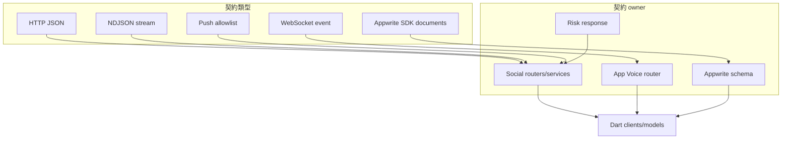
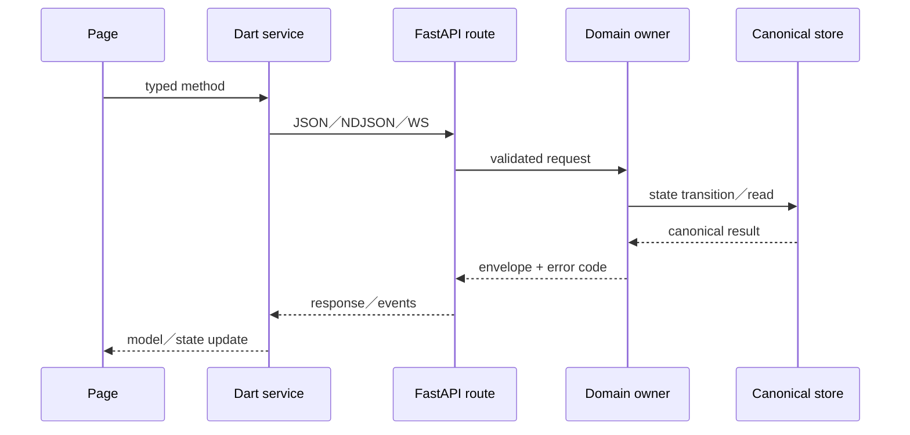

# 12 — API 與資料契約

## Relevant Source Files

- `DatingApp/lib/services/ayue_v3_api_service.dart:L953-L1005`
- `DatingApp/lib/services/ayue_v3_api_service.dart:L1261-L1685`
- `DatingApp/lib/services/chat_service.dart:L682-L810`
- `DatingApp/lib/services/matchmaking_api_service.dart:L765-L1065`
- `Server/social/main.py:L88-L104`
- `Server/social/routers/chat.py:L1-L31`
- `Server/social/routers/calendar.py:L16-L85`
- `Server/social/routers/match.py:L1958-L2048`
- `Server/app_voice_assistant/router.py:L317-L430`

## TL;DR

前後端契約分成 HTTP JSON、NDJSON stream、WebSocket event、Appwrite SDK document 與 push payload 五類。每一類都有自己的 owner、timeout、錯誤碼與狀態語意；不能只列 URL 清單。最重要的契約欄位包括 user／owner、client message id、match revision、coordination revision、stream protocol version、choice／confirmation 與 allowlisted notification references。

## Overview

Social 以 FastAPI router prefix 組裝公開 API；`chat.py` 將多個 leaf router 收斂到 `/api`，`main.py` 再掛上 `chat`、`match`、`calendar`、`google_calendar`、voice 與 relationship routers。[路由組裝](../../Server/social/routers/chat.py:L1-L31)、[主 API](../../Server/social/main.py:L88-L104)

DatingApp 的 service layer 對應這些 endpoint，並把 response envelope 轉成 typed model。公開 Agent 使用 `/api/direct_chat/stream` 和 NDJSON；私人 Agent 使用 `/api/mediator/private/stream`；配對使用 request/status/state/decision；行事曆使用 events 與 relationship date endpoints；App Voice 另以 capability/session/WSS protocol 溝通。

## Architecture Diagram

## Key Concepts

| Concept | Description | Source |
|---|---|---|
| Base URL | client 對外 API 的固定公開網域 | `DatingApp/lib/services/ayue_v3_api_service.dart:L972-L974` |
| NDJSON v1 | Agent stream 的 token／event protocol header | `DatingApp/lib/services/ayue_v3_api_service.dart:L1274-L1278` |
| Idempotency key | 配對、訊息或副作用 retry 的去重參考 | `DatingApp/lib/services/ayue_v3_api_service.dart:L1404-L1414` |
| Expected revision | calendar／match state 的 optimistic concurrency 欄位 | `DatingApp/lib/services/ayue_v3_api_service.dart:L1437-L1455` |
| Allowlisted projection | 只把前端需要的欄位送出，避免 raw document 外洩 | `Server/social/services/notification_service.py:L119-L140` |

## How It Works

前端 request adapter 會統一加入 Content-Type、Authorization（若符合條件）、timeout 與 JSON body。錯誤 response 由 client 轉成 domain exception；頁面依 code 決定顯示、retry、重新登入或更新 canonical state。

Agent stream 是長連線，不只是一個 JSON response。client 建立 request 後讀取 bytes，交給 decoder 切成 event；heartbeat 或 progress 不能無限延長整體 deadline。WebSocket 則先經 capability negotiation 和 ticket handshake，再傳 typed event。

配對與行事曆的寫入 contract 都包含狀態預期或 revision。若 server 回傳 conflict，client 應重新讀取 state，而不是盲目重送。同理，聊天使用 client message id 讓 server 可以判斷 duplicate。

Appwrite SDK contract 由 console schema、collection attributes、permissions 與 bucket config 共同定義；目前文件只從 client code 看到 resource identifiers，正式 schema 需要額外證據。

## Component Reference

| Component | Type | Responsibility | Source |
|---|---|---|---|
| `AyueV3ApiService` | Dart adapter | Agent、match、calendar JSON/NDJSON contract | `DatingApp/lib/services/ayue_v3_api_service.dart:L953-L1005` |
| `ChatService` | Dart adapter | message、risk、Realtime contract | `DatingApp/lib/services/chat_service.dart:L682-L810` |
| `chat.py` | FastAPI aggregator | `/api` chat leaf routers | `Server/social/routers/chat.py:L1-L31` |
| `AppVoiceSocketClient` | Dart WebSocket client | capability/session/ticket/event contract | `DatingApp/lib/services/app_voice/app_voice_client.dart:L115-L230` |
| `notification_service` | Python projection | push allowlisted fields | `Server/social/services/notification_service.py:L119-L140` |

## Data Flow

## Configuration & Environment

契約相關設定包括正式 API 網域、CORS origins、RISK_SERVICE_URL、內部 service ports、stream protocol version、App Voice consent／task protocol version，以及 Appwrite／Firebase 資源 identifiers。文件只記名稱與用途；secret、JWT、API key、OAuth client secret 與 `.env` 值都不應納入。

## Error Handling

API error code 是 UI 和 retry policy 的依據。需要特別保留的類型包括 authentication required、owner mismatch、invalid revision、idempotency duplicate、risk blocked、matchmaker timeout、Google reauth、voice quota、stream timeout、invalid NDJSON 與 WebSocket protocol error。

## Gotchas & Conventions

> ⚠️ **Gotcha**：同一個 `/api` prefix 下的路由可能由不同 domain owner 實作；路徑相似不表示可以共用資料模型。

> 📌 **Convention**：先定義 server-owned typed contract，再實作前端 UI；不要以 response 自由文字取代 status／revision／error code。

> ❓ **[NEEDS INVESTIGATION]**：目前尚未產生由 OpenAPI、Appwrite console 與 live response 組合出的完整欄位矩陣。

## Active Development Areas

NDJSON event envelope、App Voice protocol version、match proposal namespace、risk intervention payload、calendar revision 與 push notification allowlist 是契約最常變動的區域。

## Cross-References

- 前端 client：[03 — DatingApp 前端架構](03-datingapp-architecture.md)
- Agent contract：[05 — 阿月與 Agent](05-ai-agent.md)
- 配對：[06 — 配對與關係建立](06-matchmaking.md)
- 測試：[15 — 測試與驗證](15-testing.md)
