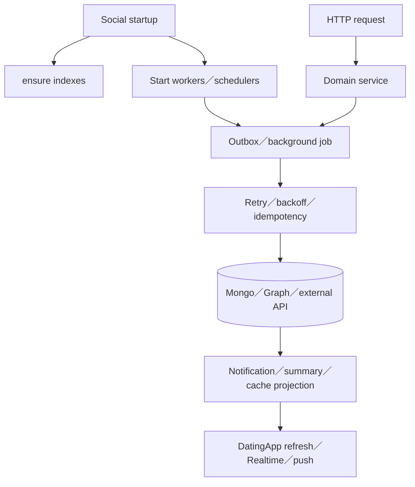
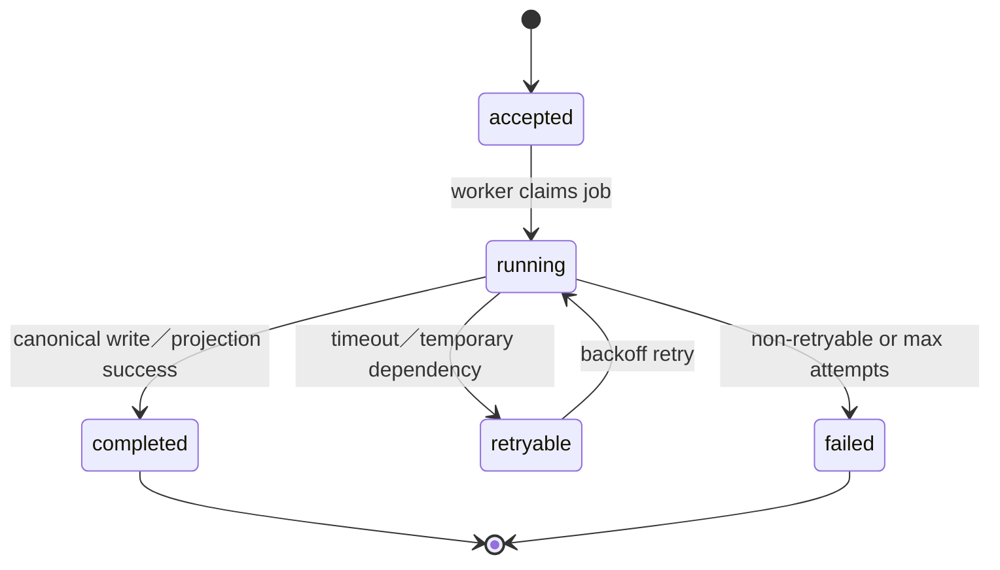

# 13 — 背景工作與可靠性

## Relevant Source Files

- `Server/social/main.py:L106-L161`
- `Server/agent_quota/service.py`
- `Server/social/services/memory_outbox_service.py`
- `Server/social/services/conversation_summary_operations.py`
- `Server/social/services/match_search_job_service.py`
- `Server/social/services/event_lifecycle_service.py`
- `Server/social/services/event_delivery_service.py`
- `Server/app_voice_assistant/task_service.py`
- `DatingApp/lib/services/app_data_coordinator.dart:L79-L145`

## TL;DR

Social 啟動時會建立索引並啟動多個 worker、scheduler、outbox 與 background task service，因此 API response 成功不一定代表所有後續 side effect 已完成。可靠性設計集中在 bounded timeout、idempotency、revision、outbox、retry、session epoch 與可觀測的 error code。文件和測試應把同步 request、非同步 job、通知投影與最終一致性分開說明。

## Overview

`social/main.py` 的 startup handler 會建立 chat、calendar、profile skill、context graph、match、event、quota 等索引，並啟動 match search、memory outbox、profile retry、proactive care、relationship memory、context graph、concept embedding、event lifecycle、event discovery、event delivery、summary 與 App Voice task services。[Startup workers](../../Server/social/main.py:L106-L140)

這表示一個 Social process 同時是 HTTP API 與多個背景任務的 host。若 worker 未啟動、資料庫不可用或 quota exhausted，API 仍可能部分可用，但 feature 的完整流程會降級。前端 `AppDataCoordinator` 也有 warmup、cache TTL、resume cooldown 與 owner／epoch gate，避免每次頁面切換都重新觸發所有讀取。[前端 warmup](../../DatingApp/lib/services/app_data_coordinator.dart:L79-L145)

## Architecture Diagram

## Key Concepts

| Concept | Description | Source |
|---|---|---|
| Startup index | 服務啟動時建立或確認資料索引 | `Server/social/main.py:L106-L128` |
| Worker | 後台執行 queue、projection、search或summary | `Server/social/main.py:L129-L140` |
| Outbox | 把 side effect 從 request path 拆出 | `Server/social/services/memory_outbox_service.py` |
| Idempotency | retry 時避免重複寫入或重複副作用 | `Server/social/services/match_search_job_service.py` |
| Warmup／TTL | 前端資料預熱、cache 與 resume 節流 | `DatingApp/lib/services/app_data_coordinator.dart:L144-L145` |

## How It Works

同步 request 先完成必要的 ownership、schema、revision 與 policy 驗證，再寫入 canonical state 或建立 job。需要耗時模型、圖譜、外部 API 或大型 projection 的工作，交給 worker／outbox；request 只回傳 accepted、pending、current state 或 bounded result。

配對搜尋是典型範例：Social 建立 search state，背景 pipeline 呼叫 Matchmaker，結果再寫入 proposal projection；前端用 status API 或通知更新 Match Hub。記憶、摘要與事件探索也使用同樣的模式，但每個 domain 有不同的 retry、failure state 與資料 owner。

App Voice task service 會在 capability 與 session policy 通過後處理可追蹤的 task ref；前端 action executor 保留 pending confirmation 和 progress generation，避免上一個 voice session 的結果更新到新頁面。

## Component Reference

| Component | Type | Responsibility | Source |
|---|---|---|---|
| `setup_calendar_indexes` | startup handler | 建立多領域索引並啟動 workers | `Server/social/main.py:L106-L140` |
| `memory_outbox_service` | outbox | 排程 memory side effect 與 retry | `Server/social/services/memory_outbox_service.py` |
| `conversation_summary_operations` | worker | summary batch、review、failure recovery | `Server/social/services/conversation_summary_operations.py` |
| `match_search_job_service` | worker | 配對搜尋與狀態投影 | `Server/social/services/match_search_job_service.py` |
| `AppDataCoordinator` | Dart coordinator | 前端 warmup、TTL 與 epoch isolation | `DatingApp/lib/services/app_data_coordinator.dart:L79-L145` |

## Data Flow

## Error Handling

可靠性錯誤要保留 domain code、attempts、job state、dependency status 與可重試性。對不可重試錯誤，不應無限 retry；對已完成但 response 遺失的 request，client 應讀 canonical state，而不是重做 write。Worker failure 需要有 health、log、metrics 或 status projection，否則使用者只能看到「沒有更新」。

## Gotchas & Conventions

> ⚠️ **Gotcha**：Social 啟動成功只證明 process 能跑；不代表 Mongo、Neo4j、Risk、Matchmaker、模型與所有 worker 都健康。

> 📌 **Convention**：任何 retryable side effect 都要有 idempotency、revision 或唯一 job key。

> ❓ **[NEEDS INVESTIGATION]**：正式環境是否有獨立 worker process、排程器或 supervisor，程式碼只顯示目前 process 內的 startup hooks，仍需部署資料確認。

## Active Development Areas

summary rollout、memory outbox、match search timeout restoration、event lifecycle／delivery、quota 與 App Voice task lifecycle 是目前可靠性驗證的主要活動區域。

## Cross-References

- API 行為：[12 — API 與資料契約](12-api-data-contracts.md)
- 配對 job：[06 — 配對與關係建立](06-matchmaking.md)
- 記憶 job：[09 — 記憶、摘要與圖譜](09-memory-graph.md)
- 啟動環境：[14 — 部署、啟動與環境](14-deployment.md)
