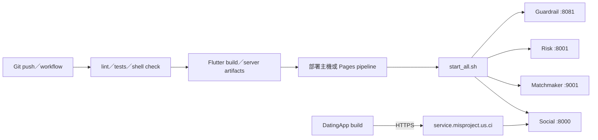
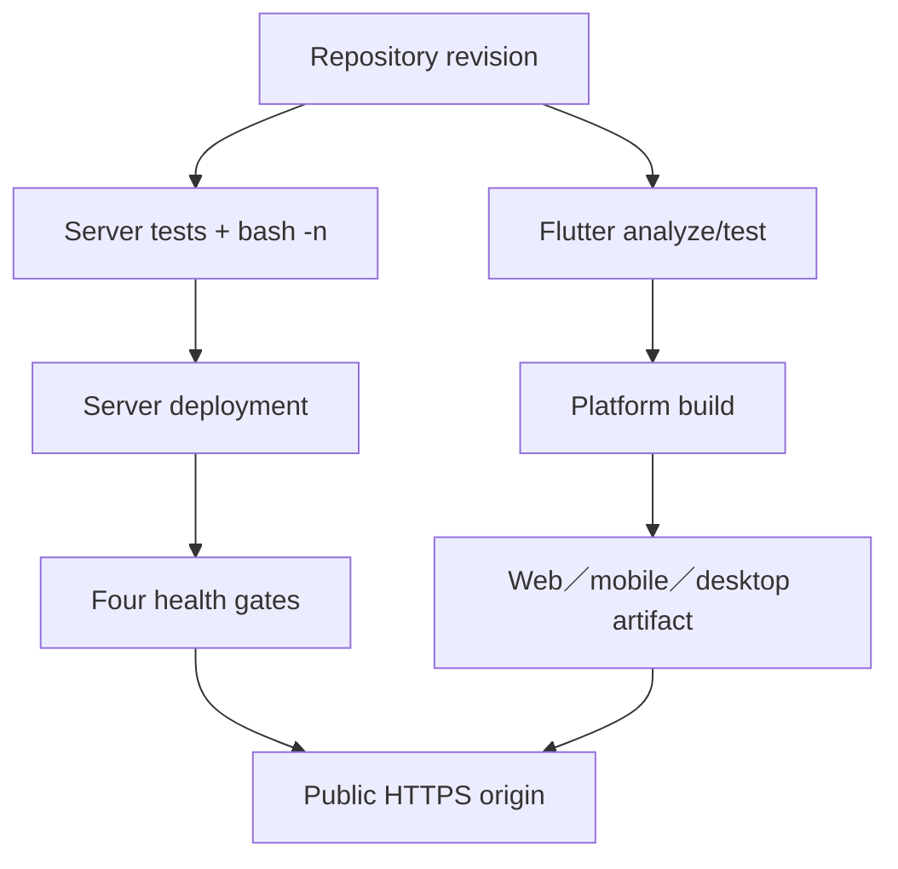

# 14 — 部署、啟動與環境

## Relevant Source Files

- `Server/start_all.sh:L1-L245`
- `Server/scripts/run_ayue_social.sh`
- `Server/scripts/run_ayue_risk.sh`
- `Server/scripts/run_ayue_matchmaker.sh`
- `Server/scripts/run_ayue_guardrail.sh`
- `Server/pi_agent/package.json`
- `Server/.github/workflows/tests.yml:L30-L40`
- `DatingApp/.github/workflows/build-release.yml`
- `DatingApp/.github/workflows/deploy-web.yml`
- `DatingApp/lib/services/ayue_v3_api_service.dart:L972-L974`

## TL;DR

Server 的正式啟動契約是 `start_all.sh`，固定服務埠為 Guardrail 8081、Risk 8001、Matchmaker 9001、Social 8000；DatingApp 的正式 API 預設網域是 `https://service.misproject.us.ci`。部署文件應把「程式碼內宣告的啟動順序」與「正式主機實際部署拓撲」分開，因為目前 repository 沒有完整證明 reverse proxy、process supervisor、資料庫與模型服務的線上配置。

## Overview

`start_all.sh` 先清理或檢查固定 ports，再啟動 Guardrail，等待 `/v1/models`，接著啟動 Risk `/health`、Matchmaker `/health`、Social `/api/health`。Pi bridge 的 Node dependencies 也會在腳本前置檢查中驗證，缺少時會要求在 `pi_agent` 安裝依賴。[完整啟動腳本](../../Server/start_all.sh:L45-L55)、[服務順序](../../Server/start_all.sh:L187-L235)

DatingApp 的 Dart service 以正式網域作為 default base URL，也允許部分 compile-time override；這些 override 不能違反專案的公開連線契約。CI workflow 會安裝 Flutter dependencies、執行 analyze/test/build 與 web／mobile／desktop packaging，但 workflow 觸發的部署不等同於此文件已驗證正式環境成功。

## Architecture Diagram

## Key Concepts

| Concept | Description | Source |
|---|---|---|
| Startup contract | 所有 Server 服務的唯一正式啟動入口 | `Server/start_all.sh:L1-L20` |
| Health gate | 服務啟動後必須通過的 endpoint check | `Server/start_all.sh:L188-L235` |
| Public origin | 前端連線的固定 HTTPS 網域 | `DatingApp/lib/services/ayue_v3_api_service.dart:L972-L974` |
| Pi bridge check | Social Agent 需要的 Node bridge 與 dependency 檢查 | `Server/start_all.sh:L45-L55` |
| CI build path | workflow 中的 test、build、deploy automation | `DatingApp/.github/workflows/build-release.yml` |

## How It Works

部署前先確認兩個 repository 的 revision、工作樹、依賴與環境變數範本。Server 依 `start_all.sh` 啟動，不使用單獨 `uvicorn` 來宣稱整合成功；腳本的 health checks 只驗證服務 endpoint 可回應，資料庫、模型或外部 API 的功能仍需額外 smoke test。

前端 build 依平台需要 Android、iOS、Web、Linux、macOS 或 Windows toolchain。`pubspec.yaml` 宣告 runtime packages，CI workflow 再執行各平台 build。Web 部署 workflow 會觸發 Pages repository 的建置流程；因此正式 web host 與本 repository 的 build artifact 之間仍有一個外部 pipeline 邊界。

## Component Reference

| Component | Type | Responsibility | Source |
|---|---|---|---|
| `start_all.sh` | shell entrypoint | process cleanup、start、health與shutdown | `Server/start_all.sh:L1-L245` |
| `run_ayue_social.sh` | shell launcher | Social API process | `Server/scripts/run_ayue_social.sh` |
| `run_ayue_risk.sh` | shell launcher | Risk backend process | `Server/scripts/run_ayue_risk.sh` |
| `run_ayue_matchmaker.sh` | shell launcher | Matchmaker process | `Server/scripts/run_ayue_matchmaker.sh` |
| `run_ayue_guardrail.sh` | shell launcher | Guardrail process | `Server/scripts/run_ayue_guardrail.sh` |
| `build-release.yml` | CI workflow | 多平台 Flutter build與artifact | `DatingApp/.github/workflows/build-release.yml` |

## Data Flow

## Configuration & Environment

需要記錄的設定類別包含固定 ports、公開 API origin、CORS origins、Mongo／Neo4j URI、Appwrite endpoint、Google OAuth、Firebase／FCM、model provider、Guardrail endpoint、Pi bridge dependency、quota 與 timeout。交付文件只描述名稱、用途與是否必要，不公開值。

## Error Handling

啟動失敗應依腳本輸出的 service log 判斷：Guardrail health、Risk health、Matchmaker health、Social health、Pi bridge self-check 各自代表不同故障面。若 API 能回應但外部資料庫 unavailable，應在健康／status projection 中表達 degraded，不能只以 process alive 判定成功。

## Gotchas & Conventions

> ⚠️ **Gotcha**：`start_all.sh` 可能清理固定 port 上的舊程序；在共享主機執行前要確認程序 ownership。

> 📌 **Convention**：Server 變更、依賴變更與啟動參數變更都必須回頭檢查 `start_all.sh`。

> ❓ **[NEEDS INVESTIGATION]**：正式 host 的 process supervisor、TLS termination、reverse proxy、log retention、database backup 與 rollout strategy 目前沒有完整 repository 證據。

## Active Development Areas

固定 port health、Pi bridge dependency、Guardrail model availability、Flutter multi-platform release、web Pages pipeline 與 production environment parity 是部署區域的活動重點。

## Cross-References

- 開始條件：[00.5 — 開始閱讀與啟動前提](00.5-getting-started.md)
- 背景工作：[13 — 背景工作與可靠性](13-background-reliability.md)
- 測試：[15 — 測試與驗證](15-testing.md)
