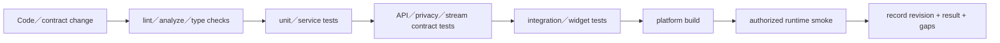
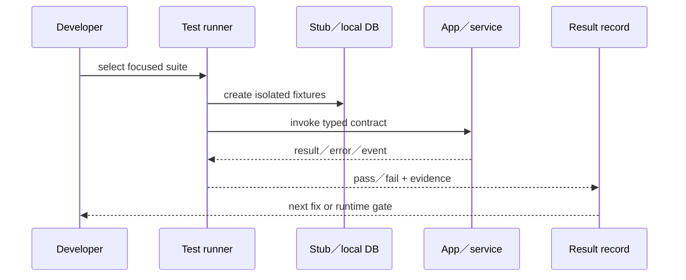

# 15 — 測試與驗證

## Relevant Source Files

- `Server/.github/workflows/tests.yml:L30-L40`
- `Server/scripts/run_offline_tests.py`
- `Server/social/tests/`
- `Server/app_voice_assistant/tests/`
- `Server/risk_backend/tests/`
- `DatingApp/test/`
- `DatingApp/integration_test/`
- `DatingApp/scripts/test_linux_launcher.py`
- `DatingApp/.github/workflows/verify.yml`

## TL;DR

兩個 repository 都有大量 unit、contract、integration 與 workflow 驗證，但測試存在不等於所有流程在目前環境通過。Server CI 明確檢查 Python dependencies、`bash -n start_all.sh` 與 offline suites；DatingApp 則有 Dart tests、integration tests、Flutter analyze 與多平台 build。正式文件應同時記錄測試覆蓋、執行前提、未執行項目與 production smoke test 缺口。

## Overview

Server 測試依 domain 分散在 `social/tests`、`risk_backend/tests`、`app_voice_assistant/tests`、`matchmaker_agent` 與 root tests。測試檔案涵蓋配對 state、風險 intervention、Agent stream、memory privacy、calendar access、summary、App Voice protocol、notification 與 service health。CI 的測試指令使用 `run_offline_tests.py`，避免自動連到正式 MongoDB Atlas／Neo4j。[Server CI](../../Server/.github/workflows/tests.yml:L30-L40)

DatingApp 的 `test/` 以 service、page contract、stream presentation、session、push、calendar、match、voice action 等主題分組，`integration_test/` 補跨 widget／平台的行為。workflow 另外處理 Flutter analyze、pub get、build-release 與 web deploy；`scripts/test_linux_launcher.py` 則驗證 Linux launcher 的正式 origin contract。

## Architecture Diagram

## Key Concepts

| Concept | Description | Source |
|---|---|---|
| Offline suite | 不連正式資料庫的 Server regression runner | `Server/scripts/run_offline_tests.py` |
| Contract test | 驗證 JSON、stream、privacy、revision與error shape | `Server/social/tests/`、`DatingApp/test/` |
| UI presentation test | 驗證 stream、choice、intervention在畫面上如何呈現 | `DatingApp/test/ai_stream_presentation_test.dart` |
| Service health test | 驗證 app root、health與dependency failure projection | `Server/social/tests/test_service_health.py` |
| Runtime smoke | 透過 `start_all.sh` 與受控測試帳號驗證服務 | `Server/start_all.sh:L187-L245` |

## How It Works

修改前先找對應的 contract、privacy、state 與 error tests。Server runtime contract 變更要確認 Social、Risk、Matchmaker、App Voice 與相關 worker 的離線測試；DatingApp endpoint 或 model 變更要確認 service tests、page tests、stream decoder、mock gateway 與 platform build。

測試層級應按照成本與風險排序：先跑 formatter／analyzer／unit，接著跑 contract／privacy／state，最後才在已準備的環境中透過 `start_all.sh` 做整合 smoke。瀏覽器或實機測試還需遵守工作區 browser-testing 記錄與 session 清理規則；本版文件沒有把這類測試當成已完成。

## Component Reference

| Component | Type | Responsibility | Source |
|---|---|---|---|
| `run_offline_tests.py` | test runner | 執行 Server 不連正式資料庫的 suites | `Server/scripts/run_offline_tests.py` |
| `tests.yml` | CI workflow | 安裝依賴、檢查 shell、執行 offline tests | `Server/.github/workflows/tests.yml:L30-L40` |
| `test/` | Flutter tests | client service、page、stream與contract tests | `DatingApp/test/` |
| `integration_test/` | Flutter integration | 跨 widget／平台整合行為 | `DatingApp/integration_test/` |
| `test_linux_launcher.py` | Python contract test | 驗證 launcher 使用 production origin | `DatingApp/scripts/test_linux_launcher.py` |

## Data Flow

## Error Handling

測試失敗要區分 compile／format、fixture、contract、dependency、timeout、environment 與真正 regression。若 test 使用 mock provider，不可把結果寫成模型 provider 已在 production 通過；若只跑 offline suite，也不能宣稱 Mongo／Neo4j／Guardrail live path 已驗證。

## Gotchas & Conventions

> ⚠️ **Gotcha**：測試檔內的 intended behavior 是證據，但不等同 live runtime behavior；文件要標註測試驗證與實機驗證的差異。

> 📌 **Convention**：任何副作用能力都要有 deterministic test；真實模型只做補充 smoke，不取代 contract tests。

> ❓ **[NEEDS INVESTIGATION]**：目前尚未執行整個 Server suite、整個 Flutter suite 或所有平台 build，因此本頁不報告 pass rate。

## Active Development Areas

Public V3 trajectory、risk intervention、match timeout／revision、summary DAG、App Voice protocol、NDJSON presentation、Google Calendar access 與 session cache isolation 是最需要持續擴充測試的區域。

## Cross-References

- 啟動環境：[14 — 部署、啟動與環境](14-deployment.md)
- API 契約：[12 — API 與資料契約](12-api-data-contracts.md)
- 風險流程：[07 — 聊天與風險治理](07-chat-risk.md)
