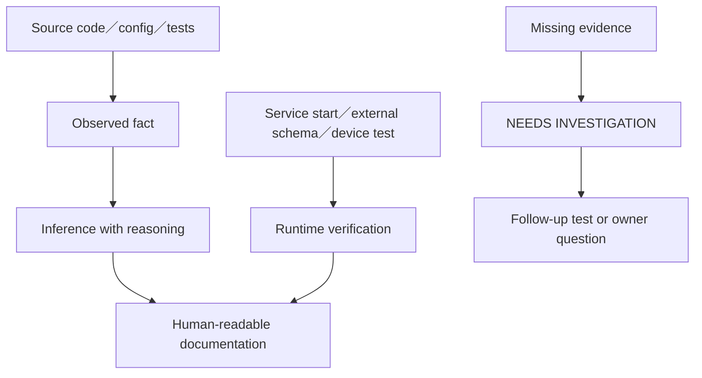
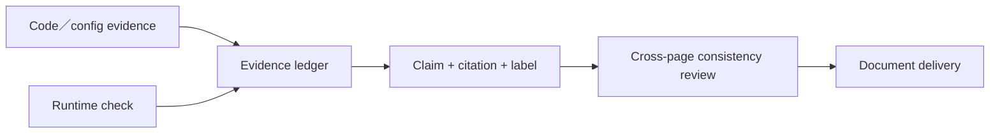

# 16 — 證據、限制與待釐清事項

## Relevant Source Files

- `Server/AGENTS.md`
- `Server/docs/AGENTS.md`
- `DatingApp/AGENTS.md`
- `Server/start_all.sh:L187-L245`
- `Server/social/main.py:L106-L161`
- `DatingApp/lib/main.dart:L46-L145`
- `DatingApp/pubspec.yaml:L30-L76`
- `docs/system/00-index.md`

## TL;DR

本套文件是以兩個 repository 的固定 revision 做的靜態、來源導向盤點；它能說明程式碼宣告的邊界與主要資料流，但不取代 live deployment、外部 schema、瀏覽器、實機或正式帳號驗證。分析工具對 Dart、cross-language property、超大流程與大檔案有已知缺口，因此所有「尚未在環境中觀察」的內容都保留為待確認。這頁是閱讀文件時的信心界線。

## Overview

本版盤點基準為 Server `main` 的 `b6c456f` 與 DatingApp `main` 的 `4426ca7`。GitNexus 已以 `--index-only` 更新三個索引；兩個 repository 工作樹在盤點前後保持原狀。onboarding analyzer 能完整列出檔案、Python／部分 AST、manifest 與 Git 資訊，但前端 Dart 主體需以 GitNexus、`pubspec.yaml` 和原始碼交叉確認；Server 的全量 PageRank 因大型文字比對成本過高而降級，不把它當成完整重要性排序。

觀察、推論與未知分開記錄。觀察引用程式碼行號；推論說明連接依據；未知列出需要什麼證據才能完成。文件不讀取或複製 `.env`、API key、JWT、密碼、cookie、真實個資及可能含秘密的 runtime log。

## Architecture Diagram

## Key Concepts

| Concept | Description | Evidence rule |
|---|---|---|
| Observed | 直接存在於檔案、設定或 command receipt | `relative/path:Lx-Ly` |
| Inferred | 由多項 observed evidence 連接出的合理解釋 | 說明推論依據與信心 |
| Unknown | 缺少、矛盾或未授權的證據 | 說明如何解決 |
| Runtime verified | 透過實際服務／裝置／瀏覽器觀察 | 記錄環境、revision與結果 |
| Static only | 未啟動或未連外部服務的程式碼閱讀 | 不得寫成 live success |

## How It Works

### 已完成的靜態證據

已確認前端啟動與 SDK 初始化、公開 API default origin、Appwrite client、Social router composition、Server 固定 ports、Risk／Matchmaker 內部呼叫、Agent public／private 分離、chat risk gate、calendar revision、App Voice capability／ticket 與多個 worker 啟動點。這些結論都有各章的來源引用。

### 尚未完成的 runtime 證據

尚未以完整 `start_all.sh` 執行整合啟動、尚未在瀏覽器／手機／桌面平台跑完整流程，也尚未取得正式 MongoDB、Neo4j、Appwrite、Guardrail、Google Calendar 或模型 provider 的 live schema／health evidence。測試檔案已盤點，但未把未執行的 test suite 寫成通過。

目前另有一個架構文件漂移：`Server/AYUE_V3_ARCHITECTURE.md` 對 Private Ayue 的描述仍稱為 Private V2、非 Pi，但 `private_mediator.py` 與 `private_pi/runtime.py` 的現行 source path、`agent_mode` 與測試都指向 Private Pi。公開阿月則由同一份架構文件、`public_runtime.py`、`pi/public_turn.py` 與近期 Pi-only commit 一致確認為 Pi。正式交付前應由維護者決定是否更新架構文件、保留 V2 作為 contract 名稱，或另行說明 Private Pi 的版本關係。

### 建議的查證順序

先在隔離環境使用非真實測試帳號和 stub／local database 驗證健康與基礎 API，再驗證登入、公開阿月、配對、雙人聊天風險、行事曆與 App Voice。每一步記錄 request、response code、visible state、log、revision 與 cleanup；若要觸及真實資料或發送外部通知，需另行確認範圍。

## Component Reference

| Component | Type | What it proves | What it does not prove |
|---|---|---|---|
| `start_all.sh` | runtime script | 程式碼宣告的啟動順序與 health endpoints | 正式主機外部依賴真的健康 |
| `social/main.py` | composition root | Social router與worker註冊 | 所有 worker 在 live host 都成功執行 |
| `pubspec.yaml` | manifest | Flutter SDK與依賴意圖 | 每個平台 build 都成功 |
| `AGENTS.md` | project policy | 架構 owner、限制與測試規則 | 實作一定符合規則 |
| GitNexus index | code graph | 可解析的 callers、processes與clusters | 未被截斷或跨語言無法解析的全部流程 |

## Data Flow

## Error Handling

若不同來源矛盾，文件保留矛盾並標記 unknown，不選擇看起來比較合理的那一份。若 GitNexus 找不到 caller，不能推論 symbol 沒有使用，因為 dynamic dispatch、跨語言或索引截斷都可能造成空結果。若 analyzer 未列出 Dart symbol，也不能推論 Flutter 沒有該功能。

## Gotchas & Conventions

> ⚠️ **Gotcha**：文件中的固定 URL、port、schema 名稱是程式碼契約；不代表本機一定能連線，也不代表正式環境未被 proxy／secret manager 改寫。

> 📌 **Convention**：每次文件更新要記錄兩個 repository 的 revision、工作樹狀態、驗證指令與未解決問題。

> ❓ **[NEEDS INVESTIGATION]**：產品研究動機、目標使用者 persona、正式部署拓撲、live data retention、外部帳號 allowlist 與模型選擇原因，不能只從程式碼可靠推導。

## Active Development Areas

最需要後續實證的是 Agent runtime／tool guard、風險治理、配對與約會 state、記憶 privacy、App Voice protocol、summary rollout、固定網域部署與 multi-platform build。

## Cross-References

- 文件入口：[00 — 文件索引](00-index.md)
- 啟動與驗證：[00.5 — 開始閱讀與啟動前提](00.5-getting-started.md)
- 測試策略：[15 — 測試與驗證](15-testing.md)
